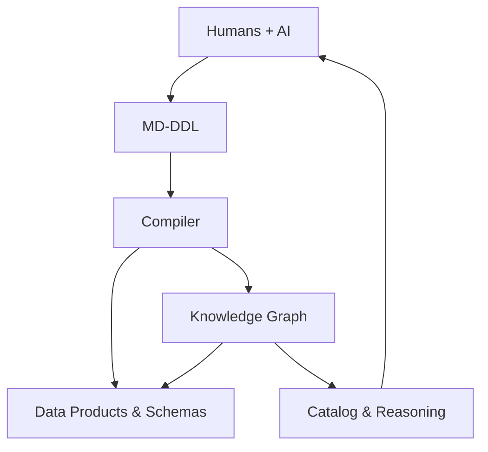

[![CC BY 4.0][cc-by-shield]][cc-by]

# md-ddl
The "Common Language" for Business Data

MD‑DDL is a simple, readable way for **humans and AI to collaboratively define data meaning**

It is a standard and tools, designed to be the bridges between people who *define the business* (Owners, Stewards, Analysts) and people who *build the systems* (Engineers, Architects) and companion AI Agents. It is:

- Human‑friendly  
- AI‑native
- Version‑controlled
- Semantically rich
- Ready for automation

This creates a data ecosystem that is **business‑friendly**, **steward‑friendly**, **tech friendly** and **AI‑friendly**.

---

## 🌟Why use md-ddl?

1. **Speak the Same Language**

Stop choosing between a "business glossary" and "technical schemas". With md-ddl, the description of a Customer sits right on top of the technical rules. It creates a single source of truth that humans can read and machines can compile.

2. **AI as a Collaborative Partner**

md-ddl uses clear text and structured logic, it acts as a "Babel Fish" for AI Agents.

Agents can help model: An AI can read your Markdown, compare with industry standard models and help users create knowledge as well as schema.

Automated Reasoning: AI can "walk" your model to find logic gaps or security risks that a human might miss.

3. **A Navigable "Map" of Your Logic**

Most data models are static lists. md-ddl creates a Knowledge Graph. This means you can ask your data model questions:

- "If we change how we calculate 'Loyalty Tier', what else breaks?"
- "Which departments are using data marked as 'Sensitive'?"
- "Who is responsible for the 'Invoice' entity in the Finance domain?"

4. **Built-in Guardrails (Governance)**

Data security shouldn't be an afterthought. md-ddl lets you bake "Privacy" and "Business Rules" directly into the definition of your data. 

5. **Smart Rules (Constraints)**

Business rules like "A customer balance can never be less than zero" aren't just buried in code. They are elevated as visible "Constraints" that link back to the data they protect.

## 🛠 How it Works
1. **Write:** Use Markdown to describe your business domains, entities and how they relate.

2. **Define:** Use simple YAML blocks to list the technical details and rules.

3. **Compile:** The md-ddl tool reads your file and builds a Knowledge Graph-a smart, searchable web of your organisation's data.

By using the same Markdown files everyone already knows how to read, md-ddl ensures that your data's meaning is never lost in translation.

---

## What is defined in the MD‑DDL standard?

MD‑DDL uses a tiered structure to capture everything from high-level business strategy to low-level technical requirements.

1. **Structural Components (The Hierarchy)**

These are the primary building blocks of your model. Each has its own identity and can be queried independently in a Knowledge Graph.

- Domains: The highest level of organization (e.g., Sales, Finance, Risk).
- Entities: The persistent "nouns" of your business (e.g., Customer, Account, Product).
- Relationships: The "verbs" that connect entities (e.g., Customer Owns Account).
- Business Events: Point-in-time occurrences (e.g., TransactionCreated, PolicyRenewed).
- Enumerations: Controlled vocabularies and reference data (e.g., CountryCodes, LoyaltyTiers).

2. **Logical Descriptors (The Details)**

These define the "shape" of your structural components.

- Attributes: Detailed field definitions including data types, patterns, and identifiers.
- Semantic Inheritance: The ability to specialized concepts (e.g., Admin extends User) to inherit logic and governance.

3. **Intelligence & Behavior (The Logic)**

- Constraints: Formalized business rules (e.g., "Balance > 0") that link attributes and entities together.
- Validation Rules: Logic that ensures data integrity across relationships and event payloads.

4. **Management & Governance (The Metadata)**

- Data Governance: Explicit markers for PII, Sensitivity, and Data Classification.
- Management: Operational metadata including Ownership, Lineage, and custom Tags.

5. **Visualizations**

- Native Diagramming: Support for embedded Mermaid or PlantUML code blocks, allowing your diagrams to live directly alongside the definitions they represent.

---

By treating Events, Relationships, and Constraints as first-class citizens, md-ddl transforms your data model from a static document into an active intelligence layer. Because everything is interconnected, any stakeholder can ask the graph questions that are implausible to answer with traditional documentation.

In a traditional model, these answers are buried in code or trapped in people's heads.

---

This work is licensed under a
[Creative Commons Attribution 4.0 International License][cc-by].

[![CC BY 4.0][cc-by-image]][cc-by]

[cc-by]: http://creativecommons.org/licenses/by/4.0/
[cc-by-image]: https://i.creativecommons.org/l/by/4.0/88x31.png
[cc-by-shield]: https://img.shields.io/badge/License-CC%20BY%204.0-lightgrey.svg
