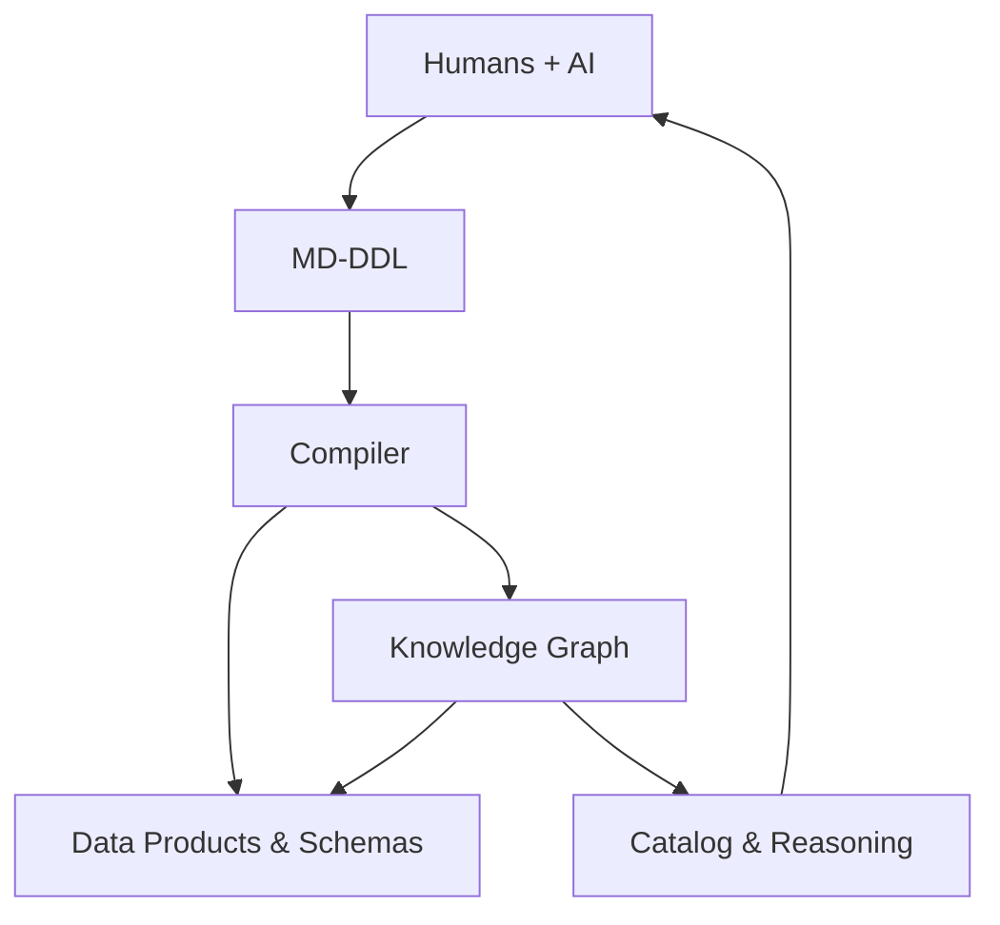

[![CC BY 4.0][cc-by-shield]][cc-by]

# md-ddl
Markdown Data Definition Language (MD‑DDL) - a human‑ and AI‑friendly way to model data

## **What is MD‑DDL?**  
MD‑DDL is a simple, readable way for **humans and AI to collaboratively define data meaning** using Markdown and YAML/JSON. It captures business concepts, attributes, relationships, domains, governance metadata, and diagrams — all in a format that works naturally in Git and is easy for AI to generate, validate, and evolve.

- Human‑friendly  
- AI‑native  
- Version‑controlled  
- Semantically rich  
- Ready for automation  

MD‑DDL documents are the *authoritative source of truth* for your data definitions.

---

## **Why MD‑DDL exists**  
Traditional data governance tools are proprietary and not AI‑native. Most off‑the‑shelf platforms are now bolting AI onto systems that were never designed to be accessible to AI or usable outside their own product ecosystem. Modern AI has made it clear that your data - and especially your data definitions - must be open, portable, and accessible in simple, universal formats.

Existing data‑modelling approaches (UML, ERDs, enterprise catalogues) are either too technical, too rigid, or too disconnected from modern workflows. They are difficult for everyday contributors to use and difficult for AI systems to interpret reliably. At the same time, knowledge graphs have become central to modern data management, but the knowledge for building them remain inaccessible to most teams.

MD‑DDL exists to bridge this gap: a Markdown‑native, human‑first, AI‑friendly way to define data meaning that is simple enough for anyone to contribute to, and structured enough for machines to reason over.

MD‑DDL bridges the gap by combining:

- **Markdown** for narrative and diagrams  
- **YAML/JSON** for structured definitions  
- **Knowledge graphs** for semantic reasoning  
- **Git** for governance and collaboration  
- **AI** for generation, validation, and refactoring  

This creates a data ecosystem that is **business‑friendly**, **steward‑friendly**, and **AI‑friendly**.

---

## **How MD‑DDL works**  
MD‑DDL defines:

- **Domains** (Sales, Finance, Risk…)
- **Entities** (Customer, Transaction…)
- **Attributes** (with classification, sensitivity, PII, keys, patterns…)
- **Relationships**
- **Constraints** (business rules, validations, referential integrity)  
- **Enumerations** (controlled vocabularies)
- **Business Event definitions** 
- **Diagrams** (Mermaid/PlantUML)
- **Metadata** - Lineage, ownership, tags, etc.)

---

## **What MD-DDL Generates**

- **Data Catalogue / Dictionary**
- **Data Product Specifications**
- **Schemas**
  - SQL/DDL
  - Avro/Parquet schemas
  - Open API
- Data quality rules
- Technical Event Mapping

---

## **What the knowledge graph does**  
Once compiled from the MD-DDL, the knowledge graph becomes the **semantic runtime** powering:

- Data Dictionary & Catalogue
- Visual modelling tools  
- Search and discovery  
- Impact analysis  
- Domain maps  
- API generation  
- **AI Reasoning**
  - Lineage inference
  - Cross‑domain dependency analysis
  - Governance enforcement
  - Semantic search

---

## **Why adopt MD‑DDL**  
- **Business‑friendly**: readable by anyone  
- **AI‑native**: LLMs can generate, validate, and refactor it  
- **Governance‑ready**: lineage, classification, sensitivity, PII, ownership  
- **Domain‑driven**: aligns with business ownership
- **Git‑native**: version control, pull requests, auditability
- **Graph‑powered**: deep semantics and reasoning

Designed for **humans, and AI working together**.

---

This work is licensed under a
[Creative Commons Attribution 4.0 International License][cc-by].

[![CC BY 4.0][cc-by-image]][cc-by]

[cc-by]: http://creativecommons.org/licenses/by/4.0/
[cc-by-image]: https://i.creativecommons.org/l/by/4.0/88x31.png
[cc-by-shield]: https://img.shields.io/badge/License-CC%20BY%204.0-lightgrey.svg
