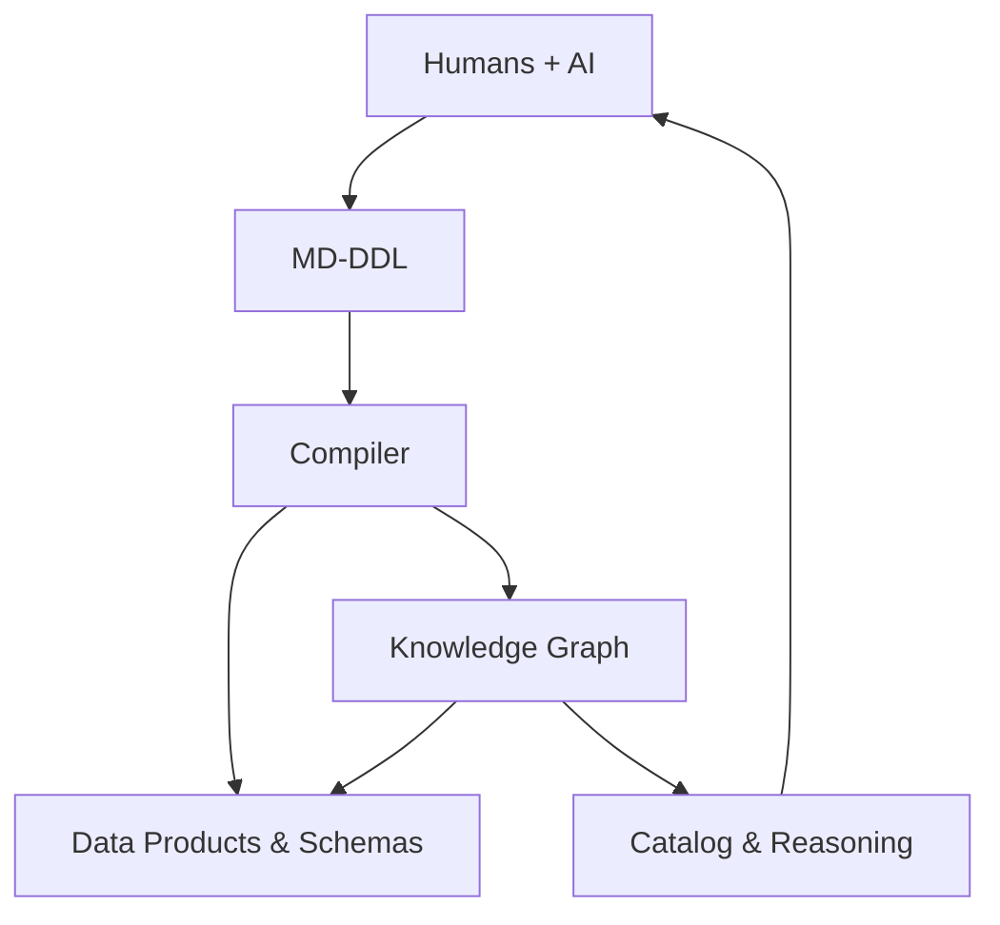

[![CC BY 4.0][cc-by-shield]][cc-by]

# Markdown Data Definition Language (md-ddl)

- *Draft 0.5*

**The data modelling language that bridges between human business intent, AI reasoning, and technical implementation.**

MD-DDL is a Markdown-native standard designed to solve the "semantic fragmentation" of modern enterprises. It allows humans and AI to collaboratively define not just *what* data is, but *what it means* and *how it is governed*.

MD‑DDL is a simple, readable way for **humans and AI to collaboratively define data meaning**

The standard into can be found in this repo at [1-Foundation.md](./md-ddl-specification/1-Foundation.md) or point your AI to the complete specification at [md-ddl-specification](./md-ddl-specification/MD-DDL-Complete.md).

md-ddl is:

- AI‑native
- Human‑friendly  
- Version‑controlled
- Semantically rich
- Ready for automation

This creates a data ecosystem that is **business‑friendly**, **steward‑friendly**, **tech friendly** and **AI‑friendly**.

---

## 🌟Why use md-ddl?

### **AI as a Collaborative Partner**

MD-DDL comes with **AI Skills** - pre-configured prompts and logic that teach LLMs how to:

- Perform **Domain Discovery** to scope new business areas.
- Map internal concepts to **External Standards**.
- Apply **Prudential Governance** metadata automatically.

md-ddl uses clear text and structured logic, it acts as a "Babel Fish" for AI Agents.

Agents can help model: An AI can read your Markdown, compare with industry standard models and help users create knowledge as well as schema.

Automated Reasoning: AI can "walk" your model to find logic gaps or security risks that a human might miss.

### **Standards are a superpower**

Don't model from scratch. MD-DDL is designed to ingest and align with global industry standards out of the box:

- **Banking**: Native patterns for **BIAN** and **ISO 20022**.
- **Compliance**: Built-in guidance for **Basel (BCBS)**, **APRA**, and **GDPR**.
- **Traceability**: Every entity and attribute can link directly to the regulatory requirement or standard that defines it.

### **Context-Aware Governance**

MD-DDL moves governance from the abmulance at the bottom of the cliff into the data definition itself. By embedding regulatory requirements and business logic early in the project/data lifecycle, the model becomes self-governing across different architectural strategies.

**Boundary-Specific Policies**: Apply governance rules based on your modeling strategy. Reference data can follow a Single Canonical policy, while core entities use Domain-Driven boundaries to isolate risk and sensitivity.

**Regulatory DNA**: Ingest and inherit compliance metadata from global and local standards like APRA, Basel (BCBS), and GDPR directly within the entity YAML.

**Executable Business Rules**: Define logic (e.g., "Transaction date cannot be in the future") as first-class constraints that can be compiled into automated data quality checks.

**Automatic Lineage**: The compiler uses domain headers and relationship blocks to automatically map how sensitive data flows between domains, making impact analysis and breach notification (e.g., CPS 234) simpler.

### **Smart Rules (Constraints)**

Business rules like "A customer balance can never be less than zero" aren't just buried in code. They are elevated as visible "Constraints" that link back to the data they protect.

## 🛠 How it Works

1. **Write:** Use Markdown to describe your business domains, entities and how they relate.

2. **Define:** Use simple YAML blocks to list the technical details and rules.

3. **Compile:** The md-ddl tool reads your file and builds:

    - A Knowledge Graph-a smart, searchable web of your organisation's data.
    - Data-in-motion schemas
    - Data-at-rest schemas
        - 3rd Normal Form
        - Dimensional data models
        - Columnar
    - Data governance rules
    - Data management artefacts & lineage

By using the same Markdown files everyone already knows how to read, md-ddl ensures that your data's meaning is never lost in translation.

---

## What is defined in the MD‑DDL standard?

MD‑DDL uses a tiered structure to capture everything from high-level business strategy to low-level technical requirements.

### **Structural Components (The Hierarchy)**

These are the primary building blocks of your model. Each has its own identity and can be queried independently in a Knowledge Graph.

- Domains: The highest level of organization (e.g., Sales, Finance, Risk).
- Entities: The persistent "nouns" of your business (e.g., Customer, Account, Product).
- Relationships: The "verbs" that connect entities (e.g., Customer Owns Account).
- Business Events: Point-in-time occurrences (e.g., TransactionCreated, PolicyRenewed).
- Enumerations: Controlled vocabularies and reference data (e.g., CountryCodes, LoyaltyTiers).

### **Logical Descriptors (The Details)**

These define the "shape" of your structural components.

- Attributes: Detailed field definitions including data types, patterns, and identifiers.
- Semantic Inheritance: The ability to specialized concepts (e.g., Admin extends User) to inherit logic and governance.

### **Intelligence & Behavior (The Logic)**

- **Constraints**: Formalized business rules (e.g., "Balance > 0") that link attributes and entities together.
- **Validation Rules**: Logic that ensures data integrity across relationships and event payloads.
- **Temporal Priority**: Every event and entity includes sequence logic to reconstruct the history of your data.

### **Management & Governance (The Metadata)**

- Data Governance: Explicit markers for PII, Sensitivity, and Data Classification.
- Management: Operational metadata including Ownership, Lineage, and custom Tags.

### **Visualizations**

- Native Diagramming: Support for embedded Mermaid or PlantUML code blocks, allowing your diagrams to live directly alongside the definitions they represent.

---

By treating Events, Relationships, and Constraints as first-class citizens, md-ddl transforms your data model from a static document into an active intelligence layer. Because everything is interconnected, any stakeholder can ask the graph questions that are implausible to answer with traditional documentation.

In a traditional model, these answers are buried in code or trapped in people's heads.

---

This work is licensed under a
[Creative Commons Attribution 4.0 International License][cc-by].

[![CC BY 4.0][cc-by-image]][cc-by]

[cc-by]: http://creativecommons.org/licenses/by/4.0/
[cc-by-image]: https://i.creativecommons.org/l/by/4.0/88x31.png
[cc-by-shield]: https://img.shields.io/badge/License-CC%20BY%204.0-lightgrey.svg
