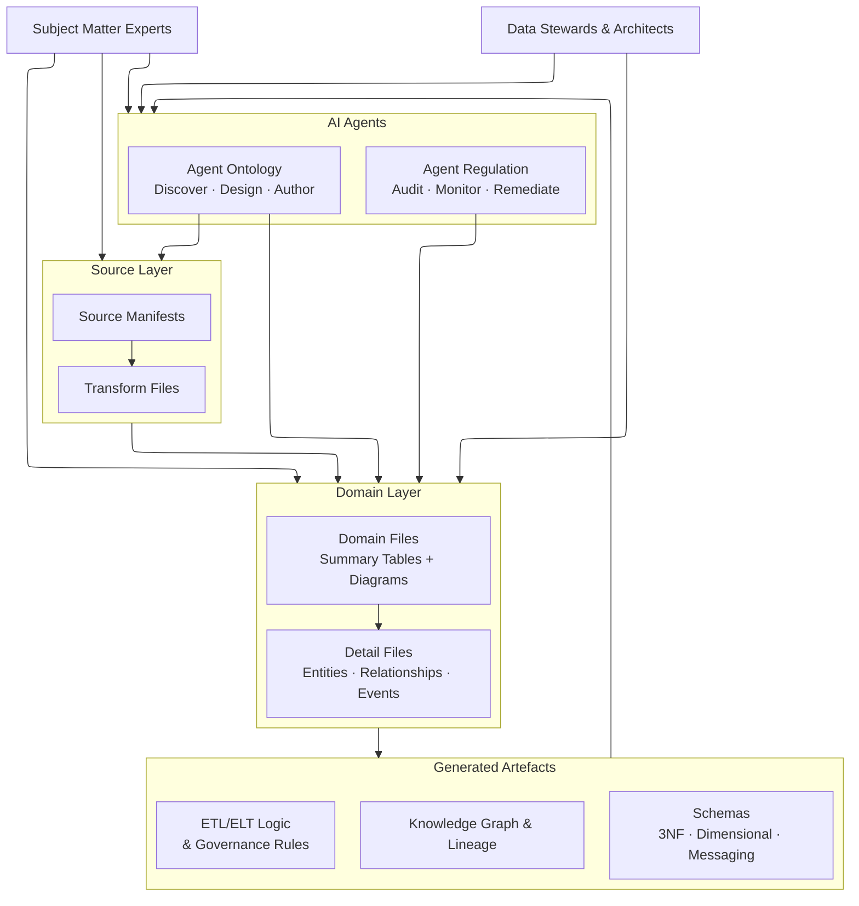

[![CC BY 4.0][cc-by-shield]][cc-by]

# Markdown Data Definition Language (md-ddl)

> **Version 0.7.1** (Latest)

**A data modelling language that bridges between human business intent, AI reasoning, and technical implementation.**

MD-DDL is a Markdown-native standard for defining not just *what* data is, but *what it means*, *where it comes from*, and *how it is governed* — in a format that humans, AI agents, and compilers all work with directly.

The specification is at [1-Foundation.md](./md-ddl-specification/1-Foundation.md), or point your AI at the single-file version: [MD-DDL-Complete.md](./md-ddl-specification/MD-DDL-Complete.md).

md-ddl is: **AI‑native · Human‑friendly · Version‑controlled · Semantically rich · Ready for automation**


```mermaid
---
config:
  layout: elk
---
flowchart TD
    SME[Subject Matter Experts]
    Stewards[Data Stewards & Architects]

    subgraph Sources["Source Layer"]
        SM[Source Manifests]
        TF[Transform Files]
        SM --> TF
    end

    subgraph Model["Domain Layer"]
        D[Domain Files<br/>Summary Tables + Diagrams]
        E[Detail Files<br/>Entities · Relationships · Events]
        D --> E
    end

    subgraph Agents["AI Agents"]
        AO["Agent Ontology<br/>Discover · Design · Author"]
        AR["Agent Regulation<br/>Audit · Monitor · Remediate"]
    end

    subgraph Outputs["Generated Artefacts"]
        KG[Knowledge Graph & Lineage]
        SC[Schemas<br/>3NF · Dimensional · Messaging]
        GV[ETL/ELT Logic<br/>& Governance Rules]
    end

    Sources --> Model
    Model --> Outputs
    AO --> Model
    AO --> Sources
    AR --> Model
    SME --> Agents
    SME --> Model
    SME --> Sources
    Stewards --> Agents
    Stewards --> Model
    Outputs --> Agents
```

This creates a data ecosystem that is **business‑friendly**, **steward‑friendly**, **tech‑friendly**, and **AI‑friendly**.

---

## 🌟 Why use md-ddl?

### **AI Agents as Collaborative Partners**

MD-DDL ships with two purpose-built AI agents covering the full data management lifecycle.

**[Agent Ontology](./agents/agent-ontology/AGENT.md)** is the primary authoring interface. Describe a business process and Agent Ontology drives the conversation — interviewing subject matter experts, checking applicable industry standards, reasoning through modelling trade-offs, and producing a draft domain model with summary tables first and detail files only after human review. It also guides source mapping, helping source system SMEs author manifests and transform files that feed the canonical model.

**[Agent Regulation](./agents/agent-regulation/AGENT.md)** is the ongoing compliance layer. It audits domain and entity files against loaded regulatory frameworks (APRA, GDPR, Basel, FATF, and more), monitors for regulatory change, and produces structured gap reports with prioritised remediation across all three governance levels — domain metadata, entity governance blocks, and attribute-level PII flags.

MD‑DDL's plain Markdown and structured YAML acts as a shared language for these agents and for any LLM you point at the spec — agents can reason over the model, walk relationships to find logic gaps, and generate technical artefacts from the same files your business stakeholders review.

### **Standards are a superpower**

Don't model from scratch. MD-DDL aligns with global industry standards out of the box — native patterns for **BIAN** and **ISO 20022**, built-in compliance guidance for **Basel (BCBS)**, **APRA**, **RBNZ**, and **GDPR**, and direct traceability from every entity and attribute to the standard or regulatory requirement that defines it.

### **Governance built into the model**

Regulatory requirements and business rules are embedded in the data definition itself, not bolted on after the fact. PII classification, retention obligations, and breach notification requirements sit directly on the entities they govern. Business rules like "balance can never be less than zero" become visible **Constraints** that compile into automated data quality checks. The domain and relationship structure automatically maps how sensitive data flows, making impact analysis and breach notification (e.g., CPS 234) traceable by default.

### **From source to canonical — with full lineage**

MD-DDL separates the operational reality of source systems from the governed meaning of canonical data. **Source Manifests** declare what each source system produces and how it generates change. **Transform Files** map source fields to canonical attributes using a typed transformation vocabulary — direct maps, derivations, lookups, multi-source reconciliation, and conditional logic — encoding source idiosyncrasies where they belong, in the source layer, not the canonical model. The result is end-to-end lineage from raw source field to governed domain attribute, compilable into ETL/ELT logic without custom tooling.

### **Domains as Data Products**

An MD-DDL domain is a complete data product definition. The effort of modelling a domain is the effort of defining the data product — one document, not two. When you apply a **Canonical** modelling strategy, the domain becomes a **Foundational Data Product** — a governed, reusable asset that other teams and systems consume without redefining.

MD-DDL | Data Product concept
--- | ---
Domain | Data product definition
Canonical domain | Foundational / platform data product
Bounded context domain | Team-owned data product
Entities + relationships | Data product schema / semantic model
Events | Output port change events
Source manifests | Source-aligned input contracts
Transform files | Integration logic — source fields to canonical attributes
Governance metadata | Data product SLA — classification, retention, PII, residency
Owners + stewards | Data product owner and domain team
Generated schemas | Data product output ports (3NF, dimensional, messaging)

> **Looking ahead to v0.8:** The spec will formalise inter-domain consumption contracts and explicit output port declarations, making domain-to-domain data product relationships as governed as source-to-canonical ones.

---

## 🛠 How it Works

### 1. Discover
Agent Ontology interviews your subject matter experts and proposes candidate entities, relationships, and events — checking applicable industry standards and surfacing modelling trade-offs before writing a line of MD-DDL.

### 2. Model
Agent Ontology drafts domain summary tables first — a compact index of every concept in the domain. Detail files follow after human review, containing entity definitions, constraints, governance metadata, and diagrams.

### 3. Map
Source system SMEs author **Source Manifests** declaring what their system produces and how it generates change. **Transform Files** map source fields to canonical attributes — encoding source-specific logic (type casts, null handling, derivations, lookups, multi-source reconciliation) in the source layer where it belongs. The canonical model stays pure.

### 4. Generate
Point any LLM at your MD-DDL files and instruct it to generate artefacts — no custom tooling required:
- **Knowledge Graph** — a queryable semantic web with end-to-end lineage from source field to canonical attribute
- **Schemas** — 3rd Normal Form, dimensional models, columnar layouts, and messaging schemas
- **ETL/ELT logic** — source-to-canonical pipelines derived directly from transform files
- **Governance artefacts** — data quality rules, lineage maps, and regulatory reports

### 5. Govern
Agent Regulation audits your model against applicable regulatory frameworks, monitors for regulatory change, and produces gap reports with specific remediation steps — running continuously against the living model.

---

## 🔌 Integrating md-ddl into your project

MD-DDL is a **dependency** of your modelling project, not an artifact of it. Your domain and source files are the artifacts — the spec and agents are the tools you use to create and govern them.

The recommended approach is a **git submodule** — the closest equivalent to `pip install` for a Markdown-based standard: pinned to a version, updated independently of your model files, never duplicated.

### Step 1 — Add md-ddl as a submodule

```bash
git submodule add https://github.com/[org]/md-ddl .md-ddl
git submodule update --init
```

To update to a new version later: `git submodule update --remote .md-ddl`

### Step 2 — Configure your AI tooling

#### GitHub Copilot in VS Code

Create `.github/copilot-instructions.md` in your project root:

```markdown
## MD-DDL Standard

This project uses MD-DDL for data modelling. The standard and agents are in `.md-ddl/`.

- Full specification: `.md-ddl/md-ddl-specification/MD-DDL-Complete.md`
- Agent Ontology (discovery, design, source mapping): `.md-ddl/agents/agent-ontology/AGENT.md`
- Agent Regulation (compliance and audit): `.md-ddl/agents/agent-regulation/AGENT.md`

When working on domain, entity, or source files, read the relevant agent prompt and
spec sections before making changes. Draft domain summary tables before detail files.
Canonical entity files contain no source references — source mappings live in sources/.
```

#### Claude Code

Create `CLAUDE.md` in your project root:

```markdown
## MD-DDL Standard

This project uses MD-DDL for data modelling. The standard and agents are in `.md-ddl/`.

- Full specification: `.md-ddl/md-ddl-specification/MD-DDL-Complete.md`
- Agent Ontology (discovery, design, source mapping): `.md-ddl/agents/agent-ontology/AGENT.md`
- Agent Regulation (compliance and audit): `.md-ddl/agents/agent-regulation/AGENT.md`

When working on domain, entity, or source files, load the relevant agent prompt first.
Canonical entity files contain no source references — source mappings live in sources/.
```

#### Claude.ai Projects

Add to your Project Knowledge:
1. `MD-DDL-Complete.md` — the full specification
2. `agents/agent-ontology/AGENT.md` — for modelling and source mapping
3. `agents/agent-regulation/AGENT.md` — for compliance auditing

No submodule needed, but re-upload when moving to a newer version of the standard.

### Your project structure

```text
your-project/
  .md-ddl/                      ← submodule — the standard (not yours to edit)
  .github/
    copilot-instructions.md     ← or CLAUDE.md
  domains/
    customer/
      domain.md                 ← canonical model
      entities/
        customer.md
        account.md
    payments/
      domain.md
  sources/
    salesforce/
      manifest.md               ← what Salesforce produces + change model
      transforms/
        customer.md             ← Salesforce → Customer field mappings
    sap/
      manifest.md
      transforms/
        customer.md             ← SAP's contribution to Customer
```

The `.md-ddl/` directory is a read-only dependency. Your modelling work lives entirely outside it.

---

## 📐 What MD‑DDL defines

**Domain layer** — *what the business means*
- **Domains** — the highest level of organisation and the unit of a data product. A canonical domain is a foundational data product.
- **Entities** — the persistent nouns of your business (Customer, Account, Product)
- **Relationships** — semantic connections between entities (Customer Holds Account)
- **Events** — point-in-time business occurrences (Customer Onboarded, Transaction Executed)
- **Enumerations** — controlled vocabularies (Country Code, Loyalty Tier)
- **Attributes** — field definitions: data types, identifiers, PII flags
- **Semantic Inheritance** — specialised concepts inherit logic and governance from parents
- **Constraints** — formalised business rules that compile into data quality checks
- **Temporal Tracking** — how each entity changes over time: immutable, append-only, slowly changing, or bitemporal
- **Existence & Mutability** — entity-level declarations that drive compiler output for dimensional modelling

**Source layer** — *where data comes from*
- **Source Manifests** — declare what a source system produces, how it generates change, and which canonical entities it contributes to
- **Transform Files** — map source fields to canonical attributes using a typed vocabulary: direct, derived, lookup, reconciliation, conditional, and aggregation. Source idiosyncrasies stay here, away from the canonical model.

**Governance layer** — *how data is protected*
- **Data Governance** — PII, classification, retention, residency, and breach notification embedded on the entities they govern
- **Regulatory Scope** — every domain and entity declares which frameworks apply
- **Ownership & Lineage** — data owners, stewards, and the full lineage graph from source field to canonical attribute

Native diagramming via embedded Mermaid — domain overview graphs and entity class diagrams live directly alongside the definitions they represent, not in a separate tool.

---

## 📁 Repository layout

```text
md-ddl-specification/         The normative standard
  1-Foundation.md             Core principles and document structure
  MD-DDL-Complete.md          Single-file version for AI context loading
  ...                         Individual section files (2–8)

agents/
  agent-ontology/             Discovery, design, and source mapping agent
  agent-regulation/           Regulatory compliance and audit agent

examples/
  Financial Crime/            Reference-quality domain with full entity detail files
  Simple Customer/            Minimal example — single detail file, good starting point
```

---

This work is licensed under a
[Creative Commons Attribution 4.0 International License][cc-by].

[![CC BY 4.0][cc-by-image]][cc-by]

[cc-by]: http://creativecommons.org/licenses/by/4.0/
[cc-by-image]: https://i.creativecommons.org/l/by/4.0/88x31.png
[cc-by-shield]: https://img.shields.io/badge/License-CC%20BY%204.0-lightgrey.svg
