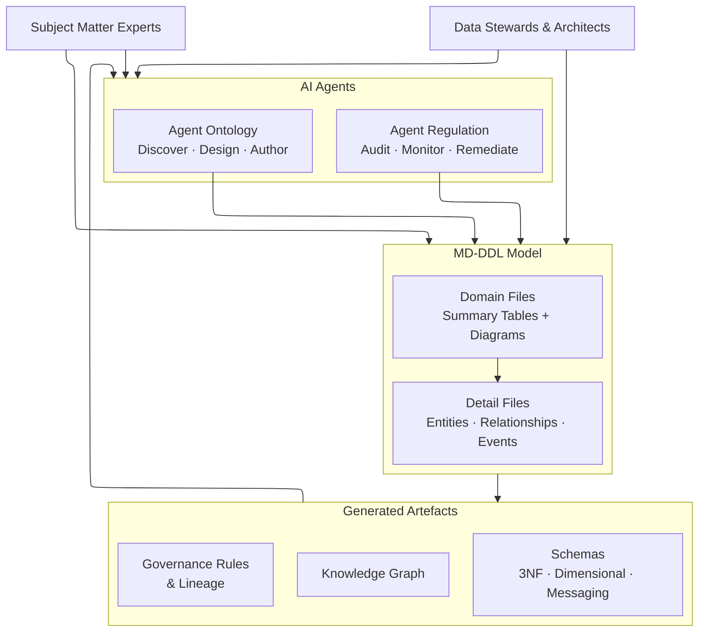

[![CC BY 4.0][cc-by-shield]][cc-by]

# Markdown Data Definition Language (md-ddl)

> **Version 0.6.5** (Latest)

**A data modelling language that bridges between human business intent, AI reasoning, and technical implementation.**

MD-DDL is a Markdown-native standard designed to solve the "semantic fragmentation" of modern enterprises. It allows humans and AI to collaboratively define not just *what* data is, but *what it means* and *how it is governed*.

MD‑DDL is a simple, readable way for **humans and AI to collaboratively define data meaning** — whether you are building a domain model, defining a canonical data product, or governing a data asset across its full lifecycle.

The specification can be found in this repo at [1-Foundation.md](./md-ddl-specification/1-Foundation.md), or point your AI directly to the complete single-file version at [MD-DDL-Complete.md](./md-ddl-specification/MD-DDL-Complete.md).

md-ddl is:

- AI‑native
- Human‑friendly
- Version‑controlled
- Semantically rich
- Ready for automation


```mermaid
---
config:
  layout: elk
---
flowchart TD
    SME[Subject Matter Experts]
    Stewards[Data Stewards & Architects]

    subgraph Model["MD-DDL Model"]
        D[Domain Files<br/>Summary Tables + Diagrams]
        E[Detail Files<br/>Entities · Relationships · Events]
        D --> E
    end

    subgraph Agents["AI Agents"]
        AO["Agent Ontology<br/>Discover · Design · Author"]
        AR["Agent Regulation<br/>Audit · Monitor · Remediate"]
    end

    subgraph Outputs["Generated Artefacts"]
        KG[Knowledge Graph]
        SC[Schemas<br/>3NF · Dimensional · Messaging]
        GV[Governance Rules<br/>& Lineage]
    end

    Model --> Outputs
    AO --> Model
    AR --> Model
    SME --> Agents
    SME --> Model
    Stewards --> Agents
    Stewards --> Model
    Outputs --> Agents
```

This creates a data ecosystem that is **business‑friendly**, **steward‑friendly**, **tech‑friendly**, and **AI‑friendly**.

---

## 🌟 Why use md-ddl?

### **AI Agents as Collaborative Partners**

MD-DDL ships with two purpose-built AI agents that cover the full data management lifecycle — from first conversation to ongoing regulatory assurance.

**[Agent Ontology](./agents/agent-ontology/AGENT.md)** is the primary authoring interface. Instead of a human writing MD-DDL from scratch, they describe a business process and Agent Ontology drives the conversation. It interviews subject matter experts, identifies applicable industry standards, reasons through inheritance hierarchies and modelling trade-offs, and produces a draft domain model — summary tables first, detail files only after human review. It operates across four specialist skills that load on demand:

- **Domain Scoping** — interview protocol, boundary decisions, canonical vs. domain-driven strategy
- **Entity Modelling** — concept realisation, inheritance reasoning, existence and mutability
- **Relationship & Events** — semantic connections, business events, temporal sequencing
- **Standards Alignment** — BIAN, ISO 20022, FHIR, ACORD, and more

**[Agent Regulation](./agents/agent-regulation/AGENT.md)** is the ongoing compliance layer. It audits domain and entity files against loaded regulatory frameworks, monitors for regulatory change, and produces structured gap reports with prioritised remediation. It understands the three-level governance structure of MD-DDL — domain metadata, entity governance blocks, and attribute-level PII flags — and checks all three. It operates across two skills:

- **Regulatory Compliance** — jurisdiction mapping, regulator file loading (APRA, GDPR, Basel, FATF, and more)
- **Compliance Audit** — systematic three-level audit protocol, severity classification, gap reporting

MD‑DDL's plain Markdown and structured YAML acts as a "Babel Fish" for these agents — and for any LLM you point at the spec. Because the model is human-readable text, agents can reason over it, walk relationships to find logic gaps, and generate technical artefacts directly from the same files your business stakeholders review.

### **Standards are a superpower**

Don't model from scratch. MD-DDL is designed to ingest and align with global industry standards out of the box:

- **Banking**: Native patterns for **BIAN** and **ISO 20022**.
- **Compliance**: Built-in guidance for **Basel (BCBS)**, **APRA**, **RBNZ**, and **GDPR**.
- **Traceability**: Every entity and attribute can link directly to the regulatory requirement or standard that defines it.

### **Context-Aware Governance**

MD-DDL moves governance away from the ambulance at the bottom of the cliff and into the data definition itself. By embedding regulatory requirements and business logic early in the data lifecycle, the model becomes self-governing across different architectural strategies.

**Boundary-Specific Policies**: Apply governance rules based on your modelling strategy. Reference data can follow a Single Canonical policy, while core entities use Domain-Driven boundaries to isolate risk and sensitivity.

**Regulatory DNA**: Inherit compliance metadata from global and local standards like APRA, Basel (BCBS), and GDPR directly within the entity YAML. Agent Regulation keeps this metadata current as regulations change.

**Executable Business Rules**: Define logic (e.g., "Transaction date cannot be in the future") as first-class constraints that can be compiled into automated data quality checks.

**Automatic Lineage**: The domain and relationship structure automatically maps how sensitive data flows between domains, making impact analysis and breach notification (e.g., CPS 234) simpler.

### **Smart Rules (Constraints)**

Business rules like "A customer balance can never be less than zero" aren't buried in code. They are elevated as visible Constraints that link back to the data they protect — and can be generated into automated data quality checks.

### **Domains as Data Products**

An MD-DDL domain is not just an organisational boundary — it is a complete data product definition.

A domain file already captures everything needed to define a data product: business purpose, ownership and stewardship, governance posture, regulatory scope, retention obligations, source systems, the full conceptual model of entities and relationships, and the events that signal state changes. When you apply a **Canonical** modelling strategy, the domain becomes a **Foundational Data Product** — a governed, reusable asset that other teams and systems consume without redefining.

This means the effort of modelling a domain is also the effort of defining the data product. You are not maintaining two documents; you are maintaining one.

The practical mapping:

MD-DDL | Data Product concept
--- | ---
Domain | Data product definition
Canonical domain | Foundational / platform data product
Bounded context domain | Team-owned data product
Entities + relationships | Data product schema / semantic model
Events | Output port change events
Governance metadata | Data product SLA — classification, retention, PII, residency
Owners + stewards | Data product owner and domain team
Generated schemas | Data product output ports (3NF, dimensional, messaging)

> **Looking ahead to v0.7:** The spec will formalise the data product mapping with explicit output port declarations and inter-domain consumption contracts. The domain structure is already the right shape — v0.7 will name it explicitly and add the contracts that make consumption governable.

---

## 🛠 How it Works

### 1. Discover

Agent Ontology interviews your subject matter experts and proposes candidate entities, relationships, and events. It checks applicable industry standards and surfaces modelling trade-offs for human decision before writing a line of MD-DDL.

### 2. Model

Using structured Markdown and YAML, Agent Ontology drafts domain summary tables first — a compact index of every concept in the domain. Detail files follow after human review, each containing the full entity definitions, constraints, override governance metadata (when needed), and diagrams.

### 3. Generate

Point any LLM at your MD-DDL files and instruct it to generate artefacts. The structured format makes this reliable without custom tooling:

- **Knowledge Graph** — a queryable semantic web of your organisation's data
- **Schemas** — 3rd Normal Form, dimensional models, columnar layouts, and messaging schemas
- **Governance artefacts** — lineage maps, data quality rules, regulatory reports

### 4. Govern

Agent Regulation audits your model against applicable regulatory frameworks, monitors for regulatory change, and produces gap reports with specific remediation steps. Governance is not a one-time activity — it runs continuously against the living model.

---

## 🔌 Integrating md-ddl into your project

MD-DDL is a **dependency** of your modelling project, not an artifact of it. Your domain and entity files are the artifacts — the spec and agents are the tools you use to create and govern them. The goal is to make the standard available to your AI tooling without it becoming something you own or maintain.

The recommended approach is a **git submodule**. This is the closest equivalent to `pip install` for a Markdown-based standard: the spec lives in your repository at a pinned version, updates independently of your model files, and is never duplicated.

### Step 1 — Add md-ddl as a submodule

```bash
git submodule add https://github.com/[org]/md-ddl .md-ddl
git submodule update --init
```

This creates a `.md-ddl/` directory in your project root containing the full spec and agents, pinned to the current commit. To update to a new version later:

```bash
git submodule update --remote .md-ddl
```

### Step 2 — Configure your AI tooling

Tell your AI tooling where to find the spec and agents. Configuration depends on your environment.

---

#### GitHub Copilot in VS Code

Create `.github/copilot-instructions.md` in your project root:

```markdown
## MD-DDL Standard

This project uses MD-DDL for data modelling. The standard and agents are in `.md-ddl/`.

- Full specification: `.md-ddl/md-ddl-specification/MD-DDL-Complete.md`
- Agent Ontology (discovery and design): `.md-ddl/agents/agent-ontology/AGENT.md`
- Agent Regulation (compliance and audit): `.md-ddl/agents/agent-regulation/AGENT.md`

When working on domain or entity files in this project, read the relevant agent
prompt and spec sections before making changes. Follow the authoring flow defined
in Agent Ontology: domain summary tables first, detail files only after review.
```

---

#### Claude Code

Create `CLAUDE.md` in your project root:

```markdown
## MD-DDL Standard

This project uses MD-DDL for data modelling. The standard and agents are in `.md-ddl/`.

- Full specification: `.md-ddl/md-ddl-specification/MD-DDL-Complete.md`
- Agent Ontology (discovery and design): `.md-ddl/agents/agent-ontology/AGENT.md`
- Agent Regulation (compliance and audit): `.md-ddl/agents/agent-regulation/AGENT.md`

When working on domain or entity files, load the relevant agent prompt first.
```

---

#### Claude.ai Projects

If you are using Claude.ai rather than a local IDE, add these files to your Project Knowledge:

1. `MD-DDL-Complete.md` — the full specification
2. `agents/agent-ontology/AGENT.md` — if you are modelling
3. `agents/agent-regulation/AGENT.md` — if you are auditing compliance

No submodule is needed for this approach, but you will not have version pinning. Re-upload when you want to move to a newer version of the standard.

---

### Your project structure

Once integrated, your project contains your model files — not the standard itself:

```text
your-project/
  .md-ddl/                  ← submodule — the standard (not yours to edit)
  .github/
    copilot-instructions.md ← or CLAUDE.md — points AI at the submodule
  domains/
    customer/
      domain.md             ← your model files (these are the artifacts)
      entities/
        customer.md
        account.md
    payments/
      domain.md
```

The `.md-ddl/` directory is a read-only dependency. Your modelling work lives entirely outside it.

MD‑DDL uses a tiered structure to capture everything from high-level business intent to low-level technical requirements.

### Structural Components

The primary building blocks of your model. Each has its own identity and can be queried independently in a Knowledge Graph.

- **Domains** — the highest level of organisation (e.g., Sales, Finance, Risk). Also the unit of definition for a data product — a canonical domain is a foundational data product.
- **Entities** — the persistent nouns of your business (e.g., Customer, Account, Product)
- **Relationships** — the semantic connections between entities (e.g., Customer Holds Account)
- **Events** — point-in-time business occurrences (e.g., Customer Onboarded, Transaction Executed)
- **Enumerations** — controlled vocabularies and reference data (e.g., Country Code, Loyalty Tier)

### Logical Descriptors

Define the shape of your structural components.

- **Attributes** — field definitions including data types, identifiers, and PII flags
- **Semantic Inheritance** — specialised concepts (e.g., Customer extends Party Role) inherit logic and governance from their parents

### Intelligence & Behaviour

- **Constraints** — formalised business rules (e.g., "Balance > 0") that link attributes and entities together and compile into data quality checks
- **Temporal Tracking** — every entity declares how it changes over time: immutable, append-only, slowly changing, or bitemporal
- **Existence & Mutability** — entity-level declarations that drive compiler output for dimensional modelling

### Management & Governance

- **Data Governance** — explicit markers for PII, classification, retention, residency, and breach notification
- **Regulatory Scope** — every domain and entity declares which frameworks govern it
- **Ownership & Lineage** — operational metadata including data owners, stewards, and source systems

### Visualisations

Native diagramming via embedded Mermaid code blocks — domain overview graphs and entity class diagrams live directly alongside the definitions they represent, not in a separate tool.

---

By treating Events, Relationships, and Constraints as first-class citizens, MD-DDL transforms your data model from a static document into an active intelligence layer. Because everything is interconnected, any stakeholder — or agent — can ask the graph questions that are implausible to answer with traditional documentation.

In a traditional model, those answers are buried in code or trapped in people's heads.

---

## 📁 Repository layout

```text
md-ddl-specification/         The normative standard
  1-Foundation.md             Core principles and document structure
  MD-DDL-Complete.md          Single-file version for AI context loading
  ...                         Individual section files (2–6)

agents/
  agent-ontology/             Discovery and design agent
  agent-regulation/           Regulatory compliance and audit agent

examples/
  Financial Crime/            Reference-quality domain with full entity detail files
  Simple Customer/            Minimal example — single detail file, good starting point
```

---

This work is licensed under a
[Creative Commons Attribution 4.0 International License][cc-by].

[![CC BY 4.0][cc-by-image]][cc-by]

[cc-by]: http://creativecommons.org/licenses/by/4.0/
[cc-by-image]: https://i.creativecommons.org/l/by/4.0/88x31.png
[cc-by-shield]: https://img.shields.io/badge/License-CC%20BY%204.0-lightgrey.svg
