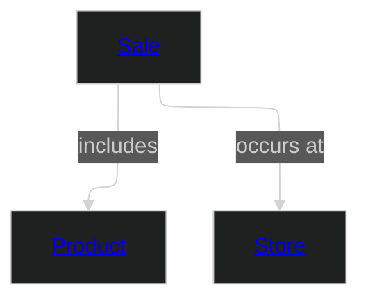

# Retail Sales (Brownfield)

This domain models retail sales transactions, products, and store locations. It demonstrates the MD-DDL brownfield adoption pattern — starting from an existing Snowflake data warehouse star schema (fact_sales, dim_product, dim_store) and progressively migrating toward declarative MD-DDL.

The existing dimensional model has been in production for three years, serving a Retail Sales Analytics dashboard. Rather than replacing it in one step, the team is following **Pattern A: Starting from Dimensional Models** to document existing state, create canonical entities, map baseline fields, and eventually generate physical artifacts from MD-DDL.

Current adoption status: **Level 2 (Mapped)** — all three core entities have been created as canonical MD-DDL entities, and source transform files define the lineage from POS system fields to canonical attributes.

## Metadata

```yaml
# Accountability
owners:
  - retail.data@example.com
stewards:
  - sales.analytics@example.com
technical_leads:
  - data.engineering@example.com

# Governance & Security
classification: "Confidential"
pii: true
regulatory_scope:
  - GDPR
default_retention: "5 years"

# Lifecycle & Discovery
status: "Draft"
version: "0.1.0"
tags:
  - Retail
  - BoundedContext
  - Brownfield

# Platform
platform:
  posture: single-platform
  technologies:
    - "Snowflake"
  product_scope:
    - domain-aligned
    - consumer-aligned
  notes: "All data products are self-contained in Snowflake. Source-aligned feeds are treated as engineering infrastructure (staging/raw schemas), not governed data products."

# Adoption
adoption:
  maturity: mapped
  adoption_started: 2024-01-15
  target_maturity: declarative
  target_date: 2025-06-30
  progress:
    at_level: 3
    total: 3
  notes: "Phase 1 captured existing Snowflake star schema. All three core entities now have canonical definitions with source transforms. Next step: complete governance metadata for Level 3."
```

### Domain Overview Diagram



## Source Systems

Business Application | Platform | Capability Domain
--- | --- | ---
[POS System](sources/pos-system/source.md) | Custom Java / Oracle DB | Point of Sale

## Entities

Name | Description
--- | ---
[Sale](entities/sale.md#sale) | A completed retail sales transaction capturing what was sold, where, and for how much.
[Product](entities/product.md#product) | A retail product available for sale, with category and pricing information.
[Store](entities/store.md#store) | A physical retail store location where sales transactions occur.

## Enums

Name | Description
--- | ---
Product Categories | Hierarchical classification of retail products (e.g., Electronics, Apparel, Grocery).

## Relationships

Name | Description
--- | ---
[Sale Includes Product](entities/sale.md#sale-includes-product) | A Sale transaction references the Product that was sold.
[Sale Occurs At Store](entities/sale.md#sale-occurs-at-store) | A Sale transaction occurs at a specific Store location.

## Events

Name | Actor | Entity | Description
--- | --- | --- | ---
Sale Completed | POS System | Sale | Emitted when a sales transaction is finalised at the point of sale.

## Data Products

Name | Class | Consumers | Status
--- | --- | --- | ---
Retail Sales Analytics | consumer-aligned | Retail Analytics Team | Draft

---
