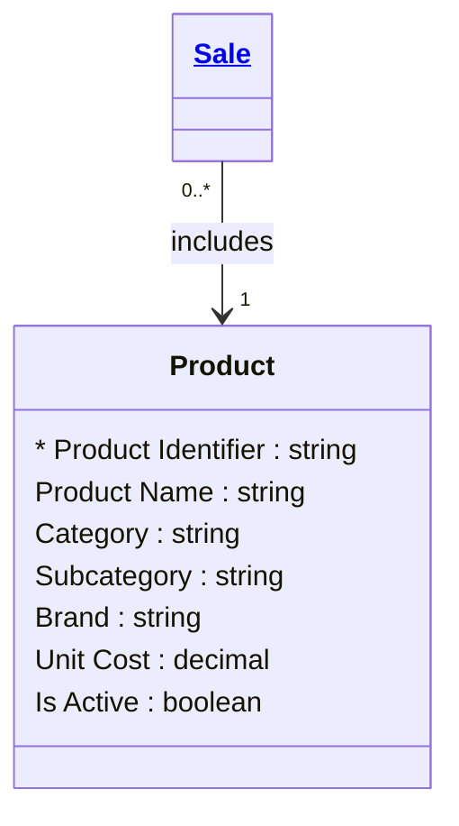

# [Retail Sales (Brownfield)](../domain.md)

## Entities

### Product

A retail product available for sale, including its category classification, brand, and cost information. The Product entity represents the canonical definition of items in the retail catalogue.

This entity was derived from the existing `analytics.dim_product` table in Snowflake. The canonical model strips away SCD2 versioning artefacts (surrogate keys, effective/expiry dates) to focus on the business meaning of a product. See [dim_product baseline](../baselines/dimensional/dim_product.md) for the original dimensional documentation and field-level mapping.



```yaml
existence: independent
mutability: mutable
attributes:
  Product Identifier:
    type: string
    identifier: true
    required: true
    description: Natural key identifying the product, sourced from the POS product master.

  Product Name:
    type: string
    required: true
    description: Display name of the product.

  Category:
    type: string
    required: true
    description: Top-level product category (e.g., Electronics, Apparel, Grocery).

  Subcategory:
    type: string
    required: false
    description: Secondary product category within the top-level category.

  Brand:
    type: string
    required: false
    description: Product brand name.

  Unit Cost:
    type: decimal
    required: true
    description: Cost per unit to the retailer.

  Is Active:
    type: boolean
    required: true
    description: Whether the product is currently available for sale.
```

```yaml
governance:
  classification: Internal
  pii: false
```
