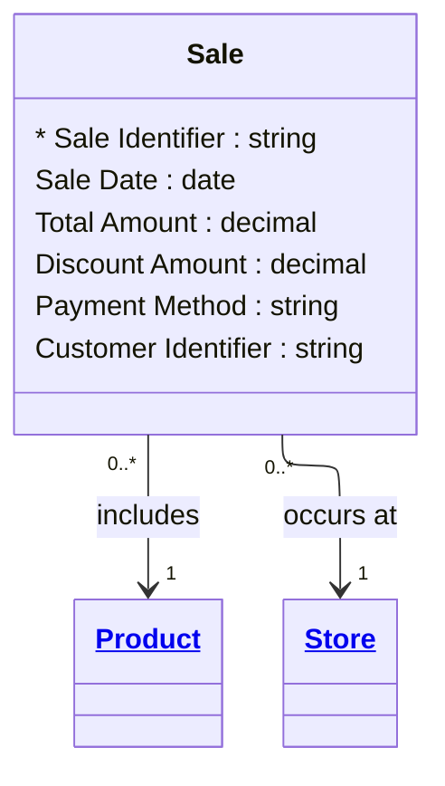

# [Retail Sales (Brownfield)](../domain.md)

## Entities

### Sale

A completed retail sales transaction capturing what was sold, where, when, and for how much. The Sale entity is the central fact of the Retail Sales domain, representing the business event of a customer purchasing a product at a store.

This entity was derived from the existing `analytics.fact_sales` table in Snowflake. The canonical model captures the business meaning of the transaction rather than the dimensional modelling artefacts (surrogate keys, ETL audit columns). See [fact_sales baseline](../baselines/dimensional/fact_sales.md) for the original dimensional documentation and field-level mapping.



```yaml
existence: independent
mutability: immutable
attributes:
  Sale Identifier:
    type: string
    identifier: true
    required: true
    description: Unique identifier for the sales transaction.

  Sale Date:
    type: date
    required: true
    description: Date the sale was completed at the point of sale.

  Total Amount:
    type: decimal
    required: true
    description: Total transaction amount after any discounts have been applied.

  Discount Amount:
    type: decimal
    required: false
    description: Discount applied to the transaction. Null when no discount was applied.

  Payment Method:
    type: string
    required: true
    description: Method of payment used for the transaction. # INFERRED: may be enum — confirm with business whether values are a controlled set (Cash, Credit, Debit, Mobile) or free-text.

  Customer Identifier:
    type: string
    required: false
    description: Loyalty program customer identifier. Only populated for loyalty program members.
```

```yaml
governance:
  classification: Confidential
  pii: true
  pii_fields:
    - Customer Identifier
```

## Relationships

### Sale Includes Product

A Sale transaction references the Product that was sold.

```yaml
source: Sale
type: includes
target: Product
cardinality: many-to-one
granularity: atomic
ownership: Sale
```

### Sale Occurs At Store

A Sale transaction occurs at a specific Store location.

```yaml
source: Sale
type: occurs at
target: Store
cardinality: many-to-one
granularity: atomic
ownership: Sale
```
