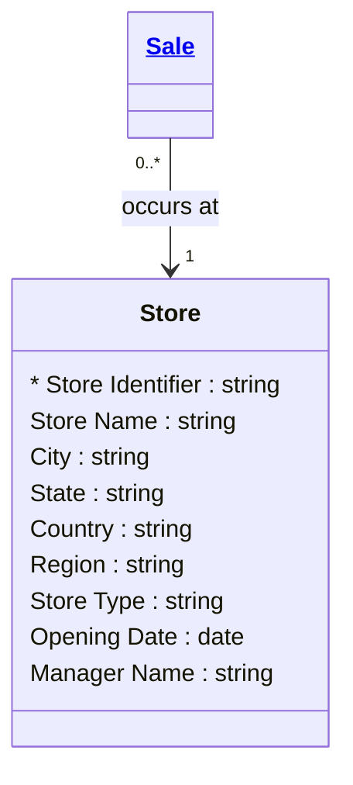

# [Retail Sales (Brownfield)](../domain.md)

## Entities

### Store

A physical retail store location where sales transactions occur. The Store entity captures the geographic and organisational attributes of each retail outlet.

This entity was derived from the existing `analytics.dim_store` table in Snowflake. The canonical model preserves the same attributes as the dimension but names them using natural language conventions. See [dim_store baseline](../baselines/dimensional/dim_store.md) for the original dimensional documentation and field-level mapping.



```yaml
existence: independent
mutability: mutable
attributes:
  Store Identifier:
    type: string
    identifier: true
    required: true
    description: Natural key identifying the store, sourced from the store operations system.

  Store Name:
    type: string
    required: true
    description: Display name of the store.

  City:
    type: string
    required: true
    description: City where the store is located.

  State:
    type: string
    required: true
    description: State or province where the store is located.

  Country:
    type: string
    required: true
    description: Country where the store is located (ISO 3166-1 alpha-2).

  Region:
    type: string
    required: true
    description: Internal business region classification. # TODO: standardise region values — currently inconsistent across stores. Consider creating a Regions enum.

  Store Type:
    type: string
    required: true
    description: Store format classification (e.g., Flagship, Standard, Express, Outlet). # INFERRED: may be enum — confirm with business.

  Opening Date:
    type: date
    required: true
    description: Date the store opened for business.

  Manager Name:
    type: string
    required: false
    description: Name of the current store manager.
```

```yaml
governance:
  classification: Internal
  pii: true
  pii_fields:
    - Manager Name
```
