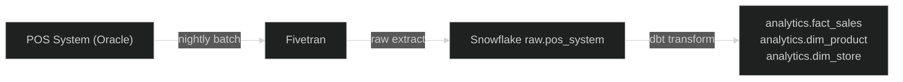

# POS System

The Point of Sale system is the primary operational system for retail transactions. It runs a custom Java application backed by an Oracle database, deployed across all retail store locations. Each store has a local POS instance that syncs to a central Oracle database nightly via batch replication.

The POS system captures every sales transaction, product scan, and payment event in real time at the store level. The nightly batch sync to the central database is the primary extraction point for the data warehouse.

## Metadata

```yaml
id: pos-system
owner: retail.operations@example.com
steward: pos.support@example.com

change_model: batch-daily
change_events:
  - Transaction Completed
  - Product Scanned
  - Payment Processed

update_frequency: daily (nightly batch sync)
data_quality_tier: 2
status: Production
version: "1.0.0"

tags:
  - POS
  - Retail
  - Transactions
```

## [Retail Sales (Brownfield)](../../domain.md) Feeds

Canonical Entity | Attributes Contributed | Change Model
--- | --- | ---
[Sale](../../entities/sale.md#sale) | Sale Identifier, Sale Date, Total Amount, Discount Amount, Payment Method, Customer Identifier | batch-daily
[Product](../../entities/product.md#product) | Product Identifier, Product Name, Category, Subcategory, Brand, Unit Cost, Is Active | batch-daily
[Store](../../entities/store.md#store) | Store Identifier, Store Name, City, State, Country, Region, Store Type, Opening Date, Manager Name | batch-daily

### Source Overview Diagram


