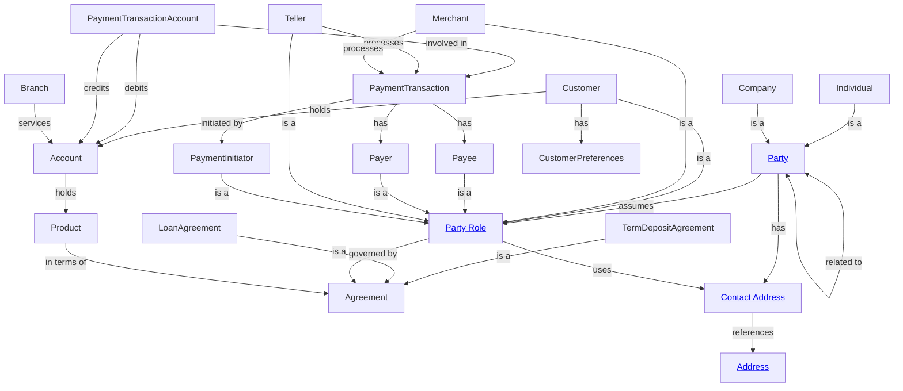

# Financial Crime

This domain encompasses all concepts required for financial crime detection, investigation, and reporting. It includes party identification, transaction monitoring, relationship analysis, and regulatory compliance for AML (Anti-Money Laundering), KYC (Know Your Customer), and CTF (Counter-Terrorist Financing).

This is a business-aligned domain that draws concepts from BIAN Business Object Model (BOM) rather than mapping directly to BIAN Service Domains.

## Metadata

```yaml
# Accountability
owners:
  - financial.crime@bank.com
stewards:
  - compliance.officer@bank.com
technical_leads:
  - data.architecture@bank.com

# Governance & Security
classification: "Highly Confidential"
pii: true
regulatory_scope:
  - AML (Anti-Money Laundering)
  - KYC (Know Your Customer)
  - CTF (Counter-Terrorist Financing)
  - FATF Recommendations
  - BSA (Bank Secrecy Act)
  - EU 5AMLD / 6AMLD
  - USA PATRIOT Act
default_retention: "10 years post relationship end"

# Lifecycle & Discovery  
status: "Production"
version: "1.0.0"
tags:
  - Compliance
  - Risk
  - Regulatory
  - Core
source_systems:
  - "Core Banking System"
  - "Transaction Monitoring System"
  - "CRM"
  - "Payment Systems"
```



## Entities

### Party
The abstract representation of any individual or organization that can participate in financial activities. In BIAN BOM, Party is the core business object that abstracts concepts like customer, correspondent, and supplier.
- detail: [Party](entities/party.md)
- references: [BIAN BOM - Party](https://bian-modelapi-v4.azurewebsites.net/BOClassByName/Party)

### Individual
A natural person who participates in financial activities.
- specializes: [Party](entities/party.md)
- detail: [Individual](entities/individual.md)
- references: [BIAN BOM - Individual](https://bian-modelapi-v4.azurewebsites.net/BOClassByName/Individual)

### Company
An organization, corporation, or other legally recognized entity. Also referred to as Legal Entity or Organisation in BIAN.
- specializes: [Party](entities/party.md)
- detail: [Company](entities/company.md)
- references: [BIAN BOM - Legal Entity](https://bian-modelapi-v4.azurewebsites.net/BOClassByName/LegalEntity)

### Party Role
The abstract representation of a Party's involvement in a specific business context. Serves as base for specific role types like Customer, Merchant, Creditor, etc.
- detail: [Party Role](entities/party-role.md)
- references: [BIAN BOM - Party Role](https://bian-modelapi-v4.azurewebsites.net/BOClassByName/PartyRole)

### Customer
A Party that holds accounts, uses products/services, or has an active relationship with the institution. First-class business concept with distinct ownership and governance.
- specializes: [Party Role](entities/party-role.md)
- detail: [Customer](entities/customer.md)
- references: [BIAN BOM - Party Role](https://bian-modelapi-v4.azurewebsites.net/BOClassByName/PartyRole)

### Merchant
A Party that accepts payments for goods or services, typically through the institution's payment systems.
- specializes: [Party Role](entities/party-role.md)
- detail: [Merchant](entities/merchant.md)
- references: [BIAN BOM - Party Role](https://bian-modelapi-v4.azurewebsites.net/BOClassByName/PartyRole)

### Creditor
A Party to whom money is owed in a transaction or agreement.
- specializes: [Party Role](entities/party-role.md)
- detail: [Creditor](entities/creditor.md)
- references: [BIAN BOM - Party Role](https://bian-modelapi-v4.azurewebsites.net/BOClassByName/PartyRole)

### Debtor
A Party who owes money in a transaction or agreement.
- specializes: [Party Role](entities/party-role.md)
- detail: [Debtor](entities/debtor.md)
- references: [BIAN BOM - Party Role](https://bian-modelapi-v4.azurewebsites.net/BOClassByName/PartyRole)

### Teller
A bank employee who processes customer transactions at a branch location.
- specializes: [Party Role](entities/party-role.md)
- detail: [Teller](entities/teller.md)
- references: [BIAN BOM - Party Role](https://bian-modelapi-v4.azurewebsites.net/BOClassByName/PartyRole)

### Instructing Agent
A Party that instructs or initiates a transaction on behalf of another party.
- specializes: [Party Role](entities/party-role.md)
- detail: [Instructing Agent](entities/instructing-agent.md)
- references: [BIAN BOM - Party Role](https://bian-modelapi-v4.azurewebsites.net/BOClassByName/PartyRole)

### Account
A financial account held with the institution.
- detail: [Account](entities/account.md)
- references: [BIAN BOM - Account](https://bian-modelapi-v4.azurewebsites.net/BOClassByName/Account)

### Contact Address
Physical, postal, or electronic address associated with a Party.
- detail: [Contact Address](entities/contact-address.md)
- references: [BIAN BOM - Contact Point](https://bian-modelapi-v4.azurewebsites.net/BOClassByName/ContactPoint)

### Customer Preferences
Customer-specific settings for communication, privacy, and interaction preferences.
- detail: [Customer Preferences](entities/customer-preferences.md)
- references: [BIAN BOM - Party Preference](https://bian-modelapi-v4.azurewebsites.net/BOClassByName/PartyPreference)

### Product
A financial product or service offered by the institution.
- detail: [Product](entities/product.md)
- references: [BIAN BOM - Product](https://bian-modelapi-v4.azurewebsites.net/BOClassByName/Product)

### Contract
A formal agreement between the institution and one or more Parties. In BIAN called Agreement or Arrangement.
- detail: [Contract](entities/contract.md)
- references: [BIAN BOM - Agreement](https://bian-modelapi-v4.azurewebsites.net/BOClassByName/Agreement)

### Term Deposit Contract
A contract for a term deposit product.
- specializes: [Contract](entities/contract.md)
- detail: [Term Deposit Contract](entities/term-deposit-contract.md)
- references: [BIAN BOM - Agreement](https://bian-modelapi-v4.azurewebsites.net/BOClassByName/Agreement)

### Loan Contract
A contract for a loan product.
- specializes: [Contract](entities/contract.md)
- detail: [Loan Contract](entities/loan-contract.md)
- references: [BIAN BOM - Loan Agreement](https://bian-modelapi-v4.azurewebsites.net/BOClassByName/LoanAgreement)

### Transaction
A financial transaction involving the movement of funds.
- detail: [Transaction](entities/transaction.md)
- references: [BIAN BOM - Payment](https://bian-modelapi-v4.azurewebsites.net/BOClassByName/Payment)

### Currency
A currency recognized by the system for transactions and positions.
- detail: [Currency](entities/currency.md)
- references: [BIAN BOM - Currency](https://bian-modelapi-v4.azurewebsites.net/BOClassByName/Currency)

### Exchange Rate
The rate at which one currency can be exchanged for another at a specific point in time.
- detail: [Exchange Rate](entities/exchange-rate.md)
- references: [BIAN BOM - Exchange Rate](https://bian-modelapi-v4.azurewebsites.net/BOClassByName/ExchangeRate)

### Branch
A physical or operational branch of the financial institution. In BIAN called Location.
- detail: [Branch](entities/branch.md)
- references: [BIAN BOM - Location](https://bian-modelapi-v4.azurewebsites.net/BOClassByName/Location)

## Enums

### Party Type
Classification of parties as Individual or Legal Entity (Company).
- detail: [Party Type](enums/party-type.md)
- references: [BIAN BOM - Party](https://bian-modelapi-v4.azurewebsites.net/BOClassByName/Party)

### Legal Entity Type
Classification of legal entities by corporate structure (Corporation, Partnership, Trust, etc.).
- detail: [Legal Entity Type](enums/legal-entity-type.md)
- references: [BIAN BOM - Legal Entity](https://bian-modelapi-v4.azurewebsites.net/BOClassByName/LegalEntity)

### Contract Type
Types of contracts (Loan, Deposit, Investment, etc.).
- detail: [Contract Type](enums/contract-type.md)
- references: [BIAN BOM - Agreement](https://bian-modelapi-v4.azurewebsites.net/BOClassByName/Agreement)

### Account Status
Current status of an account (Active, Dormant, Frozen, Closed).
- detail: [Account Status](enums/account-status.md)
- references: [BIAN BOM - Account](https://bian-modelapi-v4.azurewebsites.net/BOClassByName/Account)

### Transaction Type
Classification of transaction types (Wire Transfer, ACH, Card Payment, Cash Deposit, etc.).
- detail: [Transaction Type](enums/transaction-type.md)
- references: [BIAN BOM - Payment](https://bian-modelapi-v4.azurewebsites.net/BOClassByName/Payment)

### Risk Rating
Risk level assessment values (Low, Medium, High, Very High, Prohibited).
- detail: [Risk Rating](enums/risk-rating.md)
- references: [BIAN BOM - Rating](https://bian-modelapi-v4.azurewebsites.net/BOClassByName/Rating)

## Relationships

### Party Assumes Roles
A Party can assume multiple Party Roles (Customer, Merchant, Creditor, etc.) across different contexts and time periods.
- detail: [Party Assumes Roles](relationships/party-assumes-roles.md)
- references: [BIAN BOM - Party Role](https://bian-modelapi-v4.azurewebsites.net/BOClassByName/PartyRole)

### Party Has Contact Addresses
A Party can have multiple contact addresses for different purposes.
- detail: [Party Has Contact Addresses](relationships/party-has-contact-addresses.md)
- references: [BIAN BOM - Contact Point](https://bian-modelapi-v4.azurewebsites.net/BOClassByName/ContactPoint)

### Customer Holds Account
A Customer can hold one or more Accounts.
- detail: [Customer Holds Account](relationships/customer-holds-account.md)
- references: [BIAN BOM - Account](https://bian-modelapi-v4.azurewebsites.net/BOClassByName/Account)

### Customer Has Preferences
A Customer has associated preferences for communication and interaction.
- detail: [Customer Has Preferences](relationships/customer-has-preferences.md)
- references: [BIAN BOM - Party Preference](https://bian-modelapi-v4.azurewebsites.net/BOClassByName/PartyPreference)

### Contract Involves Party Roles
Contracts involve multiple Parties in specific roles (Customer as borrower, Company as guarantor, etc.).
- detail: [Contract Involves Party Roles](relationships/contract-involves-party-roles.md)
- references: [BIAN BOM - Agreement](https://bian-modelapi-v4.azurewebsites.net/BOClassByName/Agreement)

### Transaction Has Debtor
A Transaction has one or more Debtors (parties from whom funds are debited).
- detail: [Transaction Has Debtor](relationships/transaction-has-debtor.md)
- references: [BIAN BOM - Payment](https://bian-modelapi-v4.azurewebsites.net/BOClassByName/Payment)

### Transaction Has Creditor
A Transaction has one or more Creditors (parties to whom funds are credited).
- detail: [Transaction Has Creditor](relationships/transaction-has-creditor.md)
- references: [BIAN BOM - Payment](https://bian-modelapi-v4.azurewebsites.net/BOClassByName/Payment)

### Transaction Initiated By Instructing Agent
An Instructing Agent initiates or instructs a transaction.
- detail: [Transaction Initiated By Instructing Agent](relationships/transaction-initiated-by-instructing-agent.md)
- references: [BIAN BOM - Payment](https://bian-modelapi-v4.azurewebsites.net/BOClassByName/Payment)

### Teller Processes Transaction
A Teller processes transactions at a branch location.
- detail: [Teller Processes Transaction](relationships/teller-processes-transaction.md)
- references: [BIAN BOM - Payment](https://bian-modelapi-v4.azurewebsites.net/BOClassByName/Payment)

### Merchant Receives Payment
A Merchant receives payment through transactions.
- detail: [Merchant Receives Payment](relationships/merchant-receives-payment.md)
- references: [BIAN BOM - Payment](https://bian-modelapi-v4.azurewebsites.net/BOClassByName/Payment)

### Account Holds Product
An Account is an instance of a Product.
- detail: [Account Holds Product](relationships/account-holds-product.md)
- references: [BIAN BOM - Account](https://bian-modelapi-v4.azurewebsites.net/BOClassByName/Account)

### Branch Services Account
Accounts are serviced by a specific Branch (Location).
- detail: [Branch Services Account](relationships/branch-services-account.md)
- references: [BIAN BOM - Location](https://bian-modelapi-v4.azurewebsites.net/BOClassByName/Location)

## Events

### Party Role Assigned
Emitted when a Party assumes a new role (becomes a Customer, Merchant, etc.).
- detail: [Party Role Assigned](events/party-role-assigned.md)
- references: [BIAN BOM - Party Role](https://bian-modelapi-v4.azurewebsites.net/BOClassByName/PartyRole)

### Customer Onboarded
Emitted when a new Customer relationship is established.
- detail: [Customer Onboarded](events/customer-onboarded.md)
- references: [BIAN BOM - Party Role](https://bian-modelapi-v4.azurewebsites.net/BOClassByName/PartyRole)

### Transaction Executed
Emitted when a financial transaction is successfully executed.
- detail: [Transaction Executed](events/transaction-executed.md)
- references: [BIAN BOM - Payment](https://bian-modelapi-v4.azurewebsites.net/BOClassByName/Payment)

### Account Status Changed
Emitted when an account status changes.
- detail: [Account Status Changed](events/account-status-changed.md)
- references: [BIAN BOM - Account](https://bian-modelapi-v4.azurewebsites.net/BOClassByName/Account)

### High Risk Transaction Detected
Emitted when a transaction is flagged as potentially suspicious.
- detail: [High Risk Transaction Detected](events/high-risk-transaction-detected.md)
- references: [BIAN BOM - Payment](https://bian-modelapi-v4.azurewebsites.net/BOClassByName/Payment)

### Contract Activated
Emitted when a contract becomes active and enforceable.
- detail: [Contract Activated](events/contract-activated.md)
- references: [BIAN BOM - Agreement](https://bian-modelapi-v4.azurewebsites.net/BOClassByName/Agreement)

### KYC Status Updated
Emitted when a Party's KYC status is updated.
- detail: [KYC Status Updated](events/kyc-status-updated.md)
- references: [BIAN BOM - Party](https://bian-modelapi-v4.azurewebsites.net/BOClassByName/Party)
```

---
