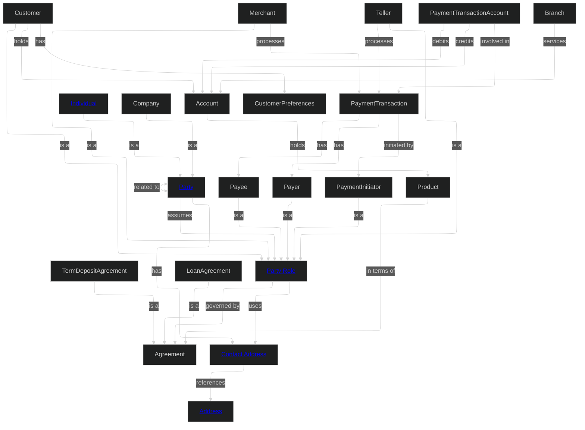

# Financial Crime

This domain encompasses all concepts required for financial crime detection, investigation, and reporting. It includes party identification, transaction monitoring, relationship analysis, and regulatory compliance for AML (Anti-Money Laundering), KYC (Know Your Customer), and CTF (Counter-Terrorist Financing).

This is a business-aligned domain that draws concepts from BIAN Business Object Model (BOM) rather than mapping directly to BIAN Service Domains.

## Metadata

```yaml
# Accountability
owners:
  - financial.crime@bank.com
stewards:
  - compliance.officer@bank.com
technical_leads:
  - data.architecture@bank.com

# Governance & Security
classification: "Highly Confidential"
pii: true
regulatory_scope:
  - AML (Anti-Money Laundering)
  - KYC (Know Your Customer)
  - CTF (Counter-Terrorist Financing)
  - FATF Recommendations
  - BSA (Bank Secrecy Act)
  - EU 5AMLD / 6AMLD
  - USA PATRIOT Act
default_retention: "10 years post relationship end"

# Lifecycle & Discovery
status: "Production"
version: "1.0.0"
tags:
  - Compliance
  - Risk
  - Regulatory
  - Core
source_systems:
  - "Core Banking System"
  - "Transaction Monitoring System"
  - "CRM"
  - "Payment Systems"
```

### Domain Overview Diagram


```mermaid
---
config:
  layout: elk
  elk:
    mergeEdges: false
    nodePlacementStrategy: LINEAR_SEGMENTS
  look: classic
  theme: dark
---
graph TD

  Individual --> |is a|Party
  Company --> |is a|Party
  TermDepositAgreement --> |is a|Agreement
  LoanAgreement --> |is a|Agreement

  Party <--> |related to|Party
  Party --> |assumes|PartyRole

  Customer --> |is a|PartyRole
  Merchant --> |is a|PartyRole
  Payee --> |is a|PartyRole
  Payer --> |is a|PartyRole
  Teller --> |is a|PartyRole
  PaymentInitiator --> |is a|PartyRole

  Party --> |has|ContactAddress
  PartyRole -->|uses|ContactAddress
  Customer --> |holds|Account
  Customer --> |has|CustomerPreferences
  PartyRole --> |governed by|Agreement
  PaymentTransaction --> |has|Payer
  PaymentTransaction --> |has|Payee
  PaymentTransaction --> |initiated by|PaymentInitiator
  PaymentTransactionAccount --> |involved in|PaymentTransaction
  PaymentTransactionAccount --> |debits|Account
  PaymentTransactionAccount --> |credits|Account
  Teller --> |processes|PaymentTransaction
  Merchant --> |processes|PaymentTransaction

  Account --> |holds|Product
  Branch --> |services|Account

  Product --> |in terms of|Agreement
  ContactAddress --> |references|Address

  Party["<a href='entities/party.md'>Party</a>"]
  Individual["<a href='entities/individual.md'>Individual</a>"]
  PartyRole["<a href='entities/party_role.md'>Party Role</a>"]
  Address["<a href='entities/address.md'>Address</a>"]
  ContactAddress["<a href='entities/contact_address.md'>Contact Address</a>"]
```

## Entities

Name | Specializes | Description | Reference
--- | --- | --- | ---
[Party](entities/party.md#party) | | The abstract representation of any individual or organization that can participate in financial activities. Core business object that abstracts concepts like customer, correspondent, and supplier. | [BIAN BOM - Party](https://bian-modelapi-v4.azurewebsites.net/BOClassByName/Party)
[Individual](entities/individual.md#individual) | [Party](entities/party.md#party) | A natural person who participates in financial activities. | [BIAN BOM - Individual](https://bian-modelapi-v4.azurewebsites.net/BOClassByName/Individual)
[Company](entities/company.md#company) | [Party](entities/party.md#party) | An organization, corporation, or other legally recognized entity. Also referred to as Legal Entity or Organisation in BIAN. | [BIAN BOM - Legal Entity](https://bian-modelapi-v4.azurewebsites.net/BOClassByName/LegalEntity)
[Party Role](entities/party_role.md#party-role) | | The abstract representation of a Party's involvement in a specific business context. Serves as base for specific role types like Customer, Merchant, Creditor, etc. | [BIAN BOM - Party Role](https://bian-modelapi-v4.azurewebsites.net/BOClassByName/PartyRole)
[Customer](entities/customer.md#customer) | [Party Role](entities/party_role.md#party-role) | A Party that holds accounts, uses products/services, or has an active relationship with the institution. First-class business concept with distinct ownership and governance. | [BIAN BOM - Party Role](https://bian-modelapi-v4.azurewebsites.net/BOClassByName/PartyRole)
[Merchant](entities/merchant.md#merchant) | [Party Role](entities/party_role.md#party-role) | A Party that accepts payments for goods or services, typically through the institution's payment systems. | [BIAN BOM - Party Role](https://bian-modelapi-v4.azurewebsites.net/BOClassByName/PartyRole)
[Payee](entities/payee.md#payee) | [Party Role](entities/party_role.md#party-role) | A Party to whom money is owed in a transaction or agreement. | [BIAN BOM - Party Role](https://bian-modelapi-v4.azurewebsites.net/BOClassByName/PartyRole)
[Peyer](entities/payer.md#payer) | [Party Role](entities/party_role.md#party-role) | A Party who owes money in a transaction or agreement. | [BIAN BOM - Party Role](https://bian-modelapi-v4.azurewebsites.net/BOClassByName/PartyRole)
[Teller](entities/teller.md#teller) | [Party Role](entities/party_role.md#party-role) | A bank employee who processes customer transactions at a branch location. | [BIAN BOM - Party Role](https://bian-modelapi-v4.azurewebsites.net/BOClassByName/PartyRole)
[Payment Initiator](entities/payment_initiator.md#PaymentInitiator) | [Party Role](entities/party_role.md#party-role) | A Party that instructs or initiates a transaction on behalf of another party. | [BIAN BOM - Party Role](https://bian-modelapi-v4.azurewebsites.net/BOClassByName/PartyRole)
[Account](entities/account.md#account) | | A financial account held with the institution. | [BIAN BOM - Account](https://bian-modelapi-v4.azurewebsites.net/BOClassByName/Account)
[Contact Address](entities/contact_address.md#contact-address) | | Physical, postal, or electronic address associated with a Party. | [BIAN BOM - Contact Point](https://bian-modelapi-v4.azurewebsites.net/BOClassByName/ContactPoint)
[Customer Preferences](entities/customer-preferences.md#customer-preferences) | | Customer-specific settings for communication, privacy, and interaction preferences. | [BIAN BOM - Party Preference](https://bian-modelapi-v4.azurewebsites.net/BOClassByName/PartyPreference)
[Product](entities/product.md#product) | | A financial product or service offered by the institution. | [BIAN BOM - Product](https://bian-modelapi-v4.azurewebsites.net/BOClassByName/Product)
[Agreement](entities/agreement.md#agreement) | | A formal agreement between the institution and one or more Parties. In BIAN called Agreement or Arrangement. | [BIAN BOM - Agreement](https://bian-modelapi-v4.azurewebsites.net/BOClassByName/Agreement)
[Term Deposit Agreement](entities/term-deposit-agreement.md#term-deposit-agreement) | [Agreement](entities/agreement.md#agreement) | An agreement for a term deposit product. | [BIAN BOM - Agreement](https://bian-modelapi-v4.azurewebsites.net/BOClassByName/Agreement)
[Loan Agreement](entities/loan-agreement.md#LoanAgreement) | [Agreement](entities/agreement.md#agreement) | An agreement for a loan product. | [BIAN BOM - Loan Agreement](https://bian-modelapi-v4.azurewebsites.net/BOClassByName/LoanAgreement)
[Transaction](entities/transaction.md#transaction) | | A financial transaction involving the movement of funds. | [BIAN BOM - Payment](https://bian-modelapi-v4.azurewebsites.net/BOClassByName/Payment)
[Currency](entities/currency.md#currency) | | A currency recognized by the system for transactions and positions. | [BIAN BOM - Currency](https://bian-modelapi-v4.azurewebsites.net/BOClassByName/Currency)
[Exchange Rate](entities/exchange-rate.md#exchange-rate) | | The rate at which one currency can be exchanged for another at a specific point in time. | [BIAN BOM - Exchange Rate](https://bian-modelapi-v4.azurewebsites.net/BOClassByName/ExchangeRate)
[Branch](entities/branch.md#branch) | | A physical or operational branch of the financial institution. In BIAN called Location. | [BIAN BOM - Location](https://bian-modelapi-v4.azurewebsites.net/BOClassByName/Location)

## Enums

Name | Description | Reference
--- | --- | ---
[Party Type](./enums/party_type.md#party-type) | Classification of parties as Individual or Legal Entity (Company). | [BIAN BOM - Party](https://bian-modelapi-v4.azurewebsites.net/BOClassByName/Party)
[Legal Entity Type](./enums/legal_entity_type.md#legal-entity-type) | Classification of legal entities by corporate structure (Corporation, Partnership, Trust, etc.). | [BIAN BOM - Legal Entity](https://bian-modelapi-v4.azurewebsites.net/BOClassByName/LegalEntity)
[Agreement Type](./enums/agreement_type.md#agreement-type) | Types of agreements (Loan, Deposit, Investment, etc.). | [BIAN BOM - Agreement](https://bian-modelapi-v4.azurewebsites.net/BOClassByName/Agreement)
[Account Status](./enums/account_status.md#account-status) | Current status of an account (Active, Dormant, Frozen, Closed). | [BIAN BOM - Account](https://bian-modelapi-v4.azurewebsites.net/BOClassByName/Account)
[Transaction Type](./enums/transaction_type.md#transaction-type) | Classification of transaction types (Wire Transfer, ACH, Card Payment, Cash Deposit, etc.). | [BIAN BOM - Payment](https://bian-modelapi-v4.azurewebsites.net/BOClassByName/Payment)
[Risk Rating](./enums/risk_rating.md#risk-rating) | Risk level assessment values (Low, Medium, High, Very High, Prohibited). | [BIAN BOM - Rating](https://bian-modelapi-v4.azurewebsites.net/BOClassByName/Rating)

## Relationships

Name | Description | Reference
--- | --- | ---
[Party Assumes Roles](./relationships/party-assumes-roles.md#party-assumes-roles) | A Party can assume multiple Party Roles (Customer, Merchant, Creditor, etc.) across different contexts and time periods. | [BIAN BOM - Party Role](https://bian-modelapi-v4.azurewebsites.net/BOClassByName/PartyRole)
[Party Has Contact Addresses](./relationships/party_has_contact_addresses.md#party-has-contact-addresses) | A Party can have multiple contact addresses for different purposes. | [BIAN BOM - Contact Point](https://bian-modelapi-v4.azurewebsites.net/BOClassByName/ContactPoint)
[Customer Holds Account](./relationships/customer_holds_account.md#customer-holds-account) | A Customer can hold one or more Accounts. | [BIAN BOM - Account](https://bian-modelapi-v4.azurewebsites.net/BOClassByName/Account)
[Customer Has Preferences](./relationships/customer_has_preferences.md#customer-has-preferences) | A Customer has associated preferences for communication and interaction. | [BIAN BOM - Party Preference](https://bian-modelapi-v4.azurewebsites.net/BOClassByName/PartyPreference)
[Agreement Involves Party Roles](./relationships/agreement_involves_party_roles.md#agreement-involves-party-roles) | Agreements involve multiple Parties in specific roles (Customer as borrower, Company as guarantor, etc.). | [BIAN BOM - Agreement](https://bian-modelapi-v4.azurewebsites.net/BOClassByName/Agreement)
[Transaction Has Debtor](./relationships/transaction_has_debtor.md#transaction-has-debtor) | A Transaction has one or more Debtors (parties from whom funds are debited). | [BIAN BOM - Payment](https://bian-modelapi-v4.azurewebsites.net/BOClassByName/Payment)
[Transaction Has Creditor](./relationships/transaction_has_creditor.md#transaction-has-creditor) | A Transaction has one or more Creditors (parties to whom funds are credited). | [BIAN BOM - Payment](https://bian-modelapi-v4.azurewebsites.net/BOClassByName/Payment)
[Transaction Initiated By Instructing Agent](./relationships/transaction_initiated_by_instructing-agent.md#transaction-initiated-by-instructing-agent) | An Instructing Agent initiates or instructs a transaction on behalf of another party. | [BIAN BOM - Payment](https://bian-modelapi-v4.azurewebsites.net/BOClassByName/Payment)
[Teller Processes Transaction](./relationships/teller_processes_transaction.md#teller-processes-transaction) | A Teller processes transactions at a branch location. | [BIAN BOM - Payment](https://bian-modelapi-v4.azurewebsites.net/BOClassByName/Payment)
[Merchant Receives Payment](./relationships/merchant_receives_payment.md#merchant-receives-payment) | A Merchant receives payment through transactions. | [BIAN BOM - Payment](https://bian-modelapi-v4.azurewebsites.net/BOClassByName/Payment)
[Account Holds Product](./relationships/account_holds_product.md#account-holds-product) | An Account is an instance of a Product. | [BIAN BOM - Account](https://bian-modelapi-v4.azurewebsites.net/BOClassByName/Account)
[Branch Services Account](./relationships/branch_services_account.md#branch-services-account) | Accounts are serviced by a specific Branch (Location). | [BIAN BOM - Location](https://bian-modelapi-v4.azurewebsites.net/BOClassByName/Location)

## Events

Name | Actor | Entity | Description
--- | --- | --- | ---
[Party Role Assigned](events/party-role-assigned.md#party-role-assigned) | Party | Party Role | Emitted when a Party assumes a new role (becomes a Customer, Merchant, etc.).
[Customer Onboarded](events/customer-onboarded.md#customer-onboarded) | Party | Customer | Emitted when a new Customer relationship is established.
[Transaction Executed](events/transaction-executed.md#transaction-executed) | Instructing Agent | Transaction | Emitted when a financial transaction is successfully executed.
[Account Status Changed](events/account-status-changed.md#account-status-changed) | Customer | Account | Emitted when an account status changes (e.g. Active → Frozen).
[High Risk Transaction Detected](events/high-risk-transaction-detected.md#high-risk-transaction-detected) | Transaction Monitoring System | Transaction | Emitted when a transaction is flagged as potentially suspicious.
[Agreement Activated](events/agreement-activated.md#agreement-activated) | Party Role | Agreement | Emitted when an agreement becomes active and enforceable.
[KYC Status Updated](events/kyc-status-updated.md#kyc-status-updated) | Compliance Officer | Party | Emitted when a Party's KYC status is updated.

---
