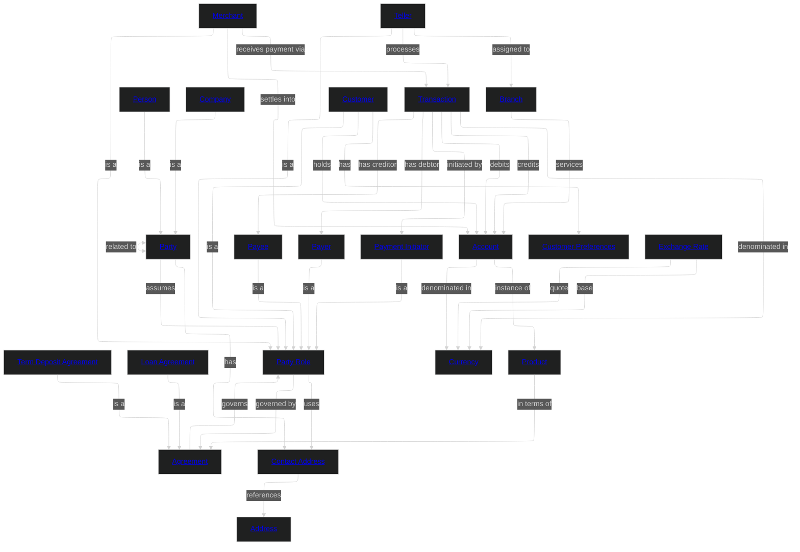

# Financial Crime

This domain encompasses all concepts required for financial crime detection, investigation, and reporting. It includes party identification, transaction monitoring, relationship analysis, and regulatory compliance for AML (Anti-Money Laundering), KYC (Know Your Customer), and CTF (Counter-Terrorist Financing).

This is a business-aligned domain that draws concepts from BIAN Business Object Model (BOM) rather than mapping directly to BIAN Service Domains.

## Metadata

```yaml
# Accountability
owners:
  - financial.crime@bank.com
stewards:
  - compliance.officer@bank.com
technical_leads:
  - data.architecture@bank.com

# Governance & Security
classification: "Highly Confidential"
pii: true
regulatory_scope:
  - AML (Anti-Money Laundering)
  - KYC (Know Your Customer)
  - CTF (Counter-Terrorist Financing)
  - FATF Recommendations
  - BSA (Bank Secrecy Act)
  - EU 5AMLD / 6AMLD
  - USA PATRIOT Act
default_retention: "10 years post relationship end"

# Lifecycle & Discovery
status: "Active"
version: "1.0.0"
tags:
  - Compliance
  - Risk
  - Regulatory
  - Core
```

### Domain Overview Diagram


```mermaid
---
config:
  layout: elk
  elk:
    mergeEdges: false
    nodePlacementStrategy: LINEAR_SEGMENTS
  look: classic
  theme: dark
---
graph TD

  Person --> |is a|Party
  Company --> |is a|Party
  TermDepositAgreement --> |is a|Agreement
  LoanAgreement --> |is a|Agreement

  Party <--> |related to|Party
  Party --> |assumes|PartyRole

  Customer --> |is a|PartyRole
  Merchant --> |is a|PartyRole
  Payee --> |is a|PartyRole
  Payer --> |is a|PartyRole
  Teller --> |is a|PartyRole
  PaymentInitiator --> |is a|PartyRole

  Party --> |has|ContactAddress
  PartyRole --> |uses|ContactAddress
  Customer --> |holds|Account
  Customer --> |has|CustomerPreferences
  PartyRole --> |governed by|Agreement
  
  Transaction --> |has debtor|Payer
  Transaction --> |has creditor|Payee
  Transaction --> |initiated by|PaymentInitiator
  Transaction --> |denominated in|Currency
  Transaction --> |debits|Account
  Transaction --> |credits|Account
  
  Teller --> |processes|Transaction
  Teller --> |assigned to|Branch
  Merchant --> |receives payment via|Transaction
  Merchant --> |settles into|Account

  Account --> |instance of|Product
  Account --> |denominated in|Currency
  Branch --> |services|Account

  Product --> |in terms of|Agreement
  Agreement --> |governs|PartyRole
  
  ContactAddress --> |references|Address

  ExchangeRate --> |base|Currency
  ExchangeRate --> |quote|Currency
  
  Party["<a href='entities/party.md'>Party</a>"]
  Person["<a href='entities/person.md'>Person</a>"]
  Company["<a href='entities/company.md'>Company</a>"]
  PartyRole["<a href='entities/party_role.md'>Party Role</a>"]
  Customer["<a href='entities/customer.md'>Customer</a>"]
  Merchant["<a href='entities/merchant.md'>Merchant</a>"]
  Payer["<a href='entities/payer.md'>Payer</a>"]
  Payee["<a href='entities/payee.md'>Payee</a>"]
  Teller["<a href='entities/teller.md'>Teller</a>"]
  PaymentInitiator["<a href='entities/payment_initiator.md'>Payment Initiator</a>"]  
  Address["<a href='entities/address.md'>Address</a>"]
  ContactAddress["<a href='entities/contact_address.md'>Contact Address</a>"]
  CustomerPreferences["<a href='entities/customer-preferences.md'>Customer Preferences</a>"]
  Account["<a href='entities/account.md'>Account</a>"]
  Product["<a href='entities/product.md'>Product</a>"]
  Agreement["<a href='entities/agreement.md'>Agreement</a>"]
  LoanAgreement["<a href='entities/loan-agreement.md'>Loan Agreement</a>"]
  TermDepositAgreement["<a href='entities/term-deposit-agreement.md'>Term Deposit Agreement</a>"]
  Transaction["<a href='entities/transaction.md'>Transaction</a>"]
  Branch["<a href='entities/branch.md'>Branch</a>"]
  Currency["<a href='entities/currency.md'>Currency</a>"]
  ExchangeRate["<a href='entities/exchange-rate.md'>Exchange Rate</a>"]
```

## Source Systems

Business Application | Platform | Capability Domain
--- | --- | ---
[Temenos Payment](sources/temenos-payment/source.md) | Temenos SaaS | Payment Execution
[SAP Fraud Management](sources/sap-fraud-management/source.md) | SAP | Fraud
[Salesforce CRM](sources/salesforce-crm/source.md) | Salesforce | Customer Relationship Management

## Entities

Name | Specializes | Description | Reference
--- | --- | --- | ---
[Party](entities/party.md#party) | | The abstract representation of any individual or organization that can participate in financial activities. Core business object that abstracts concepts like customer, correspondent, and supplier. | [BIAN BOM - Party](https://bian-modelapi-v4.azurewebsites.net/BOClassByName/Party)
[Person](entities/person.md#person) | [Party](entities/party.md#party) | A natural person who participates in financial activities. | [BIAN BOM - Person](https://bian-modelapi-v4.azurewebsites.net/BOClassByName/Person)
[Company](entities/company.md#company) | [Party](entities/party.md#party) | An organization, corporation, or other legally recognized entity. Also referred to as Legal Entity or Organisation in BIAN. | [BIAN BOM - Legal Entity](https://bian-modelapi-v4.azurewebsites.net/BOClassByName/LegalEntity)
[Party Role](entities/party_role.md#party-role) | | The abstract representation of a Party's involvement in a specific business context. Serves as base for specific role types like Customer, Merchant, Creditor, etc. | [BIAN BOM - Party Role](https://bian-modelapi-v4.azurewebsites.net/BOClassByName/PartyRole)
[Customer](entities/customer.md#customer) | [Party Role](entities/party_role.md#party-role) | A Party that holds accounts, uses products/services, or has an active relationship with the institution. First-class business concept with distinct ownership and governance. | [BIAN BOM - Party Role](https://bian-modelapi-v4.azurewebsites.net/BOClassByName/PartyRole)
[Merchant](entities/merchant.md#merchant) | [Party Role](entities/party_role.md#party-role) | A Party that accepts payments for goods or services, typically through the institution's payment systems. | [BIAN BOM - Party Role](https://bian-modelapi-v4.azurewebsites.net/BOClassByName/PartyRole)
[Payee](entities/payee.md#payee) | [Party Role](entities/party_role.md#party-role) | A Party to whom money is owed in a transaction or agreement. | [BIAN BOM - Party Role](https://bian-modelapi-v4.azurewebsites.net/BOClassByName/PartyRole)
[Payer](entities/payer.md#payer) | [Party Role](entities/party_role.md#party-role) | A Party who owes money in a transaction or agreement. | [BIAN BOM - Party Role](https://bian-modelapi-v4.azurewebsites.net/BOClassByName/PartyRole)
[Teller](entities/teller.md#teller) | [Party Role](entities/party_role.md#party-role) | A bank employee who processes customer transactions at a branch location. | [BIAN BOM - Party Role](https://bian-modelapi-v4.azurewebsites.net/BOClassByName/PartyRole)
[Payment Initiator](entities/payment_initiator.md#payment-initiator) | [Party Role](entities/party_role.md#party-role) | A Party that instructs or initiates a transaction on behalf of another party. | [BIAN BOM - Party Role](https://bian-modelapi-v4.azurewebsites.net/BOClassByName/PartyRole)
[Account](entities/account.md#account) | | A financial account held with the institution. | [BIAN BOM - Account](https://bian-modelapi-v4.azurewebsites.net/BOClassByName/Account)
[Contact Address](entities/contact_address.md#contact-address) | | Physical, postal, or electronic address associated with a Party. | [BIAN BOM - Contact Point](https://bian-modelapi-v4.azurewebsites.net/BOClassByName/ContactPoint)
[Address](entities/address.md#address) | | The canonical record of a physical or postal location. Reference data shared across parties — a single Address record is referenced by all Contact Addresses at that location, enabling network analysis without fuzzy matching. | [BIAN BOM - Location](https://bian-modelapi-v4.azurewebsites.net/BOClassByName/Location)
[Customer Preferences](entities/customer-preferences.md#customer-preferences) | | Customer-specific settings for communication, privacy, and interaction preferences. | [BIAN BOM - Party Preference](https://bian-modelapi-v4.azurewebsites.net/BOClassByName/PartyPreference)
[Product](entities/product.md#product) | | A financial product or service offered by the institution. | [BIAN BOM - Product](https://bian-modelapi-v4.azurewebsites.net/BOClassByName/Product)
[Agreement](entities/agreement.md#agreement) | | A formal agreement between the institution and one or more Parties. In BIAN called Agreement or Arrangement. | [BIAN BOM - Agreement](https://bian-modelapi-v4.azurewebsites.net/BOClassByName/Agreement)
[Term Deposit Agreement](entities/term-deposit-agreement.md#term-deposit-agreement) | [Agreement](entities/agreement.md#agreement) | An agreement for a term deposit product. | [BIAN BOM - Agreement](https://bian-modelapi-v4.azurewebsites.net/BOClassByName/Agreement)
[Loan Agreement](entities/loan-agreement.md#loan-agreement) | [Agreement](entities/agreement.md#agreement) | An agreement for a loan product. | [BIAN BOM - Loan Agreement](https://bian-modelapi-v4.azurewebsites.net/BOClassByName/LoanAgreement)
[Transaction](entities/transaction.md#transaction) | | A financial transaction involving the movement of funds. | [BIAN BOM - Payment](https://bian-modelapi-v4.azurewebsites.net/BOClassByName/Payment)
[Currency](entities/currency.md#currency) | | A currency recognized by the system for transactions and positions. | [BIAN BOM - Currency](https://bian-modelapi-v4.azurewebsites.net/BOClassByName/Currency)
[Exchange Rate](entities/exchange-rate.md#exchange-rate) | | The rate at which one currency can be exchanged for another at a specific point in time. | [BIAN BOM - Exchange Rate](https://bian-modelapi-v4.azurewebsites.net/BOClassByName/ExchangeRate)
[Branch](entities/branch.md#branch) | | A physical or operational branch of the financial institution. In BIAN called Location. | [BIAN BOM - Location](https://bian-modelapi-v4.azurewebsites.net/BOClassByName/Location)

## Enums

Name | Description | Reference
--- | --- | ---
[Party Status](enums.md#party-status) | Operational status of a party record. | [BIAN BOM - Party](https://bian-modelapi-v4.azurewebsites.net/BOClassByName/Party)
[Financial Crime Risk Rating](enums.md#financial-crime-risk-rating) | Institution-assessed ML/TF risk level for a party. | [BIAN BOM - Rating](https://bian-modelapi-v4.azurewebsites.net/BOClassByName/Rating)
[Sanctions Screen Status](enums.md#sanctions-screen-status) | Outcome of sanctions screening checks. | [BIAN BOM - Party](https://bian-modelapi-v4.azurewebsites.net/BOClassByName/Party)
[Party Role Status](enums.md#party-role-status) | Lifecycle status of a specific party role instance. | [BIAN BOM - Party Role](https://bian-modelapi-v4.azurewebsites.net/BOClassByName/PartyRole)
[Due Diligence Status](enums.md#due-diligence-status) | CDD/EDD completion state for a role. | [BIAN BOM - Party Role](https://bian-modelapi-v4.azurewebsites.net/BOClassByName/PartyRole)
[PEP Status](enums.md#pep-status) | Politically exposed person classification for individuals. | [BIAN BOM - Person](https://bian-modelapi-v4.azurewebsites.net/BOClassByName/Person)
[Address Type](enums.md#address-type) | Structural type of an address record. | [BIAN BOM - Location](https://bian-modelapi-v4.azurewebsites.net/BOClassByName/Location)
[Address Purpose](enums.md#address-purpose) | Business purpose for which a party uses an address. | [BIAN BOM - Contact Point](https://bian-modelapi-v4.azurewebsites.net/BOClassByName/ContactPoint)
[Address Verification Status](enums.md#address-verification-status) | Current verification state of a contact address association. | [BIAN BOM - Contact Point](https://bian-modelapi-v4.azurewebsites.net/BOClassByName/ContactPoint)
[Verification Method](enums.md#verification-method) | Method used to verify an address. | [BIAN BOM - Contact Point](https://bian-modelapi-v4.azurewebsites.net/BOClassByName/ContactPoint)
[Currency Code](enums.md#currency-code) | ISO 4217 currency codes for transaction and account values. | [ISO 4217](https://www.iso.org/iso-4217-currency-codes.html)
[Transaction Type](enums.md#transaction-type) | Payment mechanism and clearing pathway classification. | [BIAN BOM - Payment](https://bian-modelapi-v4.azurewebsites.net/BOClassByName/Payment)
[Transaction Status](enums.md#transaction-status) | Lifecycle state of a transaction from initiation through settlement. | [BIAN BOM - Payment](https://bian-modelapi-v4.azurewebsites.net/BOClassByName/Payment)
[Transaction Channel](enums.md#transaction-channel) | Channel through which a transaction was initiated or processed. | [BIAN BOM - Payment](https://bian-modelapi-v4.azurewebsites.net/BOClassByName/Payment)
[Account Status](enums.md#account-status) | Operational lifecycle state of an account. | [BIAN BOM - Account](https://bian-modelapi-v4.azurewebsites.net/BOClassByName/Account)
[Account Type](enums.md#account-type) | Classification of an account by primary purpose and product characteristics. | [BIAN BOM - Account](https://bian-modelapi-v4.azurewebsites.net/BOClassByName/Account)
[Agreement Status](enums.md#agreement-status) | Lifecycle state of a formal agreement. | [BIAN BOM - Agreement](https://bian-modelapi-v4.azurewebsites.net/BOClassByName/Agreement)
[Contact Preference](enums.md#contact-preference) | Customer's preferred outbound communication channel. | [BIAN BOM - Party Preference](https://bian-modelapi-v4.azurewebsites.net/BOClassByName/PartyPreference)
[Company Legal Structure](enums.md#company-legal-structure) | Legal form under which a company or organisation is constituted. | [BIAN BOM - Legal Entity](https://bian-modelapi-v4.azurewebsites.net/BOClassByName/LegalEntity)
[Association Type](enums.md#association-type) | Nature of the relationship between two parties in a network association. | [BIAN BOM - Party](https://bian-modelapi-v4.azurewebsites.net/BOClassByName/Party)
[Account Holder Type](enums.md#account-holder-type) | Nature of a customer's holding relationship with an account. | [BIAN BOM - Account](https://bian-modelapi-v4.azurewebsites.net/BOClassByName/Account)

## Relationships

Name | Description | Reference
--- | --- | ---
[Party Assumes Roles](entities/party.md#party-assumes-roles) | A Party can assume multiple Party Roles (Customer, Merchant, Creditor, etc.) across different contexts and time periods. | [BIAN BOM - Party Role](https://bian-modelapi-v4.azurewebsites.net/BOClassByName/PartyRole)
[Party Has Contact Addresses](entities/party.md#party-has-contact-addresses) | A Party can have multiple contact addresses for different purposes. | [BIAN BOM - Contact Point](https://bian-modelapi-v4.azurewebsites.net/BOClassByName/ContactPoint)
[Customer Holds Account](entities/customer.md#customer-holds-account) | A Customer can hold one or more Accounts. | [BIAN BOM - Account](https://bian-modelapi-v4.azurewebsites.net/BOClassByName/Account)
[Customer Has Preferences](entities/customer.md#customer-has-preferences) | A Customer has associated preferences for communication and interaction. | [BIAN BOM - Party Preference](https://bian-modelapi-v4.azurewebsites.net/BOClassByName/PartyPreference)
[Party Role Uses Contact Addresses](entities/party_role.md#party-role-uses-contact-addresses) | A Party Role can use one or more contact addresses associated with the Party. | [BIAN BOM - Contact Point](https://bian-modelapi-v4.azurewebsites.net/BOClassByName/ContactPoint)
[Party Role Governed By Agreement](entities/party_role.md#party-role-governed-by-agreement) | A Party Role may be governed by a specific Agreement. | [BIAN BOM - Agreement](https://bian-modelapi-v4.azurewebsites.net/BOClassByName/Agreement)
[Agreement Involves Party Roles](entities/agreement.md#agreement-involves-party-roles) | Agreements involve multiple Parties in specific roles (Customer as borrower, Company as guarantor, etc.). | [BIAN BOM - Agreement](https://bian-modelapi-v4.azurewebsites.net/BOClassByName/Agreement)
[Transaction Has Debtor](entities/transaction.md#transaction-has-debtor) | A Transaction has one or more Debtors (parties from whom funds are debited). | [BIAN BOM - Payment](https://bian-modelapi-v4.azurewebsites.net/BOClassByName/Payment)
[Transaction Has Creditor](entities/transaction.md#transaction-has-creditor) | A Transaction has one or more Creditors (parties to whom funds are credited). | [BIAN BOM - Payment](https://bian-modelapi-v4.azurewebsites.net/BOClassByName/Payment)
[Transaction Initiated By Instructing Agent](entities/transaction.md#transaction-initiated-by-instructing-agent) | An Instructing Agent initiates or instructs a transaction on behalf of another party. | [BIAN BOM - Payment](https://bian-modelapi-v4.azurewebsites.net/BOClassByName/Payment)
[Teller Processes Transaction](entities/teller.md#teller-processes-transaction) | A Teller processes transactions at a branch location. | [BIAN BOM - Payment](https://bian-modelapi-v4.azurewebsites.net/BOClassByName/Payment)
[Merchant Receives Payment](entities/merchant.md#merchant-receives-payment) | A Merchant receives payment through transactions. | [BIAN BOM - Payment](https://bian-modelapi-v4.azurewebsites.net/BOClassByName/Payment)
[Account Holds Product](entities/account.md#account-holds-product) | An Account is an instance of a Product. | [BIAN BOM - Account](https://bian-modelapi-v4.azurewebsites.net/BOClassByName/Account)
[Branch Services Account](entities/branch.md#branch-services-account) | Accounts are serviced by a specific Branch (Location). | [BIAN BOM - Location](https://bian-modelapi-v4.azurewebsites.net/BOClassByName/Location)
[Product In Terms Of Agreement](entities/product.md#product-in-terms-of-agreement) | A Product is defined in terms of an Agreement. | [BIAN BOM - Agreement](https://bian-modelapi-v4.azurewebsites.net/BOClassByName/Agreement)
[Contact Address References Address](entities/contact_address.md#contact-address-references-address) | Each Contact Address references a canonical Address record. | [BIAN BOM - Contact Point](https://bian-modelapi-v4.azurewebsites.net/BOClassByName/ContactPoint)
[Branch Transaction Summary](entities/branch.md#branch-transaction-summary) | Grouped relationship from Branch to Transactions for branch-level fraud analysis. | -
[Party Role At Point In Time](entities/party_role.md#party-role-at-point-in-time) | Period snapshot of Party Role state for regulatory reporting. | -
[Party Related To Party](entities/party.md#party-related-to-party) | A Party may be related to one or more other Parties through ownership, control, family, or association ties. Structural basis for beneficial ownership mapping and PEP network analysis. | [BIAN BOM - Party](https://bian-modelapi-v4.azurewebsites.net/BOClassByName/Party)
[Teller Assigned To Branch](entities/teller.md#teller-assigned-to-branch) | A Teller is assigned to a Branch for operational responsibilities. | [BIAN BOM - Party Role](https://bian-modelapi-v4.azurewebsites.net/BOClassByName/PartyRole)
[Exchange Rate References Base Currency](entities/exchange-rate.md#exchange-rate-references-base-currency) | Each Exchange Rate references one base Currency. | [BIAN BOM - Exchange Rate](https://bian-modelapi-v4.azurewebsites.net/BOClassByName/ExchangeRate)
[Exchange Rate References Quote Currency](entities/exchange-rate.md#exchange-rate-references-quote-currency) | Each Exchange Rate references one quote Currency. | [BIAN BOM - Exchange Rate](https://bian-modelapi-v4.azurewebsites.net/BOClassByName/ExchangeRate)
[Transaction Denominated In Currency](entities/transaction.md#transaction-denominated-in-currency) | A Transaction is denominated in exactly one Currency. | [BIAN BOM - Payment](https://bian-modelapi-v4.azurewebsites.net/BOClassByName/Payment)
[Transaction Has Debit Account](entities/transaction.md#transaction-has-debit-account) | A Transaction debits one internal Account. Null for externally-held debit accounts. | [BIAN BOM - Payment](https://bian-modelapi-v4.azurewebsites.net/BOClassByName/Payment)
[Transaction Has Credit Account](entities/transaction.md#transaction-has-credit-account) | A Transaction credits one internal Account. Null for externally-held credit accounts. | [BIAN BOM - Payment](https://bian-modelapi-v4.azurewebsites.net/BOClassByName/Payment)
[Account Denominated In Currency](entities/account.md#account-denominated-in-currency) | An Account is denominated in exactly one Currency. | [BIAN BOM - Account](https://bian-modelapi-v4.azurewebsites.net/BOClassByName/Account)
[Merchant Has Settlement Account](entities/merchant.md#merchant-has-settlement-account) | A Merchant may have a designated Account for settlement credit. | [BIAN BOM - Party Role](https://bian-modelapi-v4.azurewebsites.net/BOClassByName/PartyRole)

## Events

Name | Actor | Entity | Description
--- | --- | --- | ---
[Party Role Assigned](events/party-role-assigned.md#party-role-assigned) | Party | Party Role | Emitted when a Party assumes a new role (becomes a Customer, Merchant, etc.).
[Customer Onboarded](events/customer-onboarded.md#customer-onboarded) | Party | Customer | Emitted when a new Customer relationship is established.
[Transaction Executed](events/transaction-executed.md#transaction-executed) | Instructing Agent | Transaction | Emitted when a financial transaction is successfully executed.
[Account Status Changed](events/account-status-changed.md#account-status-changed) | Customer | Account | Emitted when an account status changes (e.g. Active → Frozen).
[High Risk Transaction Detected](events/high-risk-transaction-detected.md#high-risk-transaction-detected) | Transaction Monitoring System | Transaction | Emitted when a transaction is flagged as potentially suspicious.
[Agreement Activated](events/agreement-activated.md#agreement-activated) | Party Role | Agreement | Emitted when an agreement becomes active and enforceable.
[KYC Status Updated](events/kyc-status-updated.md#kyc-status-updated) | Compliance Officer | Party | Emitted when a Party's KYC status is updated.

## Data Products

Name | Class | Consumers | Status
--- | --- | --- | ---
[Canonical Party](products/canonical.md#canonical-party) | domain-aligned | Cross-domain Integration | Active
[Transaction Risk Summary](products/analytics.md#transaction-risk-summary) | consumer-aligned | Financial Crime Analytics | Active
[Patient Financial Fraud Detection](products/patient-fraud-detection.md#patient-financial-fraud-detection) | consumer-aligned | Financial Crime Analytics; Enterprise Fraud Operations; Clinical Revenue Integrity | Active
[Salesforce CRM Raw Feed](products/source-feeds.md#salesforce-crm-raw-feed) | source-aligned | Data Engineering | Active
[Party Risk Report (Legacy)](products/party-risk-report-legacy.md#party-risk-report-legacy) | consumer-aligned | Financial Crime Analytics | Deprecated

---
