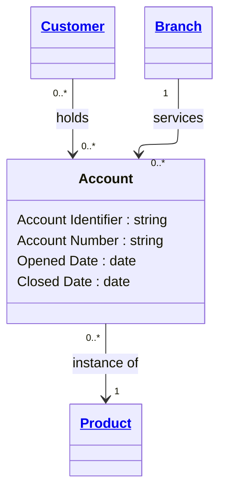

# [Financial Crime](../domain.md)

## Entities

### Account

An Account represents a financial record used to hold balances and process debits and credits for a customer relationship.



```yaml
existence: independent
mutability: slowly_changing
attributes:
  Account Identifier:
    type: string
    identifier: primary
    description: Unique account identifier across systems.

  Account Number:
    type: string
    description: Human-facing account number.

  Opened Date:
    type: date
    description: Date the account was opened.

  Closed Date:
    type: date
    description: Date the account was closed, if applicable.
```

```yaml
governance:
  retention_basis: Inherited from domain default retention of 10 years post relationship end for AML/CTF record-keeping
```

## Relationships

### Account Holds Product

An Account is an instance of one Product definition.

```yaml
source: Account
type: references
target: Product
cardinality: many-to-one
granularity: atomic
ownership: Account
```
