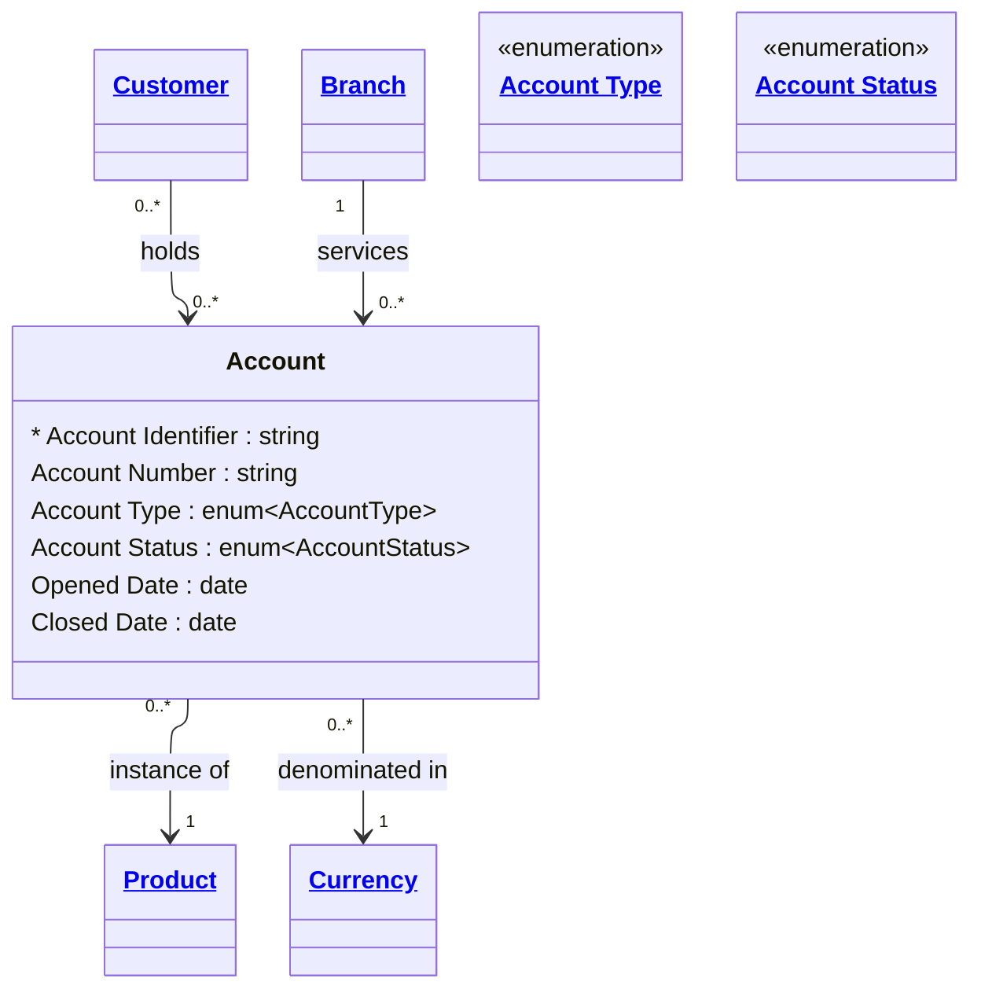

# [Financial Crime](../domain.md)

## Entities

### Account

An Account represents a financial record used to hold balances and process debits and credits for a customer relationship. In a dimensional model, Account is a key slowly-changing dimension — its status, type, and currency are required attributes for transaction risk analytics and account-level monitoring.



```yaml
existence: independent
mutability: slowly_changing
temporal:
  tracking: valid_time
  description: >
    Account status transitions (e.g., Active → Frozen → Active) must be tracked
    with valid time to support point-in-time regulatory queries such as "was this
    account frozen at the time of this transaction?". Opened Date and Closed Date
    serve as the outer valid time boundaries.
attributes:
  Account Identifier:
    type: string
    identifier: primary
    description: >
      Globally unique surrogate identifier for this account across all systems.
      Immutable once assigned.

  Account Number:
    type: string
    description: >
      Human-facing account number as presented to the customer. May follow BSB+account
      format for Australian accounts or IBAN format for international accounts.

  Account Type:
    type: enum:Account Type
    description: >
      Classification of the account by its primary purpose and product characteristics
      (e.g., Savings, Current, Term Deposit, Loan). Used as a dimension key in transaction
      risk analytics — different account types have different expected transaction patterns
      and applicable AML typologies.

  Account Status:
    type: enum:Account Status
    description: >
      The current operational lifecycle state of the account. Frozen and Suspended statuses
      are set by compliance or fraud operations and must be tracked with their effective dates
      to support regulatory audit. Closed accounts must be retained — they must not be deleted.

  Opened Date:
    type: date
    description: >
      Date the account was opened and became operational. Establishes the start of the
      account's valid time period. Used in dormancy calculations and account age risk factors.

  Closed Date:
    type: date
    description: >
      Date the account was permanently closed. A null value indicates the account is still
      open. Accounts must not be deleted — the Closed Date and a status of Closed is the
      only permitted termination mechanism.
```

```yaml
constraints:
  Closed Account Requires Closed Date:
    check: >
      Account Status != 'Closed'
      OR Closed Date IS NOT NULL
    description: >
      An account with status Closed must have a Closed Date recorded to preserve
      valid time integrity.
  Closed Date After Opened Date:
    check: "Closed Date IS NULL OR Closed Date > Opened Date"
    description: >
      An account's closure date must be later than its opening date.
```

```yaml
governance:
  pii: false
  classification: Highly Confidential
  retention: 10 years
  retention_basis: Domain default retention aligned to AML/CTF record-keeping obligations
  description: >
    Account records must be retained for 7 years from Closed Date, aligned to AUSTRAC
    AML/CTF Act 2006 record-keeping obligations. Accounts must not be deleted — closure
    via Closed Date and status update is the only permitted termination mechanism.
  access_role:
    - FINANCIAL_CRIME_ANALYST
    - KYC_OFFICER
    - COMPLIANCE_OFFICER
    - RELATIONSHIP_MANAGER
  compliance_relevance:
    - AUSTRAC AML/CTF Act 2006 — Part B account record-keeping
    - AUSTRAC AML/CTF Amendment Act 2024
    - RBNZ AML/CFT Act 2009 — section 58
    - FATF Recommendation 10 — Customer Due Diligence
```

## Relationships

### Account Holds Product

An Account is an instance of one Product definition.

```yaml
source: Account
type: references
target: Product
cardinality: many-to-one
granularity: atomic
ownership: Account
```

### Account Denominated In Currency
An Account is denominated in exactly one Currency. All balances and transaction amounts on the account are expressed in this currency.
```yaml
source: Account
type: references
target: Currency
cardinality: many-to-one
granularity: atomic
ownership: Account
```
