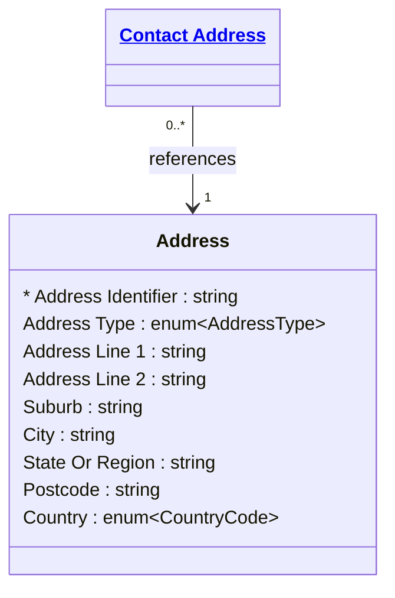

# [Financial Crime](../domain.md)

## Entities

### Address
An Address is the canonical record of a physical or postal location. It holds
only the structured components of the location itself — no party association,
no purpose, no verification metadata. Those belong on Contact Address.

Separating Address from Contact Address enables deduplication: a single Address
record serves as the reference point for all parties associated with that
location. This is significant in a financial crime context — when two or more
unrelated parties share the same Address, that shared reference is a detectable
network signal without requiring any fuzzy address matching across duplicated
strings.

Address records are reference data. They are not owned by any party and must
not be modified when a party changes their address — instead the party's Contact
Address is closed and a new one opened referencing the correct Address record.



```yaml
attributes:
  Address Identifier:
    type: string
    identifier: primary
    description: >
      Globally unique surrogate identifier for this physical location record.
      Immutable once assigned. Multiple parties may reference the same
      Address Identifier via their Contact Address records.

  Address Type:
    type: enum:Address Type
    description: >
      The structural type of the address. Determines which fields are
      applicable — a PO Box does not have Address Line 1 in the same
      sense as a street address, and an Overseas Address may not have
      a State Or Region.

  Address Line 1:
    type: string
    description: >
      The primary street address line, typically including street number
      and street name. For PO Box addresses, the PO Box number.

  Address Line 2:
    type: string
    description: >
      Secondary address line for suite, level, unit, or building name
      where applicable.

  Suburb:
    type: string
    description: >
      The suburb or locality component of the address. Retained as a
      distinct field from City to support Australian and New Zealand
      address formats where suburb and city are separate concepts.

  City:
    type: string
    description: >
      The city or town. For addresses in Australia and New Zealand this
      is typically the metropolitan area (e.g., Sydney, Auckland) where
      distinct from the suburb.

  State Or Region:
    type: string
    description: >
      The state, territory, or region. For Australia: NSW, VIC, QLD, etc.
      For New Zealand: region name. For international addresses: the
      equivalent administrative subdivision.

  Postcode:
    type: string
    description: >
      The postal code. Stored as a string to preserve leading zeros and
      support international formats.

  Country:
    type: enum:Country Code
    description: >
      The country in which the address is located, as an ISO 3166-1
      alpha-2 country code. Mandatory for all address types.
```
```yaml
constraints:
  Country Required:
    not_null: Country
    description: >
      Every address must have a country. Country is the minimum information
      required for jurisdiction risk assessment.

  Street Address Requires Address Line 1:
    check: >
      Address Type != 'Street Address'
      OR Address Line 1 IS NOT NULL
    description: >
      A street address must have at least Address Line 1 populated.
```
```yaml
governance:
  pii: false
  classification: Confidential
  retention: 7 years
  description: >
    Address records must be retained for 7 years from the date the last
    Contact Address referencing this record is closed. Address records
    must not be modified or deleted — they are immutable reference data.
    Changes to an address (e.g., a street renamed) should result in a
    new Address record; existing Contact Address records are not
    retrospectively updated so that historical point-in-time queries
    remain accurate.
  access_role:
    - FINANCIAL_CRIME_ANALYST
    - KYC_OFFICER
    - COMPLIANCE_OFFICER
    - RELATIONSHIP_MANAGER
  compliance_relevance:
    - AUSTRAC AML/CTF Act 2006 — Part B address record-keeping
    - RBNZ AML/CFT Act 2009 — section 58
```
