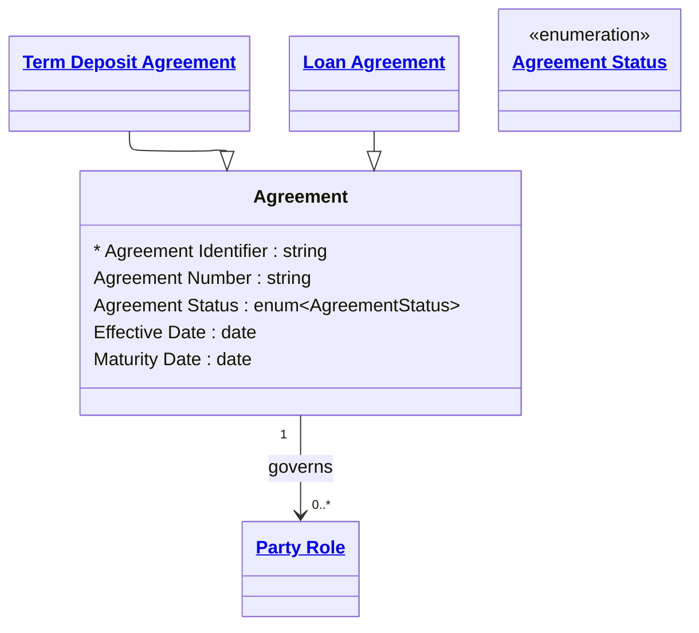

# [Financial Crime](../domain.md)

## Entities

### Agreement

An Agreement defines the formal contractual terms that govern relationships between party roles and financial products.



```yaml
existence: independent
mutability: slowly_changing
attributes:
  Agreement Identifier:
    type: string
    identifier: primary
    description: Unique identifier of the agreement record.

  Agreement Number:
    type: string
    description: Human-facing agreement reference number.

  Agreement Status:
    type: enum:Agreement Status
    description: >
      The current lifecycle state of the agreement. Active agreements govern current
      obligations; Terminated and Matured agreements must be retained for audit. Used
      as a dimension attribute in agreement-level analytics and regulatory reporting
      of active product holdings.

  Effective Date:
    type: date
    description: Date the agreement became enforceable.

  Maturity Date:
    type: date
    description: Date the agreement is scheduled to mature, if applicable.
```

```yaml
governance:
  retention_basis: Inherited from domain default retention of 10 years post relationship end for AML/CTF record-keeping
```

## Relationships

### Agreement Involves Party Roles

An Agreement governs and involves one or more Party Roles participating in the contract.

```yaml
source: Agreement
type: governs
target: Party Role
cardinality: one-to-many
granularity: atomic
ownership: Agreement
```
