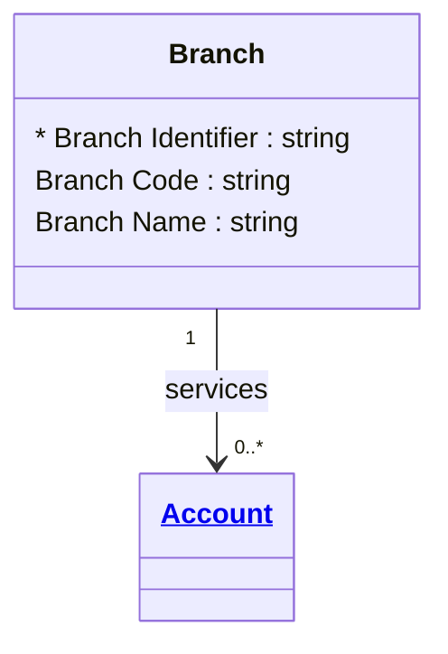

# [Financial Crime](../domain.md)

## Entities

### Branch

A Branch is an operational location responsible for servicing accounts and branch-mediated transactions.



```yaml
existence: independent
mutability: reference
attributes:
  Branch Identifier:
    type: string
    identifier: primary
    description: Unique identifier for the branch location.

  Branch Code:
    type: string
    description: Operational code used to identify the branch.

  Branch Name:
    type: string
    description: Human-readable branch name.
```

```yaml
governance:
  retention_basis: Inherited from domain default retention of 10 years post relationship end for AML/CTF record-keeping
```

## Relationships

### Branch Services Account

A Branch services one or more Accounts.

```yaml
source: Branch
type: has
target: Account
cardinality: one-to-many
granularity: atomic
ownership: Branch
```

### Branch Transaction Summary

A Branch has a grouped relationship to Transactions processed through its serviced Accounts. This supports branch-level aggregated reporting for fraud pattern analysis.

```yaml
source: Branch
type: associates_with
target: Transaction
cardinality: one-to-many
granularity: group
ownership: Branch
```
