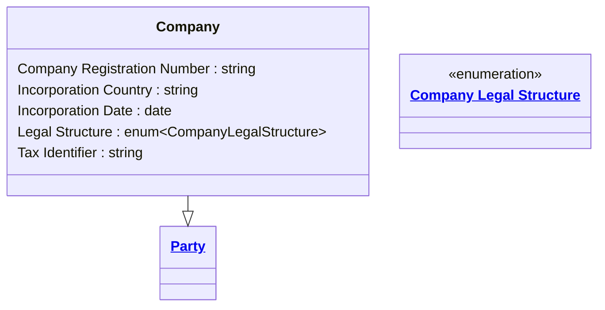

# [Financial Crime](../domain.md)

## Entities

### Company

A Company is a legal entity that participates in financial relationships with the institution. It specialises Party and carries organisation-specific identification and registration attributes.

Company legal structure is a primary AML risk factor. Shell companies, special purpose vehicles, and trusts carry elevated money-laundering risk due to beneficial ownership complexity — structure must be recorded to support risk rating and Enhanced Due Diligence decisions.



```yaml
extends: Party
existence: independent
mutability: slowly_changing
attributes:
  Company Registration Number:
    type: string
    description: >
      Government-issued registration identifier for the legal entity (e.g., ACN for Australian
      companies, NZBN for New Zealand companies). Required for legal entity identification
      under AML/CTF Act 2006 Part B.

  Incorporation Country:
    type: string
    description: >
      ISO 3166-1 alpha-2 country code where the company is incorporated. Used for
      jurisdiction risk scoring — entities incorporated in FATF-listed high-risk
      jurisdictions require Enhanced Due Diligence.

  Incorporation Date:
    type: date
    description: >
      Date the company was formally incorporated. Recently incorporated entities with
      no operating history are a risk signal, particularly when associated with high-value
      or complex transactions.

  Legal Structure:
    type: enum:Company Legal Structure
    description: >
      The legal form under which the company is constituted. Critical for AML risk
      assessment — trusts, special purpose vehicles, and foreign entities carry elevated
      beneficial ownership risk. The legal structure determines which additional due
      diligence obligations apply under the AML/CTF Act 2006 and RBNZ AML/CFT Act 2009.

  Tax Identifier:
    type: string
    description: >
      Tax registration number issued by the relevant revenue authority (e.g., Australian
      Business Number (ABN), New Zealand Business Number (NZBN), US Employer Identification
      Number (EIN)). Used as a supplementary identity verification attribute and cross-reference
      for adverse media and sanction screening.
```
```yaml
constraints:
  Registration Number Required For Active Company:
    not_null: Company Registration Number
    lifecycle_stage: Onboarding
    description: >
      A company must have a valid Company Registration Number before any designated
      service is provided. Required for legal entity identification under AML/CTF Act 2006
      Part B customer identification obligations.
```

```yaml
governance:
  pii: false
  classification: Highly Confidential
  retention: 10 years
  retention_basis: Domain default retention aligned to AML/CTF record-keeping obligations
  description: >
    10-year retention from the end of the business relationship, aligned to AUSTRAC and
    RBNZ record-keeping obligations. The regulatory minimum is 7 years under AUSTRAC
    AML/CTF Act 2006; the domain default of 10 years is applied as the conservative standard.
  access_role:
    - FINANCIAL_CRIME_ANALYST
    - KYC_OFFICER
    - COMPLIANCE_OFFICER
  compliance_relevance:
    - AUSTRAC AML/CTF Act 2006 — Part B legal entity identification
    - AUSTRAC AML/CTF Amendment Act 2024
    - RBNZ AML/CFT Act 2009 — section 14
    - FATF Recommendation 10 — Customer Due Diligence (legal persons)
    - FATF Recommendation 24 — Transparency and beneficial ownership of legal persons
```

## Relationships

No relationships are sourced directly from Company in the current domain model.
