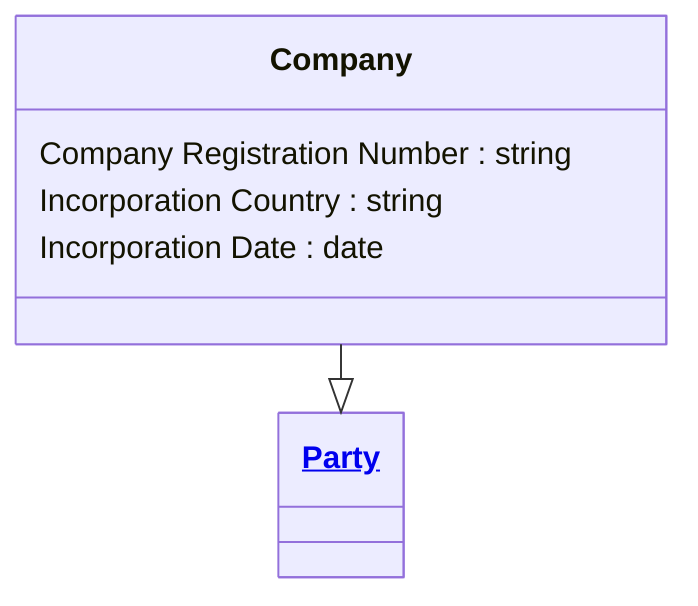

# [Financial Crime](../domain.md)

## Entities

### Company

A Company is a legal entity that participates in financial relationships with the institution. It specialises Party and carries organisation-specific identification and registration attributes.



```yaml
extends: Party
existence: independent
mutability: slowly_changing
attributes:
  Company Registration Number:
    type: string
    description: Government-issued registration identifier for the legal entity.

  Incorporation Country:
    type: string
    description: ISO 3166-1 alpha-2 country code where the company is incorporated.

  Incorporation Date:
    type: date
    description: Date the company was formally incorporated.
```

```yaml
governance:
  retention_basis: Inherited from domain default retention of 10 years post relationship end for AML/CTF record-keeping
```

## Relationships

No relationships are sourced directly from Company in the current domain model.
