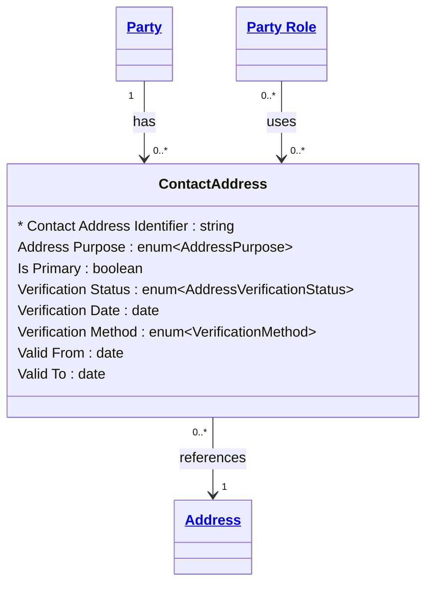

# [Financial Crime](../domain.md)

## Entities

### Contact Address
A Contact Address is the association between a Party and a physical Address,
qualified by purpose, verification status, and the period during which it was
in use. It is not the address itself — the canonical physical location is held
in the Address entity and reused across parties. Contact Address carries only
the metadata that describes *how* and *when* a Party uses a given address.

This separation supports two critical financial crime capabilities. First,
deduplication: if two parties share the same physical address, a single Address
record exists and both Contact Address records point to it, enabling network
analysis queries such as "which other parties are associated with this address".
Second, temporal accuracy: the valid time period on Contact Address allows
point-in-time queries — "what address did this party use at the time of this
transaction" — which is essential for regulatory audit and SAR evidence.

A Party *has* Contact Addresses — it owns the association. A Party Role *uses*
Contact Addresses — a role references which of the party's addresses applies
for the specific purpose of that role. For example, the same Individual may
have a residential address used for identification and a mailing address used
by their Customer role for correspondence.



```yaml
temporal:
  tracking: valid_time
  description: >
    Valid time is carried explicitly as Valid From and Valid To attributes
    rather than relying on the compiler's temporal columns. This allows
    future-dated address changes (e.g. recording a new address before a
    customer moves) and supports point-in-time queries for regulatory audit.
attributes:
  Contact Address Identifier:
    type: string
    identifier: primary
    description: >
      Globally unique surrogate identifier for this party-address association
      instance.

  Address Purpose:
    type: enum:Address Purpose
    description: >
      The purpose for which this address is used by the party. Determines
      regulatory significance — a Residential Address is required for
      individual identification under the AML/CTF Act 2006; a Registered
      Office Address is required for legal entity verification.

  Is Primary:
    type: boolean
    default: false
    description: >
      Indicates whether this is the party's primary contact address for the
      given purpose. A party may have only one primary address per Address
      Purpose at any point in time.

  Verification Status:
    type: enum:Address Verification Status
    description: >
      The current verification status of this address association. Unverified
      addresses must not be used as the sole basis for satisfying AML/CTF
      identification obligations. Expired verification must be renewed at
      the next CDD review.

  Verification Date:
    type: date
    description: >
      The date on which the address was most recently verified against an
      acceptable document or electronic source. Used to determine whether
      re-verification is required at periodic CDD review.

  Verification Method:
    type: enum:Verification Method
    description: >
      The method used to verify this address. Documentary verification
      requires an acceptable identity or address document. Electronic
      verification uses a third-party data source. In-person verification
      is performed at a branch or by a third party.

  Valid From:
    type: date
    description: >
      The date from which the party began using this address for the stated
      purpose. Establishes the start of the valid time period for point-in-time
      queries.

  Valid To:
    type: date
    description: >
      The date on which the party ceased using this address for the stated
      purpose. A null value indicates the address is currently in use. Closed
      associations must not be deleted — Valid To must be set to preserve
      address history for regulatory audit.
```
```yaml
constraints:
  One Primary Per Purpose:
    check: >
      COUNT(Contact Address WHERE Party == this.Party
        AND Address Purpose == this.Address Purpose
        AND Is Primary == true
        AND (Valid To IS NULL OR Valid To >= Today)) <= 1
    description: >
      A party may have at most one primary Contact Address per Address Purpose
      at any point in time.

  Valid To After Valid From:
    check: "Valid To IS NULL OR Valid To > Valid From"
    description: >
      The end of the address validity period must be later than the start.

  Verification Date Required When Verified:
    check: >
      Verification Status != 'Verified'
      OR Verification Date IS NOT NULL
    description: >
      A Contact Address with a status of Verified must have a Verification
      Date recorded.

  Residential Required Before Activation:
    check: >
      EXISTS (Contact Address WHERE Party == this.Party
        AND Address Purpose == 'Residential'
        AND Verification Status == 'Verified')
    lifecycle_stage: Onboarding
    description: >
      An individual party must have at least one verified Residential Address
      before any designated service is provided. Required for identification
      under the AML/CTF Act 2006 Part B individual identification program.
```
```yaml
governance:
  pii: true
  classification: Highly Confidential
  retention: 7 years
  description: >
    Address association records must be retained for 7 years from Valid To
    date, aligned to AUSTRAC and RBNZ record-keeping obligations. Records
    must never be deleted — closure via Valid To is the only permitted
    termination mechanism.
  access_role:
    - FINANCIAL_CRIME_ANALYST
    - KYC_OFFICER
    - COMPLIANCE_OFFICER
    - RELATIONSHIP_MANAGER
  compliance_relevance:
    - AUSTRAC AML/CTF Act 2006 — Part B address identification obligations
    - AUSTRAC AML/CTF Amendment Act 2024
    - RBNZ AML/CFT Act 2009 — section 14
    - FATF Recommendation 10 — Customer Due Diligence
```
