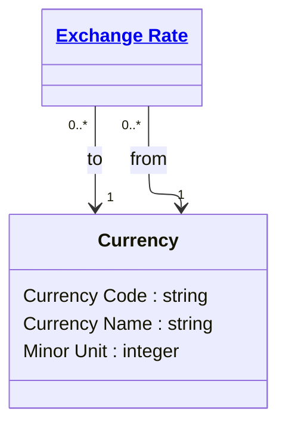

# [Financial Crime](../domain.md)

## Entities

### Currency

Currency defines a recognised monetary unit used for account balances and transactions.



```yaml
existence: independent
mutability: reference
attributes:
  Currency Code:
    type: string
    identifier: primary
    description: ISO 4217 alphabetic currency code.

  Currency Name:
    type: string
    description: Official currency display name.

  Minor Unit:
    type: integer
    description: Number of decimal places used for the currency.
```

```yaml
governance:
  retention_basis: Inherited from domain default retention of 10 years post relationship end for AML/CTF record-keeping
```

## Relationships

No relationships are sourced directly from Currency in the current domain model.
