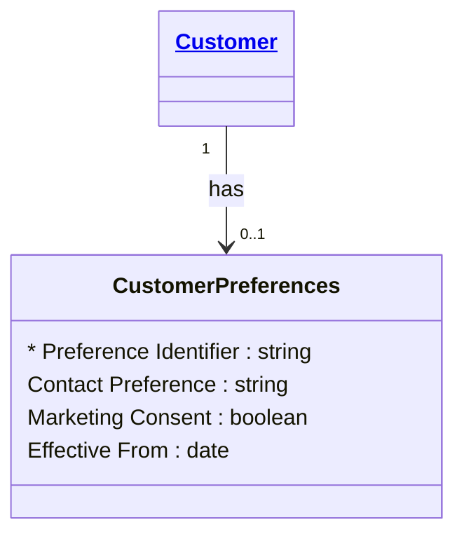

# [Financial Crime](../domain.md)

## Entities

### Customer Preferences

Customer Preferences captures communication and consent preferences that apply to a specific customer relationship.



```yaml
existence: dependent
mutability: slowly_changing
attributes:
  Preference Identifier:
    type: string
    identifier: primary
    description: Unique identifier for the customer preference profile.

  Contact Preference:
    type: string
    description: Preferred communication channel for customer contact.

  Marketing Consent:
    type: boolean
    description: Indicates whether the customer has consented to marketing communications.

  Effective From:
    type: date
    description: Date from which the current preference set applies.
```

```yaml
governance:
  retention_basis: Inherited from domain default retention of 10 years post relationship end for AML/CTF record-keeping
```

## Relationships

No relationships are sourced directly from Customer Preferences in the current domain model.
