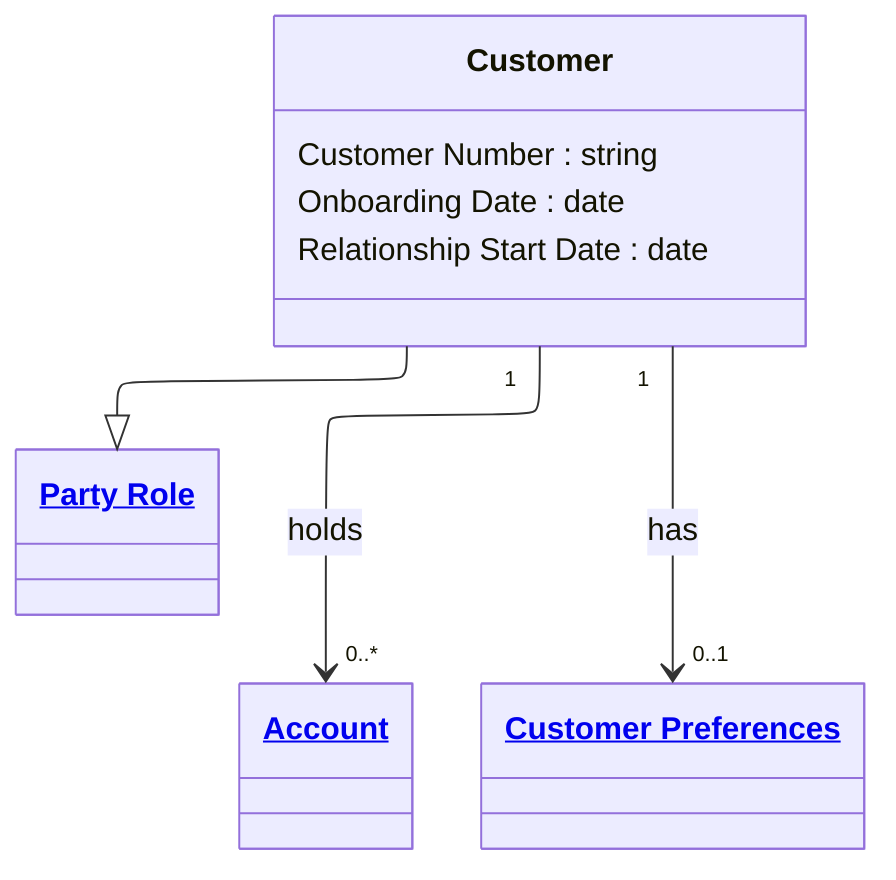

# [Financial Crime](../domain.md)

## Entities

### Customer

A Customer is a Party Role representing an active or prospective relationship with the institution for products and services.



```yaml
extends: Party Role
existence: independent
mutability: slowly_changing
attributes:
  Customer Number:
    type: string
    identifier: primary
    description: Unique customer identifier used for service and support operations.

  Onboarding Date:
    type: date
    description: Date the customer onboarding process was completed.

  Relationship Start Date:
    type: date
    description: Date the customer relationship became effective.
```

```yaml
governance:
  retention_basis: Inherited from domain default retention of 10 years post relationship end for AML/CTF record-keeping
```

## Relationships

### Customer Holds Account

A Customer can hold one or more Accounts used for products and transactions.

```yaml
source: Customer
type: has
target: Account
cardinality: one-to-many
granularity: atomic
ownership: Customer
```

### Customer Has Preferences

A Customer has at most one active Customer Preferences profile at a time.

```yaml
source: Customer
type: has
target: Customer Preferences
cardinality: one-to-one
granularity: atomic
ownership: Customer
```
