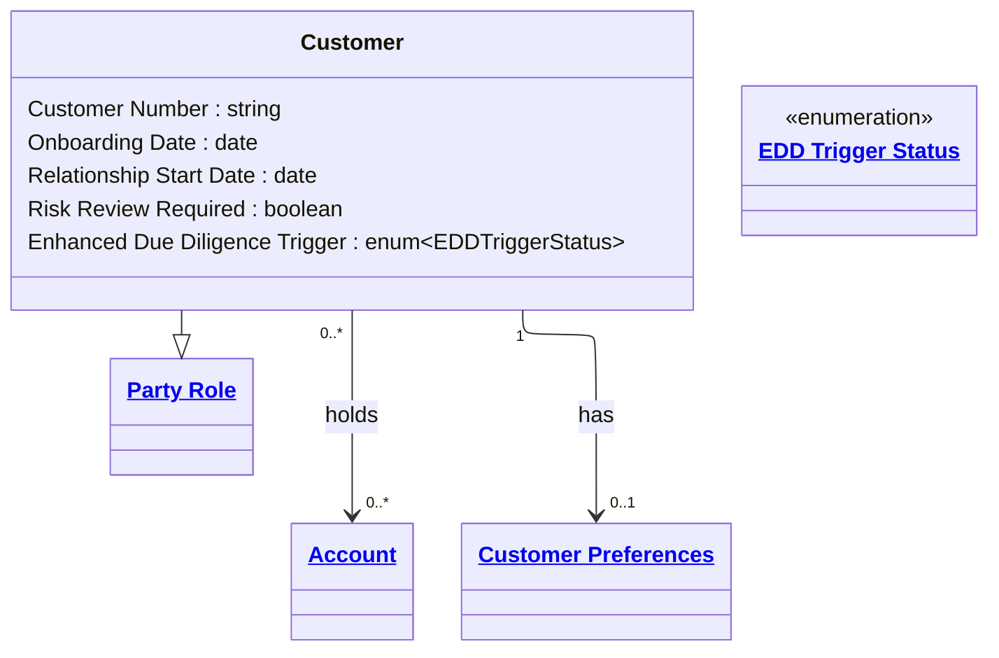

# [Financial Crime](../domain.md)

## Entities

### Customer

A Customer is a Party Role representing an active or prospective relationship with the institution for products and services.


```mermaid
---
config:
  layout: elk
---
classDiagram
  class Customer{
    Customer Number : string
    Onboarding Date : date
    Relationship Start Date : date
    Risk Review Required : boolean
    Enhanced Due Diligence Trigger : enum~EDDTriggerStatus~
  }

  Customer --|> PartyRole
  Customer "0..*" --> "0..*" Account : holds
  Customer "1" --> "0..1" CustomerPreferences : has

  class EDDTriggerStatus["<a href='https://github.com/Semprini/md-ddl/blob/main/examples/Financial%20Crime/enums.md#edd-trigger-status'>EDD Trigger Status</a>"]{<<enumeration>>}
  class PartyRole["<a href='https://github.com/Semprini/md-ddl/blob/main/examples/Financial%20Crime/entities/party_role.md'>Party Role</a>"]
  class Account["<a href='https://github.com/Semprini/md-ddl/blob/main/examples/Financial%20Crime/entities/account.md'>Account</a>"]
  class CustomerPreferences["<a href='https://github.com/Semprini/md-ddl/blob/main/examples/Financial%20Crime/entities/customer-preferences.md'>Customer Preferences</a>"]
```

```yaml
extends: Party Role
existence: independent
mutability: slowly_changing
attributes:
  Customer Number:
    type: string
    identifier: alternate
    description: Unique customer identifier used for service and support operations.

  Onboarding Date:
    type: date
    description: Date the customer onboarding process was completed.

  Relationship Start Date:
    type: date
    description: Date the customer relationship became effective.

  Risk Review Required:
    type: boolean
    description: >
      Set by the fraud and risk assessment when the customer needs a formal risk review
      before their next scheduled review date.

  Enhanced Due Diligence Trigger:
    type: enum:EDD Trigger Status
    description: >
      Whether the customer's risk profile has triggered Enhanced Customer Due Diligence
      under the AML/CTF Act 2006 and NZ AML/CFT Act 2009 section 22. Distinct from the
      inherited Due Diligence Status, which tracks the progress of whichever due diligence
      is under way.
```

```yaml
governance:
  retention_basis: Inherited from domain default retention of 10 years post relationship end for AML/CTF record-keeping
```

## Relationships

### Customer Holds Account

A Customer can hold one or more Accounts, and an Account can be held by one or more Customers. Joint accounts, business accounts with multiple authorized signatories, and beneficial ownership structures all require many-to-many cardinality. In the Financial Crime domain this is the structural basis for network analysis — connecting Customers through shared Accounts.

```yaml
source: Customer
type: has
target: Account
cardinality: many-to-many
granularity: atomic
ownership: Customer
relationship_attributes:
  - Holder Type (enum:Account Holder Type)
  - Holder Start Date
  - Holder End Date
  - Is Primary Holder
```

### Customer Has Preferences

A Customer has at most one active Customer Preferences profile at a time.

```yaml
source: Customer
type: has
target: Customer Preferences
cardinality: one-to-one
granularity: atomic
ownership: Customer
```
