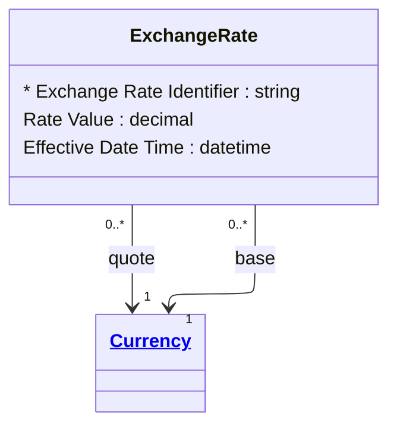

# [Financial Crime](../domain.md)

## Entities

### Exchange Rate

An Exchange Rate records conversion values between a source and target currency at a specific effective time.



```yaml
existence: dependent
mutability: append_only
attributes:
  Exchange Rate Identifier:
    type: string
    identifier: primary
    description: Unique identifier for the exchange rate observation.

  Rate Value:
    type: decimal
    description: Conversion multiplier from base to quote currency.

  Effective Date Time:
    type: datetime
    description: Timestamp at which the rate became effective.
```

```yaml
governance:
  retention_basis: Inherited from domain default retention of 10 years post relationship end for AML/CTF record-keeping
```

## Relationships

### Exchange Rate References Base Currency

Each Exchange Rate references one base Currency.

```yaml
source: Exchange Rate
type: references
target: Currency
cardinality: many-to-one
granularity: atomic
ownership: Exchange Rate
```

### Exchange Rate References Quote Currency

Each Exchange Rate references one quote Currency.

```yaml
source: Exchange Rate
type: references
target: Currency
cardinality: many-to-one
granularity: atomic
ownership: Exchange Rate
```
