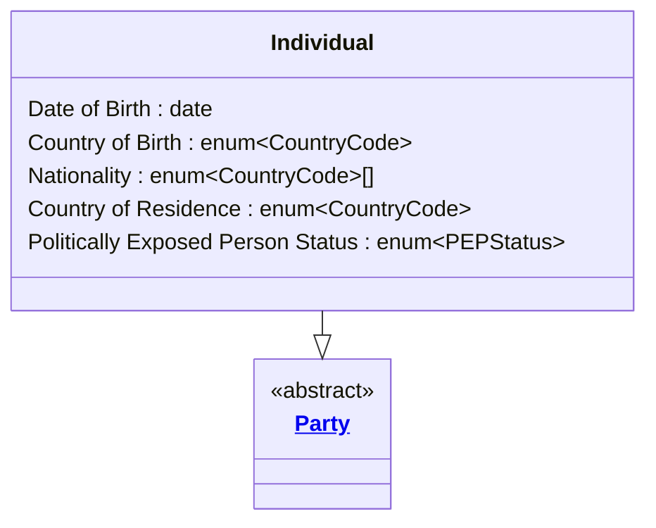

# [Financial Crime](../domain.md)

## Entities

### Individual
An Individual is a natural person who has, or may have, a financial
relationship with the institution. Individual specialises Party, inheriting
all universal party attributes and adding those that are specific to a
natural person — including identity verification details, biographic
attributes, and PEP status.

Under the AUSTRAC AML/CTF Act 2006 and RBNZ AML/CFT Act 2009, the
identification and verification requirements for individuals differ
materially from those for legal entities, making Individual a distinct
and necessary specialisation.



```yaml
extends: Party
attributes:
  Date of Birth:
    type: date
    pii: true
    description: >
      The individual's date of birth as recorded on their primary identity
      document. Required for identity verification under the AML/CTF Act 2006
      Part B customer identification program.

  Country of Birth:
    type: enum:Country Code
    pii: true
    description: >
      The country in which the individual was born. Used as a supplementary
      identity verification attribute and as an input to jurisdiction risk
      scoring.

  Nationality:
    type: enum:Country Code[1..*]
    pii: true
    description: >
      One or more nationalities held by the individual. A key factor in
      sanctions jurisdiction screening — an individual may hold nationality
      in a sanctioned country while residing elsewhere.

  Country of Residence:
    type: enum:Country Code
    pii: true
    description: >
      The country in which the individual currently resides. Used for
      jurisdiction risk scoring, FATF high-risk country screening, and
      determining applicable CDD obligations.

  Politically Exposed Person Status:
    type: enum:PEP Status
    description: >
      Indicates whether the individual is a Politically Exposed Person, a
      close associate of a PEP, or a family member of a PEP. PEP status
      applies only to natural persons. Triggers mandatory Enhanced Customer
      Due Diligence under the AML/CTF Act 2006 and RBNZ AML/CFT Act 2009
      section 22.
```
```yaml
constraints:
  Date of Birth Required at Onboarding:
    not_null: Date of Birth
    lifecycle_stage: Onboarding
    description: >
      Date of birth is a mandatory identification attribute for individuals
      under the AML/CTF Act 2006 Part B customer identification obligations.
      It must be collected and verified before any designated service is
      provided.

  PEP Requires High Risk Rating:
    check: >
      Politically Exposed Person Status == 'Not PEP'
      OR Risk Rating IN ('High', 'Very High')
    description: >
      Any individual identified as a PEP or PEP associate must be assigned a
      minimum Risk Rating of High, inherited from Party. This triggers
      Enhanced Customer Due Diligence obligations under the AML/CTF Act 2006
      and RBNZ AML/CFT Act 2009. The Risk Rating constraint is evaluated
      against the inherited attribute.
```
```yaml
governance:
  pii: true
  classification: Highly Confidential
  retention: 7 years
  description: >
    Inherits 7-year retention from Party, aligned to AUSTRAC and RBNZ
    record-keeping obligations. Retention runs from the end of the business
    relationship.
  access_role:
    - FINANCIAL_CRIME_ANALYST
    - KYC_OFFICER
    - COMPLIANCE_OFFICER
  compliance_relevance:
    - AUSTRAC AML/CTF Act 2006 — Part B Individual Identification
    - AUSTRAC AML/CTF Amendment Act 2024
    - RBNZ AML/CFT Act 2009 — sections 14, 22
    - FATF Recommendation 12 — Politically Exposed Persons
```
