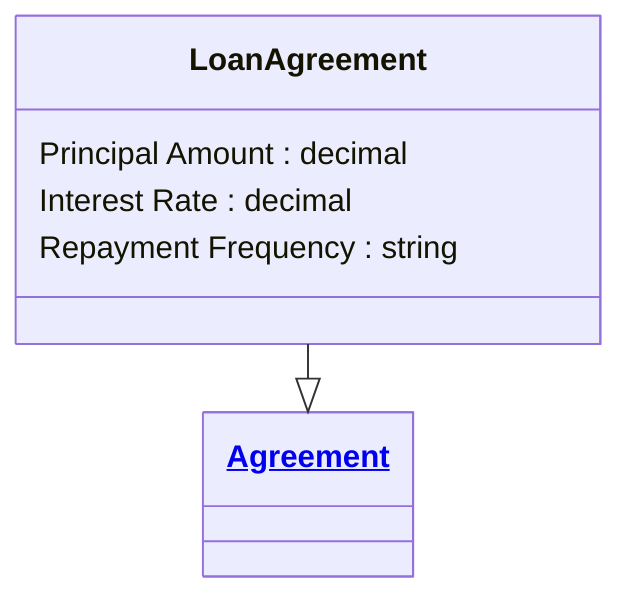

# [Financial Crime](../domain.md)

## Entities

### Loan Agreement

A Loan Agreement is a specialised agreement defining loan amount, schedule, and repayment obligations.



```yaml
extends: Agreement
existence: independent
mutability: slowly_changing
attributes:
  Principal Amount:
    type: decimal
    description: Principal amount disbursed under the loan.

  Interest Rate:
    type: decimal
    description: Contracted annual interest rate for the loan.

  Repayment Frequency:
    type: string
    description: Payment cadence for scheduled repayments.
```

```yaml
governance:
  retention_basis: Inherited from domain default retention of 10 years post relationship end for AML/CTF record-keeping
```

## Relationships

No relationships are sourced directly from Loan Agreement in the current domain model.
