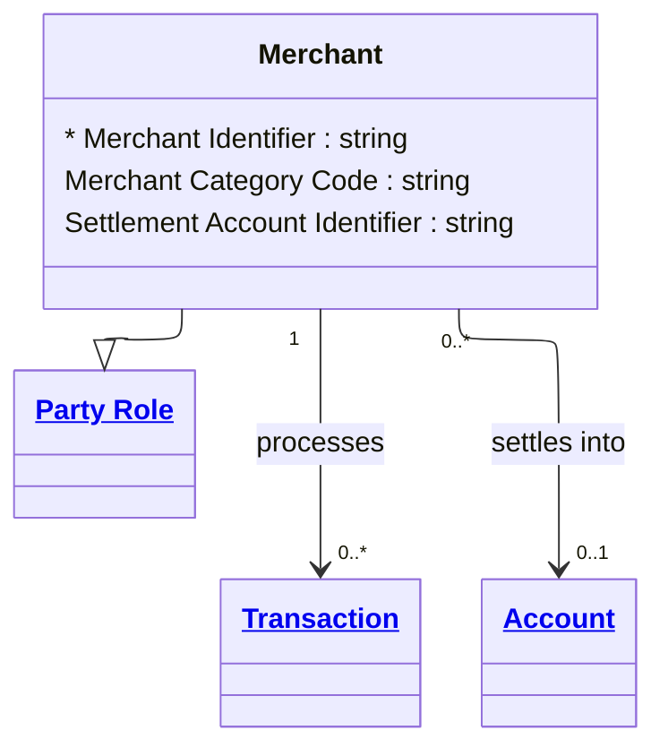

# [Financial Crime](../domain.md)

## Entities

### Merchant

A Merchant is a Party Role that accepts payments for goods or services through institution channels.



```yaml
extends: Party Role
existence: independent
mutability: slowly_changing
attributes:
  Merchant Identifier:
    type: string
    identifier: primary
    description: Unique identifier for the merchant role instance.

  Merchant Category Code:
    type: string
    description: >
      ISO 18245 Merchant Category Code (MCC) representing the merchant's primary
      business type. Used in transaction monitoring rule segmentation — certain MCCs
      (e.g., cash-intensive businesses, money services) attract heightened scrutiny.

  Settlement Account Identifier:
    type: string
    description: Account identifier used for merchant settlement.
```

```yaml
governance:
  retention_basis: Inherited from domain default retention of 10 years post relationship end for AML/CTF record-keeping
```

## Relationships

### Merchant Receives Payment

A Merchant receives funds through one or more Transactions.

```yaml
source: Merchant
type: associates_with
target: Transaction
cardinality: one-to-many
granularity: atomic
ownership: Merchant
```

### Merchant Has Settlement Account
A Merchant may have a designated Account into which settlement funds are credited by the institution.
```yaml
source: Merchant
type: references
target: Account
cardinality: many-to-one
granularity: atomic
ownership: Merchant
```
