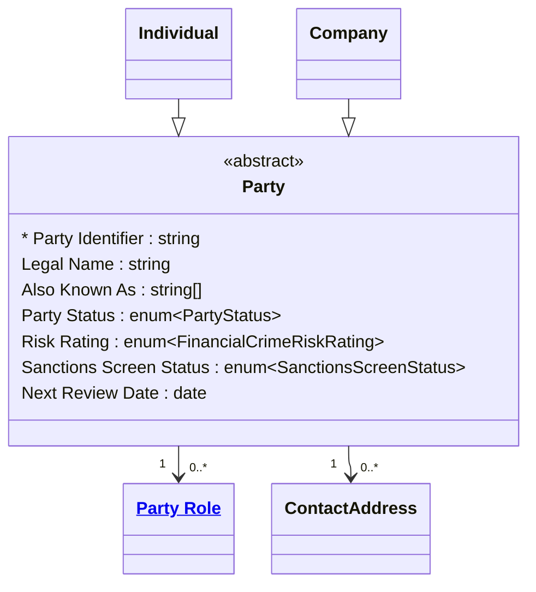

# [Financial Crime](../domain.md)

## Entities

### Party
A Party is any individual or legal entity that has, or may have, a financial relationship with the institution. Aligned to the BIAN Party Reference Data Directory, Party is the foundational abstract concept from which all financial crime subjects are derived — it carries only the attributes that are universal across every party type.

In the Financial Crime domain a Party represents any subject that may be assessed for risk, screened against watchlists, investigated, or reported to a regulatory authority. A Party does not hold relationships directly — it participates through a Party Role (e.g., Account Holder, Beneficial Owner, Signatory). The same Party may hold multiple roles across multiple products simultaneously.

Specialisations of Party — Individual and Legal Entity — carry the attributes that are specific to a natural person or an incorporated body respectively.



```yaml
temporal:
  tracking: bitemporal
  description: >
    Valid time captures when the party information was true in the real world
    (e.g., a name change effective date). Transaction time captures when the
    institution recorded or became aware of the information. Both dimensions
    are required to support regulatory audit trails and Suspicious Matter
    Report evidence under the AUSTRAC AML/CTF Act 2006.
attributes:
  Party Identifier:
    type: string
    identifier: primary
    description: >
      Globally unique surrogate identifier for this party across all systems
      and jurisdictions. Immutable once assigned.

  Legal Name:
    type: string
    pii: true
    description: >
      The full legal name of the party as it appears on the most recently
      verified official documentation. For individuals this is the full given
      and family name. For legal entities this is the registered name.

  Also Known As:
    type: string[]
    pii: true
    description: >
      Alternative names, aliases, trading names, or former names. Critical for
      watchlist screening — a party may appear on a sanctions or adverse media
      list under an alias rather than their current legal name.

  Party Status:
    type: enum:Party Status
    description: >
      The current operational status of the party record within the institution.
      Controls whether new relationships may be established and flags parties
      under active investigation or restriction.

  Risk Rating:
    type: enum:Financial Crime Risk Rating
    description: >
      The institution's current assessed ML/TF risk rating for this party,
      derived from the most recent CDD or EDD review. Drives transaction
      monitoring thresholds, review frequency, and the level of due diligence
      required under the AML/CTF Act 2006 Part B program obligations.

  Sanctions Screen Status:
    type: enum:Sanctions Screen Status
    description: >
      The outcome of the most recent screening run against applicable
      consolidated sanctions lists. A potential or confirmed match must trigger
      an investigation before any designated service is provided or any
      transaction is processed.

  Next Review Date:
    type: date
    description: >
      The date by which the next periodic CDD review must be completed.
      Calculated from the Risk Rating in accordance with the institution's
      Part A OCDD program — high-risk parties annually, medium-risk every
      two years, low-risk every three years.
```
```yaml
constraints:
  Legal Name Required:
    not_null: Legal Name
    description: >
      Every party must have a verified legal name before any designated service
      is provided. Anonymous parties cannot be onboarded under the AML/CTF
      Act 2006 Part B identification obligations.

  Review Date Must Not Be Overdue:
    check: "Next Review Date >= Today OR Party Status == 'Under Review'"
    description: >
      A party whose Next Review Date has passed must be placed Under Review
      and must not be permitted to initiate new transactions until the CDD
      review is completed and a new review date is set.

  Confirmed Sanctions Match Blocks Service:
    check: "Sanctions Screen Status != 'Confirmed Match'"
    lifecycle_stage: Onboarding
    description: >
      A party with a confirmed sanctions match must not be onboarded or
      permitted to transact. This is a hard stop pending review by the
      Financial Crime Compliance Officer.
```
```yaml
governance:
  pii: true
  classification: Highly Confidential
  retention: 7 years
  description: >
    Minimum 7-year retention from the end of the business relationship,
    aligned to AUSTRAC record-keeping obligations under the AML/CTF Act 2006
    and RBNZ AML/CFT Act 2009 section 58.
  access_role:
    - FINANCIAL_CRIME_ANALYST
    - KYC_OFFICER
    - COMPLIANCE_OFFICER
  compliance_relevance:
    - AUSTRAC AML/CTF Act 2006
    - AUSTRAC AML/CTF Amendment Act 2024
    - RBNZ AML/CFT Act 2009
    - APRA Prudential Standard CPS 234
    - FATF Recommendations 10, 11, 12
  regulatory_reporting:
    - Suspicious Matter Report (SMR) — AUSTRAC
    - Suspicious Transaction Report (STR) — RBNZ
    - Threshold Transaction Report (TTR) — AUSTRAC
    - International Funds Transfer Instruction (IFTI) — AUSTRAC
```