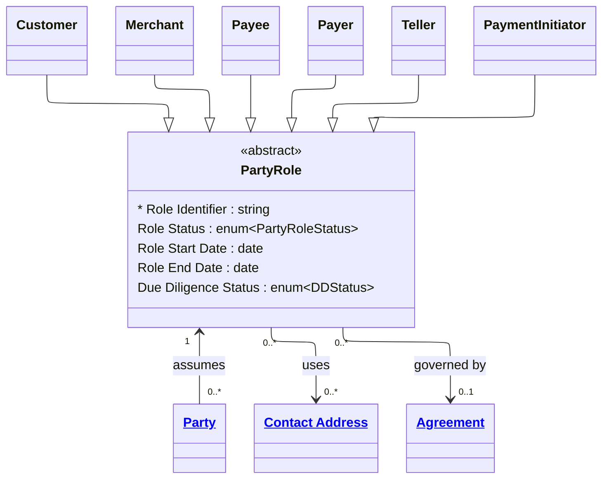

# [Financial Crime](../domain.md)

## Entities

### Party Role
A Party Role represents the specific capacity or context in which a Party
participates in a business relationship with the institution. Aligned to the
BIAN BOM, Party Role is the abstract concept that separates *who* a party is
(the Party) from *what they do* in a given context (the Role). The same Party
may hold multiple Party Roles simultaneously — a natural person may be a
Customer on a home loan, a Payer on a standing order, and a Beneficial Owner
of a company that holds a business account, all at the same time.

In the Financial Crime domain, Party Role is significant because AML/CTF
obligations attach to roles, not parties in isolation. The due diligence
required for a Beneficial Owner differs from that required for an Account
Holder, and the same individual may require different levels of scrutiny
depending on which role they are assessed in.

Party Role is abstract — it is never instantiated directly. All roles are
expressed through specialisations: Customer, Merchant, Payer, Payee, Teller,
Instructing Agent, and others defined in the domain.



```yaml
temporal:
  tracking: valid_time
  description: >
    Valid time tracks the period during which the role was active in the real
    world, using Role Start Date and Role End Date. This supports point-in-time
    queries required for regulatory audit — e.g. "was this party a Beneficial
    Owner at the time of this transaction?"
attributes:
  Role Identifier:
    type: string
    identifier: primary
    description: >
      Globally unique surrogate identifier for this specific role instance.
      Distinct from the Party Identifier — the same party holding two different
      roles will have two Role Identifiers.

  Role Status:
    type: enum:Party Role Status
    description: >
      The current lifecycle status of this role. Controls whether the role
      confers active privileges (e.g., ability to transact) and flags roles
      under review or restriction.

  Role Start Date:
    type: date
    description: >
      The date from which this role became effective. Used to establish the
      valid time period for regulatory audit and point-in-time queries.

  Role End Date:
    type: date
    description: >
      The date on which this role ceased to be effective, if applicable.
      A null value indicates the role is currently active. Roles must not be
      deleted — they must be closed with a Role End Date to preserve audit
      history.

  Due Diligence Status:
    type: enum:Due Diligence Status
    description: >
      The completion status of the CDD or EDD obligations associated with
      this specific role. AML/CTF obligations under the AML/CTF Act 2006
      and RBNZ AML/CFT Act 2009 attach at the role level — a party may
      have completed CDD as a Customer but still require separate CDD
      assessment as a Beneficial Owner of a related entity.
```
```yaml
constraints:
  Role End After Start:
    check: "Role End Date IS NULL OR Role End Date > Role Start Date"
    description: >
      A role's end date must be later than its start date. A null end date
      indicates the role is currently open.

  Active Role Requires Complete Due Diligence:
    check: >
      Role Status != 'Active'
      OR Due Diligence Status == 'Complete'
    lifecycle_stage: Activation
    description: >
      A role must not be set to Active until the CDD or EDD obligations
      associated with that role have been completed. This enforces the
      AML/CTF Act 2006 obligation that designated services must not be
      provided before identification and verification is complete.

  Closed Role Requires End Date:
    check: >
      Role Status != 'Closed'
      OR Role End Date IS NOT NULL
    description: >
      A role with a status of Closed must have a Role End Date recorded.
      This ensures the valid time period is always closed correctly for
      audit and regulatory reporting purposes.
```
```yaml
governance:
  pii: false
  classification: Confidential
  retention: 7 years
  description: >
    Role records must be retained for 7 years from Role End Date, aligned
    to AUSTRAC and RBNZ record-keeping obligations. Roles must never be
    deleted — closure via Role End Date and Role Status is the only
    permitted termination mechanism.
  access_role:
    - FINANCIAL_CRIME_ANALYST
    - KYC_OFFICER
    - COMPLIANCE_OFFICER
    - RELATIONSHIP_MANAGER
  compliance_relevance:
    - AUSTRAC AML/CTF Act 2006 — Part B role-level identification obligations
    - AUSTRAC AML/CTF Amendment Act 2024
    - RBNZ AML/CFT Act 2009
    - FATF Recommendation 10 — Customer Due Diligence
```
