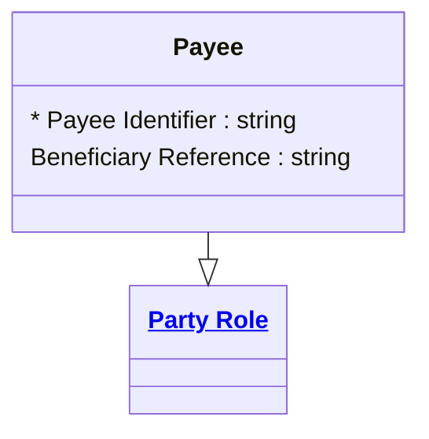

# [Financial Crime](../domain.md)

## Entities

### Payee

A Payee is a Party Role representing the recipient of funds in a transaction.



```yaml
extends: Party Role
existence: independent
mutability: slowly_changing
attributes:
  Payee Identifier:
    type: string
    identifier: primary
    description: Unique identifier for the payee role instance.

  Beneficiary Reference:
    type: string
    description: Reference used to identify the beneficiary in payment instructions.
```

```yaml
governance:
  retention_basis: Inherited from domain default retention of 10 years post relationship end for AML/CTF record-keeping
```

## Relationships

No relationships are sourced directly from Payee. The canonical direction is Transaction-owned — see [Transaction Has Creditor](transaction.md#transaction-has-creditor).
