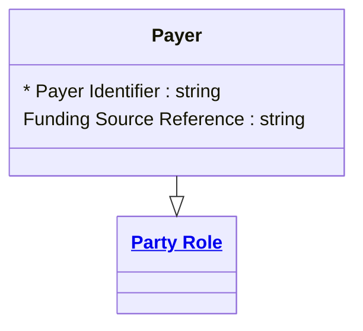

# [Financial Crime](../domain.md)

## Entities

### Payer

A Payer is a Party Role representing the party from whom funds are debited in a transaction.



```yaml
extends: Party Role
existence: independent
mutability: slowly_changing
attributes:
  Payer Identifier:
    type: string
    identifier: primary
    description: Unique identifier for the payer role instance.

  Funding Source Reference:
    type: string
    description: Reference to the source account or instrument used to fund payments.
```

```yaml
governance:
  retention_basis: Inherited from domain default retention of 10 years post relationship end for AML/CTF record-keeping
```

## Relationships

No relationships are sourced directly from Payer. The canonical direction is Transaction-owned — see [Transaction Has Debtor](transaction.md#transaction-has-debtor).
