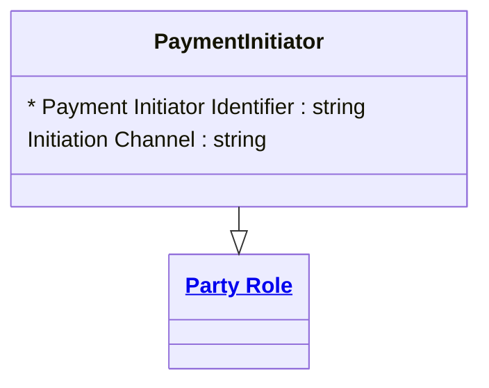

# [Financial Crime](../domain.md)

## Entities

### Payment Initiator

A Payment Initiator is a Party Role representing the party that instructs or initiates a transaction.



```yaml
extends: Party Role
existence: independent
mutability: slowly_changing
attributes:
  Payment Initiator Identifier:
    type: string
    identifier: primary
    description: Unique identifier for the payment initiator role instance.

  Initiation Channel:
    type: string
    description: Channel used to initiate payment instructions.
```

```yaml
governance:
  retention_basis: Inherited from domain default retention of 10 years post relationship end for AML/CTF record-keeping
```

## Relationships

No relationships are sourced directly from Payment Initiator. The canonical direction is Transaction-owned — see [Transaction Initiated By Instructing Agent](transaction.md#transaction-initiated-by-instructing-agent).
