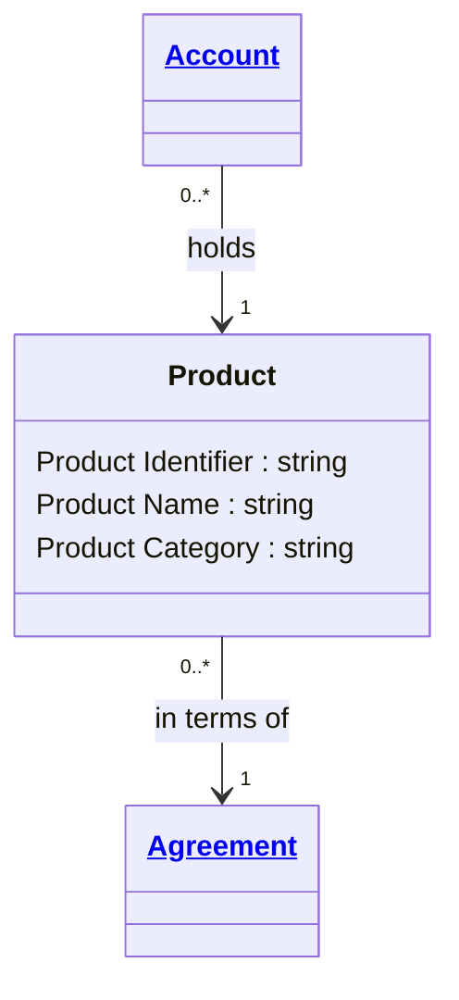

# [Financial Crime](../domain.md)

## Entities

### Product

A Product is a financial offering whose terms are governed by an agreement and used by one or more accounts.



```yaml
existence: independent
mutability: slowly_changing
attributes:
  Product Identifier:
    type: string
    identifier: primary
    description: Unique identifier of the product definition.

  Product Name:
    type: string
    description: Business name of the product offering.

  Product Category:
    type: string
    description: Product classification used for reporting and controls.
```

```yaml
governance:
  retention_basis: Inherited from domain default retention of 10 years post relationship end for AML/CTF record-keeping
```

## Relationships

### Product In Terms Of Agreement

A Product is defined in terms of an Agreement template or contractual framework.

```yaml
source: Product
type: references
target: Agreement
cardinality: many-to-one
granularity: atomic
ownership: Product
```
