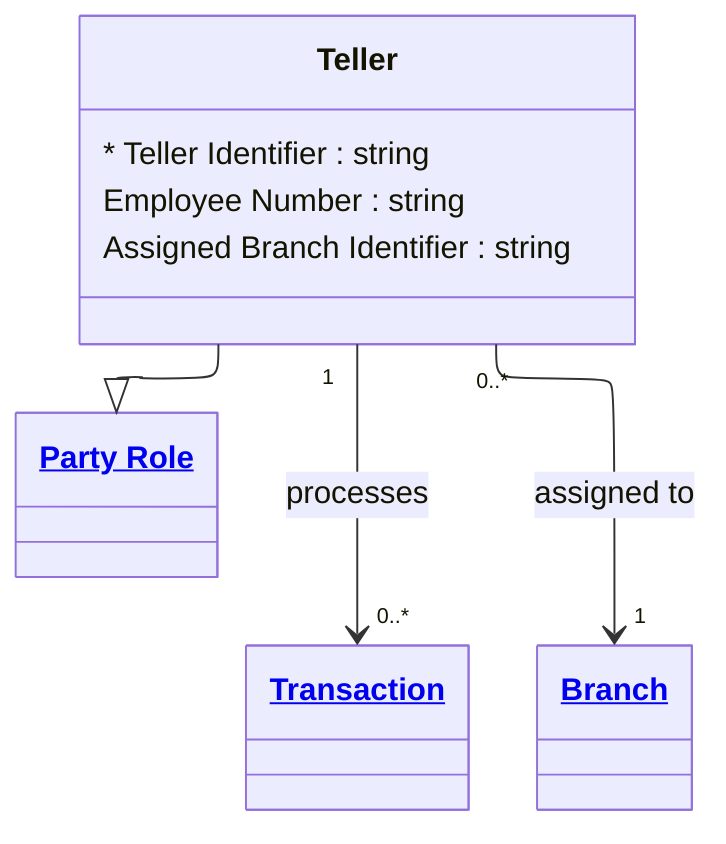

# [Financial Crime](../domain.md)

## Entities

### Teller

A Teller is a Party Role representing a bank employee who processes branch-based customer transactions.



```yaml
extends: Party Role
existence: independent
mutability: slowly_changing
attributes:
  Teller Identifier:
    type: string
    identifier: primary
    description: Unique identifier for the teller role instance.

  Employee Number:
    type: string
    description: Internal identifier of the staff member acting as teller.

  Assigned Branch Identifier:
    type: string
    description: Branch identifier where the teller is primarily assigned.
```

```yaml
governance:
  retention_basis: Inherited from domain default retention of 10 years post relationship end for AML/CTF record-keeping
```

## Relationships

### Teller Processes Transaction

A Teller can process one or more branch-mediated Transactions.

```yaml
source: Teller
type: associates_with
target: Transaction
cardinality: one-to-many
granularity: atomic
ownership: Teller
```

### Teller Assigned To Branch

A Teller is assigned to a Branch for operational responsibilities.

```yaml
source: Teller
type: assigned_to
target: Branch
cardinality: many-to-one
granularity: atomic
ownership: Teller
```
