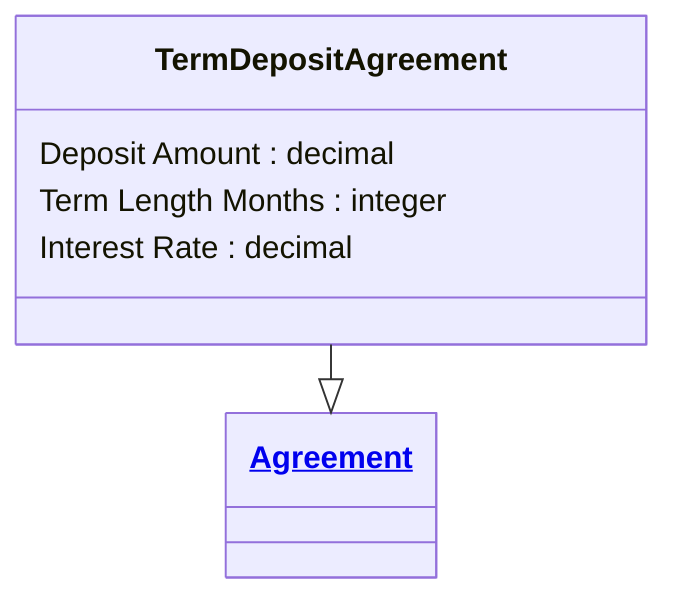

# [Financial Crime](../domain.md)

## Entities

### Term Deposit Agreement

A Term Deposit Agreement is a specialised agreement defining fixed-term deposit terms.



```yaml
extends: Agreement
existence: independent
mutability: slowly_changing
attributes:
  Deposit Amount:
    type: decimal
    description: Principal amount committed to the term deposit.

  Term Length Months:
    type: integer
    description: Fixed term length in months.

  Interest Rate:
    type: decimal
    description: Contracted annual interest rate for the term.
```

```yaml
governance:
  retention_basis: Inherited from domain default retention of 10 years post relationship end for AML/CTF record-keeping
```

## Relationships

No relationships are sourced directly from Term Deposit Agreement in the current domain model.
