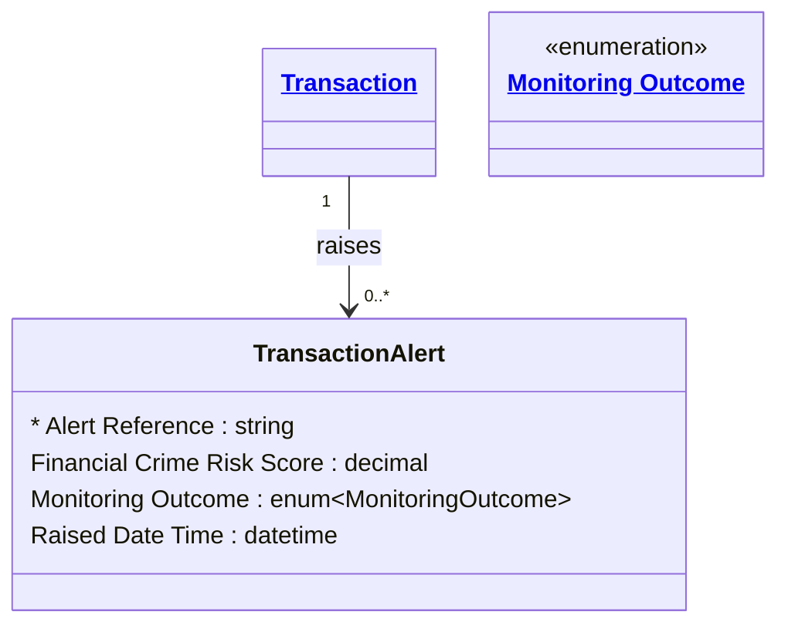

# [Financial Crime](../domain.md)

## Entities

### Transaction Alert

A Transaction Alert records that transaction monitoring flagged a transaction for review, with the risk score that triggered it and the analyst's disposition. It is separate from Transaction because a transaction is append-only once recorded, while an alert moves through review (Under Review, then Escalated or Cleared) after the fact. One transaction can raise several alerts from different rules or re-scoring runs.



```yaml
since: "2.0.0"
existence: dependent
mutability: slowly_changing
temporal:
  tracking: valid_time
  description: >
    The disposition changes as the alert is reviewed. Valid time records when each outcome
    applied, so an investigator can see an alert was Under Review when a related transaction
    settled.
attributes:
  Alert Reference:
    type: string
    identifier: primary
    description: Case identifier assigned by the fraud management system when the alert is raised.

  Financial Crime Risk Score:
    type: decimal
    description: >
      ML/TF risk score computed for the transaction by the monitoring model at the time the
      alert was raised.

  Monitoring Outcome:
    type: enum:Monitoring Outcome
    description: Current disposition of the alert.

  Raised Date Time:
    type: datetime
    description: When the monitoring system raised the alert.
```

```yaml
constraints:
  Risk Score Non-Negative:
    check: "Financial Crime Risk Score IS NULL OR Financial Crime Risk Score >= 0"
    description: Risk scores are non-negative model outputs.
```

```yaml
governance:
  compliance_relevance:
    - AUSTRAC AML/CTF Act 2006 — transaction monitoring program
    - FATF Recommendation 20 — Reporting of suspicious transactions
  regulatory_reporting:
    - Suspicious Matter Report (SMR) — AUSTRAC (when escalated)
```

## Relationships

No relationships are sourced directly from Transaction Alert. It is linked to its Transaction by [Transaction Raises Alerts](transaction.md#transaction-raises-alerts).
