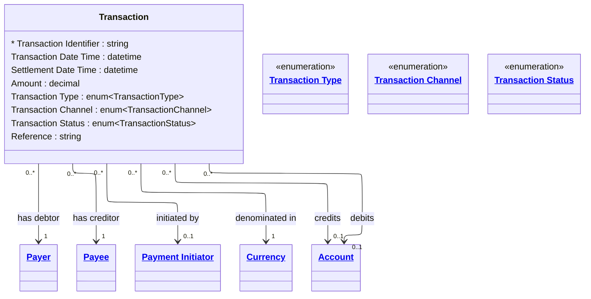

# [Financial Crime](../domain.md)

## Entities

### Transaction

A Transaction represents a movement of value between parties and accounts. It is the primary fact entity in the Financial Crime domain — it carries the monetary amount, the timing, the mechanism, and the parties and accounts involved. Every transaction must be monitorable for suspicious activity patterns.

In a dimensional model, Transaction is the central fact table grain. Currency, Account (debit and credit), Channel, Type, Status, and temporal attributes are the dimension keys required for transaction risk analytics.


```yaml
existence: dependent
mutability: append_only
temporal:
  tracking: transaction_time
  description: >
    Transactions are append-only records. Once settled they must not be modified.
    Transaction time captures when the institution recorded the transaction.
    Reversals are recorded as new transaction records referencing the original
    Transaction Identifier, not as updates to the original.
attributes:
  Transaction Identifier:
    type: string
    identifier: primary
    description: >
      Globally unique identifier for the transaction event. Immutable once assigned.
      For reversed transactions, the reversal carries its own identifier and references
      this identifier in the Reference field.

  Transaction Date Time:
    type: datetime
    description: >
      Timestamp when the transaction was initiated or instructed by the originating party.
      Used as the primary event time for transaction monitoring rule evaluation.

  Settlement Date Time:
    type: datetime
    description: >
      Timestamp when final, irrevocable settlement occurred. May differ from Transaction Date
      Time for transactions that clear across business days or time zones. Required for
      accurate AML typology detection (e.g., structuring detection across settlement windows).

  Amount:
    type: decimal
    description: >
      Monetary value moved by the transaction, expressed in the denomination currency.
      Always positive — direction (debit or credit) is determined by the Payer and Payee
      relationships, not by sign.

  Transaction Type:
    type: enum:Transaction Type
    description: >
      The mechanism by which the transaction was processed (e.g., Wire Transfer, EFTPOS,
      ATM Withdrawal, Direct Debit). Used for transaction monitoring rule segmentation —
      different typologies apply to different transaction types.

  Transaction Channel:
    type: enum:Transaction Channel
    description: >
      The channel or medium through which the transaction was initiated. Used in conjunction
      with Transaction Type for risk rule evaluation — a high-value cash deposit at branch
      carries different risk signals than the same amount via online banking.

  Transaction Status:
    type: enum:Transaction Status
    description: >
      The current lifecycle state of the transaction. Under Review status suspends settlement
      and is set by the transaction monitoring system. Failed and Reversed transactions must
      be retained for AML audit — absence of completed transactions is itself a monitoring signal.

  Reference:
    type: string
    description: >
      Free-form transaction reference text as supplied by the initiating party. May contain
      invoice numbers, payment descriptions, or, in the case of reversals, the original
      Transaction Identifier being reversed.
```
```yaml
constraints:
  Settlement After Initiation:
    check: "Settlement Date Time IS NULL OR Settlement Date Time >= Transaction Date Time"
    description: >
      Settlement cannot precede initiation. A null Settlement Date Time indicates the
      transaction has not yet settled (e.g., Pending, Authorised, or Under Review status).

  Settled Transaction Has Settlement Time:
    check: >
      Transaction Status != 'Settled'
      OR Settlement Date Time IS NOT NULL
    description: >
      A transaction with status Settled must have a Settlement Date Time recorded.

  Amount Must Be Positive:
    check: "Amount > 0"
    description: >
      Transaction amounts are always expressed as positive values. Direction is conveyed
      by the Payer (debit) and Payee (credit) relationships.
```

```yaml
governance:
  pii: false
  classification: Highly Confidential
  retention: 10 years
  retention_basis: Domain default retention aligned to AML/CTF record-keeping obligations
  description: >
    Transaction records must be retained for 7 years from the transaction date, aligned
    to AUSTRAC AML/CTF Act 2006 record-keeping obligations. Records are append-only and
    must never be modified or deleted. Reversals are represented as new records.
  access_role:
    - FINANCIAL_CRIME_ANALYST
    - TRANSACTION_MONITORING_SYSTEM
    - COMPLIANCE_OFFICER
  compliance_relevance:
    - AUSTRAC AML/CTF Act 2006 — Part B transaction record-keeping
    - AUSTRAC AML/CTF Amendment Act 2024
    - RBNZ AML/CFT Act 2009 — section 58
    - FATF Recommendation 10 — Customer Due Diligence (transaction context)
    - FATF Recommendation 16 — Wire Transfers (for SWIFT and Wire Transfer types)
  regulatory_reporting:
    - Threshold Transaction Report (TTR) — AUSTRAC (cash transactions >= AUD 10,000)
    - International Funds Transfer Instruction (IFTI) — AUSTRAC
    - Suspicious Matter Report (SMR) — AUSTRAC
```

## Relationships

### Transaction Has Debtor

A Transaction has one Payer representing the party from whom funds are debited.

```yaml
source: Transaction
type: has
target: Payer
cardinality: one-to-many
granularity: atomic
ownership: Transaction
```

### Transaction Has Creditor

A Transaction has one Payee representing the party to whom funds are credited.

```yaml
source: Transaction
type: has
target: Payee
cardinality: one-to-many
granularity: atomic
ownership: Transaction
```

### Transaction Initiated By Instructing Agent

A Transaction may be initiated by one Payment Initiator acting as instructing agent on behalf of the originating party.

```yaml
source: Transaction
type: references
target: Payment Initiator
cardinality: many-to-one
granularity: atomic
ownership: Transaction
```

### Transaction Denominated In Currency
A Transaction is denominated in exactly one Currency.

```yaml
source: Transaction
type: references
target: Currency
cardinality: many-to-one
granularity: atomic
ownership: Transaction
```

### Transaction Has Debit Account
The internal account from which funds are debited. Null for transactions where the debit side is an external counterparty account not held at the institution (e.g., inbound wire transfers).

```yaml
source: Transaction
type: references
target: Account
cardinality: many-to-one
granularity: atomic
ownership: Transaction
```

### Transaction Has Credit Account
The internal account to which funds are credited. Null for transactions where the credit side is an external counterparty account not held at the institution (e.g., outbound wire transfers).

```yaml
source: Transaction
type: references
target: Account
cardinality: many-to-one
granularity: atomic
ownership: Transaction
```
