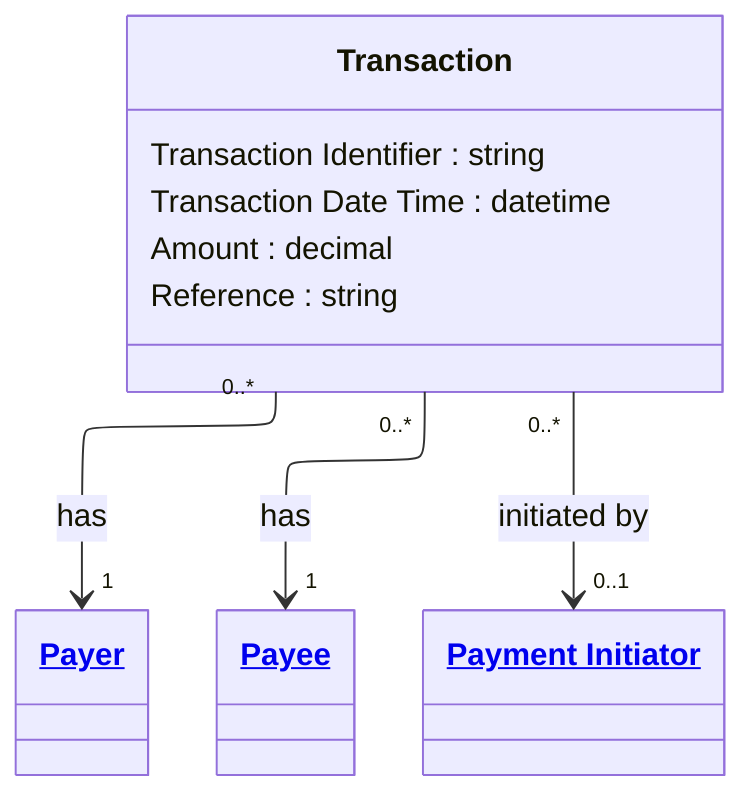

# [Financial Crime](../domain.md)

## Entities

### Transaction

A Transaction represents a movement of value between parties and accounts, with payer/payee and initiation context.



```yaml
existence: dependent
mutability: append_only
attributes:
  Transaction Identifier:
    type: string
    identifier: primary
    description: Unique identifier for the transaction event.

  Transaction Date Time:
    type: datetime
    description: Timestamp when the transaction was executed.

  Amount:
    type: decimal
    description: Monetary value moved by the transaction.

  Reference:
    type: string
    description: Free-form transaction reference text.
```

```yaml
governance:
  retention_basis: Inherited from domain default retention of 10 years post relationship end for AML/CTF record-keeping
```

## Relationships

### Transaction Has Debtor

A Transaction has one or more debtors represented by Payer roles.

```yaml
source: Transaction
type: has
target: Payer
cardinality: one-to-many
granularity: atomic
ownership: Transaction
```

### Transaction Has Creditor

A Transaction has one or more creditors represented by Payee roles.

```yaml
source: Transaction
type: has
target: Payee
cardinality: one-to-many
granularity: atomic
ownership: Transaction
```

### Transaction Initiated By Instructing Agent

A Transaction may be initiated by one Payment Initiator acting as instructing agent.

```yaml
source: Transaction
type: references
target: Payment Initiator
cardinality: many-to-one
granularity: atomic
ownership: Transaction
```
