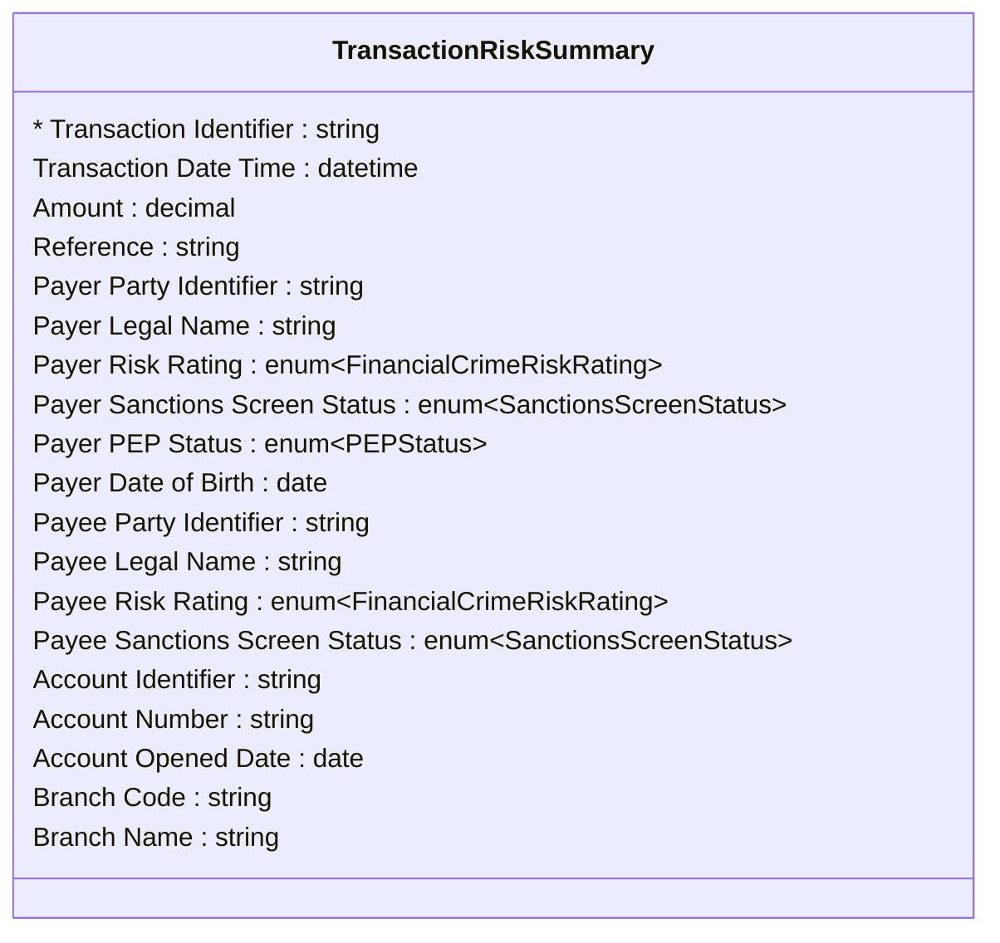

# [Financial Crime](../domain.md)

## Data Products

### Transaction Risk Summary

A denormalized wide-column view combining transaction details with party
identity, account context, and risk indicators for the financial crime
analytics team. Designed for high-volume scan queries without joins.

```yaml
class: consumer-aligned
schema_type: wide-column
owner: fincrime.analytics@bank.com
consumers:
  - Financial Crime Analytics
  - Transaction Monitoring Dashboard
status: Active
version: "1.0.0"

entities:
  - Transaction Risk Summary

lineage:
  - domain: Financial Crime
    entities:
      - Transaction
      - Party
      - Person
      - Party Role
      - Payer
      - Payee
      - Customer
      - Account
      - Branch

governance:
  classification: Highly Confidential
  pii: true
  retention: "10 years"
  masking:
    - attribute: "Date of Birth"
      strategy: year-only
    - attribute: "Tax Identification Number"
      strategy: hash

sla:
  freshness: "< 15 minutes"
  availability: "99.9%"

refresh: real-time
```

#### Logical Model

This product denormalizes transaction, party, account, and branch context
into a single wide-column structure. Every attribute maps to a canonical
entity — consumer-aligned products do not source from source systems.



#### Attribute Mapping

Product Attribute | Source | Path | Transform
--- | --- | --- | ---
Transaction Identifier | Transaction.Transaction Identifier | — | —
Transaction Date Time | Transaction.Transaction Date Time | — | —
Amount | Transaction.Amount | — | —
Reference | Transaction.Reference | — | —
Payer Party Identifier | Party.Party Identifier | Transaction → Payer → Party | —
Payer Legal Name | Party.Legal Name | Transaction → Payer → Party | —
Payer Risk Rating | Party.Risk Rating | Transaction → Payer → Party | —
Payer Sanctions Screen Status | Party.Sanctions Screen Status | Transaction → Payer → Party | —
Payer PEP Status | Person.Politically Exposed Person Status | Transaction → Payer → Party → Person | —
Payer Date of Birth | Person.Date of Birth | Transaction → Payer → Party → Person | —
Payee Party Identifier | Party.Party Identifier | Transaction → Payee → Party | —
Payee Legal Name | Party.Legal Name | Transaction → Payee → Party | —
Payee Risk Rating | Party.Risk Rating | Transaction → Payee → Party | —
Payee Sanctions Screen Status | Party.Sanctions Screen Status | Transaction → Payee → Party | —
Account Identifier | Account.Account Identifier | Transaction → Payer → Customer → Account | —
Account Number | Account.Account Number | Transaction → Payer → Customer → Account | —
Account Opened Date | Account.Opened Date | Transaction → Payer → Customer → Account | —
Branch Code | Branch.Branch Code | Transaction → Payer → Customer → Account → Branch | —
Branch Name | Branch.Branch Name | Transaction → Payer → Customer → Account → Branch | —
