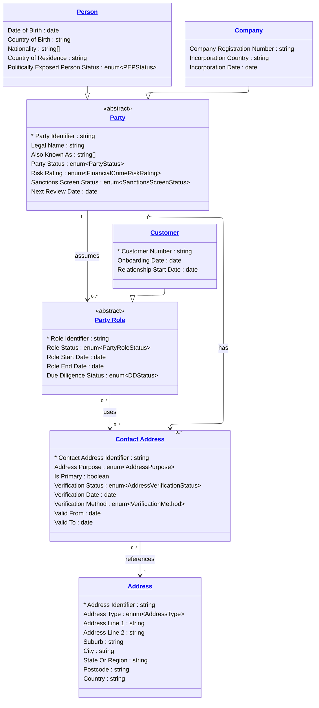

# [Financial Crime](../domain.md)

## Data Products

### Canonical Party

The governed canonical representation of Party, Party Role, and related
identity entities for consumption by downstream domains and cross-domain
integration points.

```yaml
class: domain-aligned
schema_type: normalized
owner: data.architecture@bank.com
consumers:
  - Cross-domain Integration
  - Customer Domain
  - Regulatory Reporting
status: Active
version: "1.0.0"

entities:
  - Party
  - Person
  - Company
  - Party Role
  - Customer
  - Contact Address
  - Address

lineage:
  - source: salesforce-crm
    tables:
      - table_account
      - table_contact
      - table_contact_point
  - source: sap-fraud-management
    tables:
      - table_sanctions_screening
      - table_customer_risk_profile

sla:
  freshness: "< 1 hour"
  availability: "99.95%"

refresh: hourly
```

#### Logical Model


