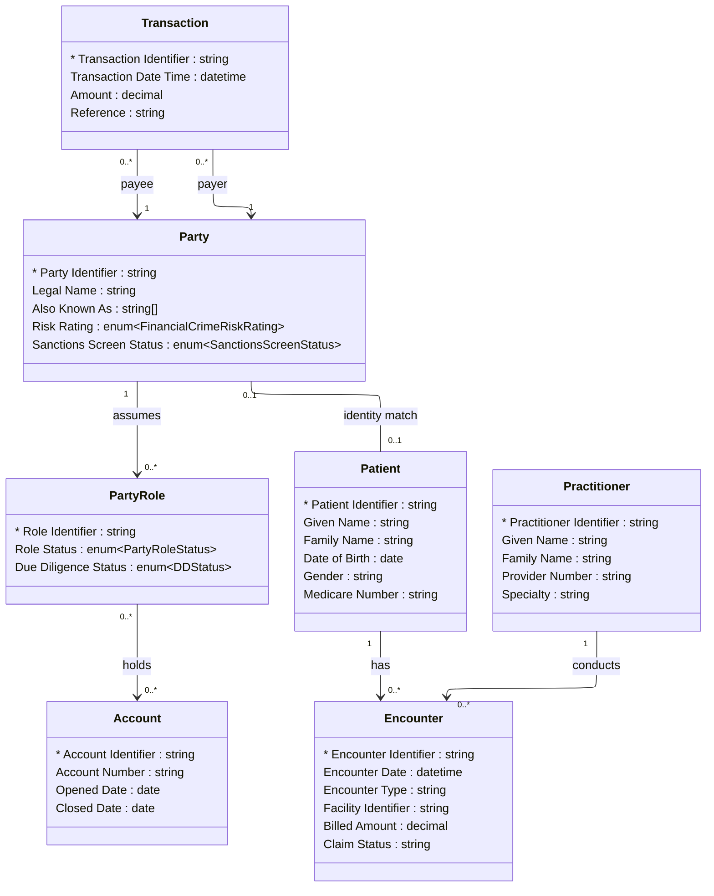

# [Financial Crime](../domain.md)

## Data Products

### Patient Financial Fraud Detection

Consumer-aligned product combining financial transaction activity with
healthcare patient and encounter context to detect cross-channel fraud,
synthetic identities, and abnormal billing or reimbursement patterns.

```yaml
class: consumer-aligned
schema_type: normalized
owner: financial.crime.analytics@bank.com
consumers:
  - Financial Crime Analytics
  - Enterprise Fraud Operations
  - Clinical Revenue Integrity
status: Active
version: "1.0.0"

entities:
  - Transaction
  - Party
  - Party Role
  - Account
  - Patient
  - Encounter
  - Practitioner

lineage:
  - domain: Financial Crime
    entities:
      - Transaction
      - Party
      - Party Role
      - Account
  - domain: Healthcare
    entities:
      - Patient
      - Encounter
      - Practitioner

governance:
  # Classification resolution: both contributing domains are
  # Highly Confidential at domain level. Effective classification remains
  # Highly Confidential.
  classification: Highly Confidential
  # Retention conflict: Financial Crime 10 years vs Healthcare 7 years.
  # Longest wins.
  retention: "10 years"
  # PII/PHI union across both contributing domains.
  pii: true
  # Regulatory scope union across both contributing domains.
  regulatory_scope:
    - AML (Anti-Money Laundering)
    - KYC (Know Your Customer)
    - CTF (Counter-Terrorist Financing)
    - FATF Recommendations
    - BSA (Bank Secrecy Act)
    - EU 5AMLD / 6AMLD
    - USA PATRIOT Act
    - HIPAA (Health Insurance Portability and Accountability Act)
    - HITECH Act
    - 21st Century Cures Act

masking:
  - attribute: "Patient.Given Name"
    strategy: redact
  - attribute: "Patient.Family Name"
    strategy: redact
  - attribute: "Patient.Date of Birth"
    strategy: year-only
  - attribute: "Practitioner.Given Name"
    strategy: tokenize
  - attribute: "Practitioner.Family Name"
    strategy: tokenize
  - attribute: "Party.Legal Name"
    strategy: hash
  - attribute: "Party.Also Known As"
    strategy: hash
  - attribute: "Transaction.Reference"
    strategy: truncate

sla:
  freshness: "< 4 hours"
  availability: "99.9%"
  latency_p99: "< 500ms"

refresh: hourly
```

#### Logical Model

Normalized structure preserving entity boundaries across both contributing
domains. All attributes source from canonical products — Financial Crime
entities from Canonical Party, Healthcare entities from the Healthcare
domain-aligned product.



#### Attribute Mapping

##### Transaction

Product Attribute | Source | Transform
--- | --- | ---
Transaction Identifier | Transaction.Transaction Identifier | —
Transaction Date Time | Transaction.Transaction Date Time | —
Amount | Transaction.Amount | —
Reference | Transaction.Reference | —

##### Party

Product Attribute | Source | Transform
--- | --- | ---
Party Identifier | Party.Party Identifier | —
Legal Name | Party.Legal Name | —
Also Known As | Party.Also Known As | —
Risk Rating | Party.Risk Rating | —
Sanctions Screen Status | Party.Sanctions Screen Status | —

##### Party Role

Product Attribute | Source | Transform
--- | --- | ---
Role Identifier | Party Role.Role Identifier | —
Role Status | Party Role.Role Status | —
Due Diligence Status | Party Role.Due Diligence Status | —

##### Account

Product Attribute | Source | Transform
--- | --- | ---
Account Identifier | Account.Account Identifier | —
Account Number | Account.Account Number | —
Opened Date | Account.Opened Date | —
Closed Date | Account.Closed Date | —

##### Patient

Product Attribute | Source | Transform
--- | --- | ---
Patient Identifier | Healthcare.Patient.Patient Identifier | —
Given Name | Healthcare.Patient.Given Name | —
Family Name | Healthcare.Patient.Family Name | —
Date of Birth | Healthcare.Patient.Date of Birth | —
Gender | Healthcare.Patient.Gender | —
Medicare Number | Healthcare.Patient.Medicare Number | —

##### Encounter

Product Attribute | Source | Transform
--- | --- | ---
Encounter Identifier | Healthcare.Encounter.Encounter Identifier | —
Encounter Date | Healthcare.Encounter.Encounter Date | —
Encounter Type | Healthcare.Encounter.Encounter Type | —
Facility Identifier | Healthcare.Encounter.Facility Identifier | —
Billed Amount | Healthcare.Encounter.Billed Amount | —
Claim Status | Healthcare.Encounter.Claim Status | —

##### Practitioner

Product Attribute | Source | Transform
--- | --- | ---
Practitioner Identifier | Healthcare.Practitioner.Practitioner Identifier | —
Given Name | Healthcare.Practitioner.Given Name | —
Family Name | Healthcare.Practitioner.Family Name | —
Provider Number | Healthcare.Practitioner.Provider Number | —
Specialty | Healthcare.Practitioner.Specialty | —
