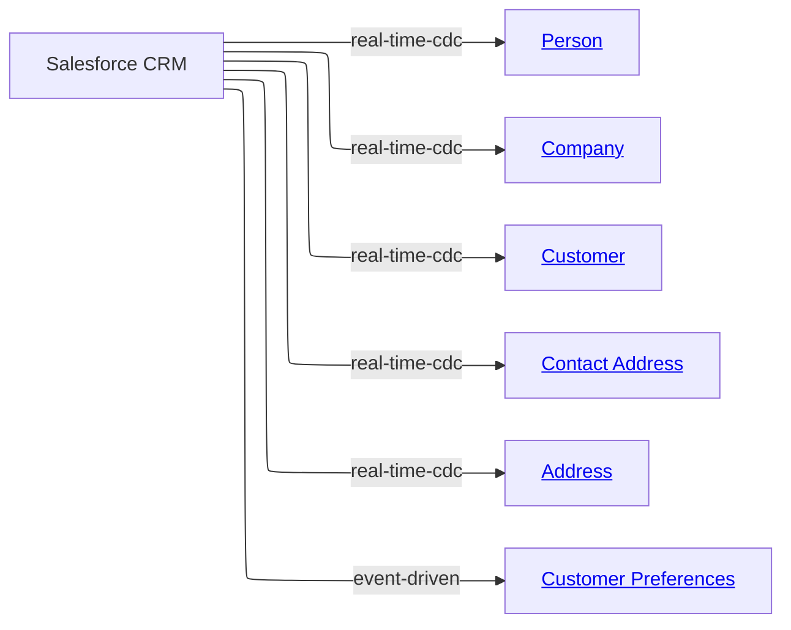

# [Financial Crime](../../domain.md)

## Sources

### Salesforce CRM

Salesforce CRM is the customer relationship source for onboarding, profile maintenance, and communication preferences. It contributes party identity, customer profile, and contact data used by KYC and due diligence workflows.

#### Metadata

```yaml
id: salesforce-crm
owner: crm.platform@bank.com
steward: data.governance@bank.com

change_model: real-time-cdc
change_events:
  - Customer Created
  - Customer Updated
  - Contact Address Updated
  - Customer Preference Updated

update_frequency: real-time
data_quality_tier: 1
status: Production
version: "2.0.0"
```

Every extract carries the enterprise party identifier (`ExternalPartyId` on Account, `PartyExternalId` on the child tables), so each row can be tied to its canonical Party without joining extracts.

#### Source Overview Diagram



#### Feeds

Canonical Entity | Transform | Attributes Contributed | Change Model
--- | --- | --- | ---
[Company](../../entities/company.md#company) | [table_account](transforms/table_account.md#account) | Party Identifier, Party Status, Legal Name, Company Registration Number (Party attributes inherited) | real-time-cdc
[Person](../../entities/person.md#person) | [table_account](transforms/table_account.md#account), [table_contact](transforms/table_contact.md#contact) | Party Identifier, Party Status (from Account); Given Name, Family Name, Legal Name, Date of Birth, Politically Exposed Person Status (from Contact) | real-time-cdc
[Customer](../../entities/customer.md#customer) | [table_account](transforms/table_account.md#account) | Role Identifier, Customer Number, Onboarding Date | real-time-cdc
[Contact Address](../../entities/contact_address.md#contact-address) | [table_contact_point](transforms/table_contact_point.md#contactpoint) | Contact Address Identifier, Address Purpose, Is Primary, Verification Status, Verification Date, Valid From, Valid To | real-time-cdc
[Address](../../entities/address.md#address) | [table_contact_point](transforms/table_contact_point.md#contactpoint) | Address Identifier, Address Line 1, City, State Or Region, Postcode, Country | real-time-cdc
[Customer Preferences](../../entities/customer-preferences.md#customer-preferences) | [table_preference](transforms/table_preference.md#preference) | Preference Identifier, Contact Preference, Marketing Consent, Effective From | event-driven

Preferences arrive through Salesforce Platform Events rather than row-level CDC, hence the different change model.
