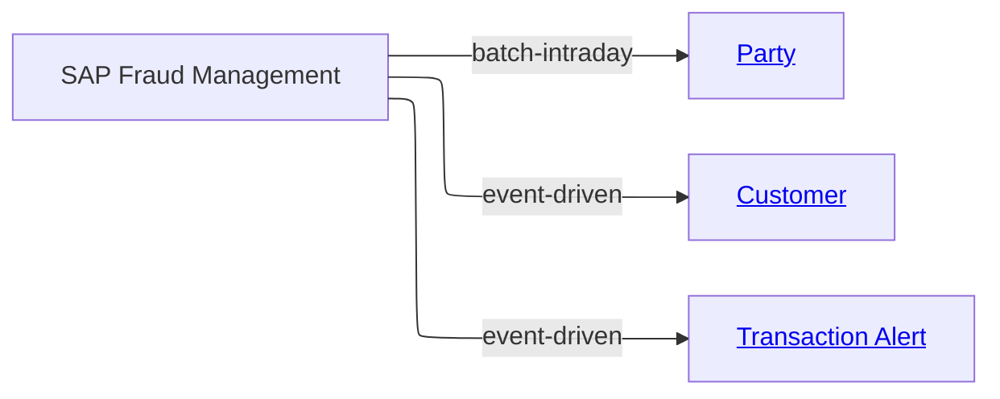

# [Financial Crime](../../domain.md)

## Sources

### SAP Fraud Management

SAP Fraud Management is the analytical source for fraud and suspicious activity detection signals. It contributes screening outcomes, customer risk assessments, and transaction monitoring alerts used by AML, KYC, and transaction monitoring controls.

#### Metadata

```yaml
id: sap-fraud-management
owner: fraud.operations@bank.com
steward: compliance.officer@bank.com

change_model: event-driven
change_events:
  - Fraud Alert Raised
  - Fraud Alert Closed
  - Transaction Risk Scored
  - Case Escalated

update_frequency: real-time
data_quality_tier: 2
status: Production
version: "2.0.0"

tags:
  - Fraud
  - AML
  - Financial Crime
```

SAP doesn't know whether a party is a person or a company. Its screening and risk rows add attributes to the Party and Customer that Salesforce CRM establishes, matched on the enterprise party identifier.

#### Source Overview Diagram



#### Feeds

Canonical Entity | Transform | Attributes Contributed | Change Model
--- | --- | --- | ---
[Transaction Alert](../../entities/transaction-alert.md#transaction-alert) | [table_alert_case](transforms/table_alert_case.md#alertcase) | Alert Reference, Financial Crime Risk Score, Monitoring Outcome, Raised Date Time | event-driven
[Party](../../entities/party.md#party) | [table_sanctions_screening](transforms/table_sanctions_screening.md#sanctionsscreening) | Sanctions Screen Status | batch-intraday
[Customer](../../entities/customer.md#customer) | [table_customer_risk_profile](transforms/table_customer_risk_profile.md#customerriskprofile) | Risk Review Required, Enhanced Due Diligence Trigger | event-driven

Screening results are produced by intraday rescreening batches, not by SAP's alert events, which is why that feed differs from the source's event-driven default.
