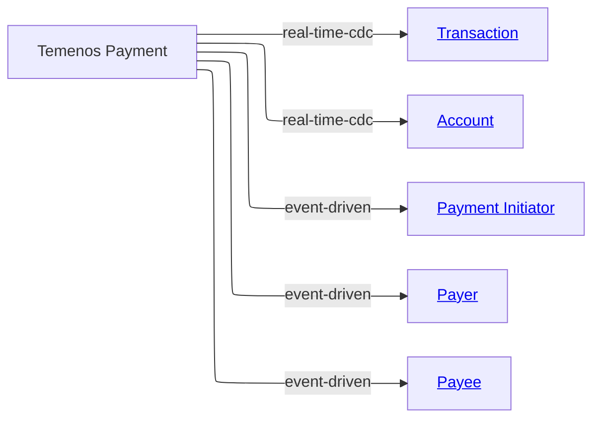

# [Financial Crime](../../domain.md)

## Sources

### Temenos Payment

Temenos Payment is the operational source for payment initiation and execution records. It emits high-volume transaction changes used for financial crime monitoring and downstream payment analytics.

#### Metadata

```yaml
id: temenos-payment
owner: payments.platform@bank.com
steward: data.governance@bank.com

change_model: real-time-cdc
change_events:
  - Payment Initiated
  - Payment Executed
  - Payment Reversed
  - Payment Rejected

update_frequency: real-time
data_quality_tier: 1
status: Production
version: "2.0.0"

tags:
  - Payments
  - Core Banking
  - Financial Crime
```

#### Source Overview Diagram



#### Feeds

Canonical Entity | Transform | Attributes Contributed | Change Model
--- | --- | --- | ---
[Transaction](../../entities/transaction.md#transaction) | [table_payment_event](transforms/table_payment_event.md#paymentevent), [table_initiation](transforms/table_initiation.md#initiation), [table_payment_parties](transforms/table_payment_parties.md#paymentparties) | Transaction Identifier, Amount, Settlement Date Time, Transaction Status; Transaction Channel and initiator link (from Initiation); debtor and creditor links (from PaymentParties) | real-time-cdc
[Account](../../entities/account.md#account) | [table_account_ref](transforms/table_account_ref.md#accountref) | Account Identifier, Account Number, Account Status | real-time-cdc
[Payment Initiator](../../entities/payment_initiator.md#payment-initiator) | [table_initiation](transforms/table_initiation.md#initiation) | Role Identifier | event-driven
[Payer](../../entities/payer.md#payer) | [table_payment_parties](transforms/table_payment_parties.md#paymentparties) | Role Identifier | event-driven
[Payee](../../entities/payee.md#payee) | [table_payment_parties](transforms/table_payment_parties.md#paymentparties) | Role Identifier | event-driven

Initiation and party details arrive as payment workflow events rather than table CDC.
