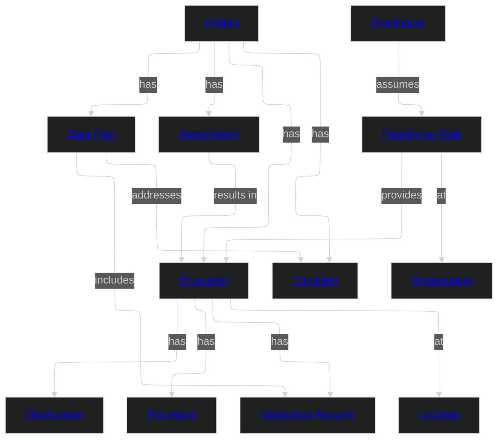

# Healthcare

This domain encompasses clinical concepts required for patient care delivery, clinical observation, and treatment management. It includes patient identity, encounter management, clinical observations, condition tracking, procedures, medication management, and care planning.

This is a business-aligned domain that draws concepts from HL7 FHIR R4 (Fast Healthcare Interoperability Resources) to ensure standards alignment with industry-wide healthcare data interoperability.

## Metadata

```yaml
# Accountability
owners:
  - clinical.data@hospital.org
stewards:
  - chief.medical.informatics@hospital.org
technical_leads:
  - health.it.architecture@hospital.org

# Governance & Security
classification: "Highly Confidential"
pii: true
regulatory_scope:
  - HIPAA (Health Insurance Portability and Accountability Act)
  - HITECH Act
  - 21st Century Cures Act
default_retention: "7 years post last encounter"

# Lifecycle & Discovery
status: "Production"
version: "1.0.0"
tags:
  - Clinical
  - Patient Care
  - Healthcare
  - FHIR
```

### Domain Overview Diagram



## Source Systems

Business Application | Platform | Capability Domain
--- | --- | ---
[Hospital EHR](sources/hospital-ehr/source.md) | Epic-compatible EHR | Clinical Records
[Lab Information System](sources/lab-information-system/source.md) | Cerner PathNet-compatible LIS | Laboratory Results

## Entities

Name | Specializes | Description | Reference
--- | --- | --- | ---
[Patient](entities/patient.md#patient) | | Demographics and administrative information about an individual receiving care. | [FHIR R4 Patient](http://hl7.org/fhir/R4/patient.html)
[Encounter](entities/encounter.md#encounter) | | An interaction between a patient and healthcare provider(s) for the purpose of providing care. | [FHIR R4 Encounter](http://hl7.org/fhir/R4/encounter.html)
[Observation](entities/observation.md#observation) | | Measurements and simple assertions made about a patient. | [FHIR R4 Observation](http://hl7.org/fhir/R4/observation.html)
[Condition](entities/condition.md#condition) | | A clinical condition, problem, diagnosis, or other concept that has risen to a level of concern. | [FHIR R4 Condition](http://hl7.org/fhir/R4/condition.html)
[Procedure](entities/procedure.md#procedure) | | An action that is or was performed on or for a patient. | [FHIR R4 Procedure](http://hl7.org/fhir/R4/procedure.html)
[Practitioner](entities/practitioner.md#practitioner) | | A person directly or indirectly involved in the provisioning of healthcare. | [FHIR R4 Practitioner](http://hl7.org/fhir/R4/practitioner.html)
[Practitioner Role](entities/practitioner_role.md#practitioner-role) | | A specific set of roles, locations, and specialties that a practitioner may perform at an organization. | [FHIR R4 PractitionerRole](http://hl7.org/fhir/R4/practitionerrole.html)
[Organization](entities/organization.md#organization) | | A formally or informally recognized grouping of people or organizations providing healthcare services. | [FHIR R4 Organization](http://hl7.org/fhir/R4/organization.html)
[Location](entities/location.md#location) | | A physical place where healthcare services are provided. | [FHIR R4 Location](http://hl7.org/fhir/R4/location.html)
[Medication Request](entities/medication_request.md#medication-request) | | An order or request for supply and administration of medication to a patient. | [FHIR R4 MedicationRequest](http://hl7.org/fhir/R4/medicationrequest.html)
[Care Plan](entities/care_plan.md#care-plan) | | A plan describing the intention of how practitioners intend to deliver care for a patient. | [FHIR R4 CarePlan](http://hl7.org/fhir/R4/careplan.html)
[Appointment](entities/appointment.md#appointment) | | A booking of a healthcare event among patients, practitioners, and locations. | [FHIR R4 Appointment](http://hl7.org/fhir/R4/appointment.html)

## Enums

Name | Description | Reference
--- | --- | ---
[Encounter Status](enums.md#encounter-status) | Lifecycle status of a clinical encounter. | [FHIR R4 EncounterStatus](http://hl7.org/fhir/R4/valueset-encounter-status.html)
[Encounter Class](enums.md#encounter-class) | Classification of patient encounter type. | [FHIR R4 ActEncounterCode](http://hl7.org/fhir/R4/v3/ActEncounterCode/vs.html)
[Condition Clinical Status](enums.md#condition-clinical-status) | Clinical status of a condition. | [FHIR R4 ConditionClinicalStatus](http://hl7.org/fhir/R4/valueset-condition-clinical.html)
[Observation Status](enums.md#observation-status) | Status of an observation result. | [FHIR R4 ObservationStatus](http://hl7.org/fhir/R4/valueset-observation-status.html)
[Medication Request Status](enums.md#medication-request-status) | Lifecycle status of a medication request. | [FHIR R4 MedicationRequestStatus](http://hl7.org/fhir/R4/valueset-medicationrequest-status.html)
[Care Plan Status](enums.md#care-plan-status) | Lifecycle status of a care plan. | [FHIR R4 RequestStatus](http://hl7.org/fhir/R4/valueset-request-status.html)
[Appointment Status](enums.md#appointment-status) | Lifecycle status of an appointment. | [FHIR R4 AppointmentStatus](http://hl7.org/fhir/R4/valueset-appointmentstatus.html)
[Procedure Status](enums.md#procedure-status) | Lifecycle status of a procedure. | [FHIR R4 EventStatus](http://hl7.org/fhir/R4/valueset-event-status.html)
[Administrative Gender](enums.md#administrative-gender) | Administrative gender of a person. | [FHIR R4 AdministrativeGender](http://hl7.org/fhir/R4/valueset-administrative-gender.html)
[LOINC Observation Code](enums.md#loinc-observation-code) | Logical Observation Identifiers Names and Codes for laboratory and clinical observations. | [LOINC](https://loinc.org/)
[ICD-10 Condition Code](enums.md#icd-10-condition-code) | International Classification of Diseases codes for conditions and diagnoses. | [ICD-10](https://icd.who.int/browse10/)
[SNOMED CT Procedure Code](enums.md#snomed-ct-procedure-code) | SNOMED Clinical Terms codes for clinical procedures. | [SNOMED CT](https://www.snomed.org/)

## Relationships

Name | Description | Reference
--- | --- | ---
[Patient Has Encounters](entities/patient.md#patient-has-encounters) | A Patient can have multiple Encounters over time. | [FHIR R4 Encounter](http://hl7.org/fhir/R4/encounter.html)
[Patient Has Conditions](entities/patient.md#patient-has-conditions) | A Patient can have multiple diagnosed Conditions. | [FHIR R4 Condition](http://hl7.org/fhir/R4/condition.html)
[Patient Has Care Plans](entities/patient.md#patient-has-care-plans) | A Patient can have multiple active Care Plans. | [FHIR R4 CarePlan](http://hl7.org/fhir/R4/careplan.html)
[Patient Has Appointments](entities/patient.md#patient-has-appointments) | A Patient can have scheduled Appointments. | [FHIR R4 Appointment](http://hl7.org/fhir/R4/appointment.html)
[Encounter Has Observations](entities/encounter.md#encounter-has-observations) | An Encounter can produce multiple Observations. | [FHIR R4 Observation](http://hl7.org/fhir/R4/observation.html)
[Encounter Has Procedures](entities/encounter.md#encounter-has-procedures) | An Encounter can involve multiple Procedures. | [FHIR R4 Procedure](http://hl7.org/fhir/R4/procedure.html)
[Encounter Has Medication Requests](entities/encounter.md#encounter-has-medication-requests) | Medication Requests can originate from an Encounter. | [FHIR R4 MedicationRequest](http://hl7.org/fhir/R4/medicationrequest.html)
[Encounter At Location](entities/encounter.md#encounter-at-location) | An Encounter takes place at a Location. | [FHIR R4 Location](http://hl7.org/fhir/R4/location.html)
[Practitioner Assumes Practitioner Role](entities/practitioner.md#practitioner-assumes-practitioner-role) | A Practitioner can hold multiple roles across organizations and locations. | [FHIR R4 PractitionerRole](http://hl7.org/fhir/R4/practitionerrole.html)
[Practitioner Role Provides Encounter](entities/practitioner_role.md#practitioner-role-provides-encounter) | A Practitioner Role participates in Encounters. | [FHIR R4 Encounter](http://hl7.org/fhir/R4/encounter.html)
[Practitioner Role At Organization](entities/practitioner_role.md#practitioner-role-at-organization) | A Practitioner Role is affiliated with an Organization. | [FHIR R4 Organization](http://hl7.org/fhir/R4/organization.html)
[Care Plan Addresses Condition](entities/care_plan.md#care-plan-addresses-condition) | A Care Plan addresses one or more Conditions. | [FHIR R4 CarePlan](http://hl7.org/fhir/R4/careplan.html)
[Care Plan Includes Medication Requests](entities/care_plan.md#care-plan-includes-medication-requests) | A Care Plan can include Medication Requests as planned activities. | [FHIR R4 CarePlan](http://hl7.org/fhir/R4/careplan.html)
[Appointment Results In Encounter](entities/appointment.md#appointment-results-in-encounter) | A fulfilled Appointment results in an Encounter. | [FHIR R4 Appointment](http://hl7.org/fhir/R4/appointment.html)

## Events

Name | Actor | Entity | Description
--- | --- | --- | ---
[Patient Admitted](events/patient-admitted.md#patient-admitted) | Registration Clerk | Encounter | Emitted when a patient is admitted and an encounter begins.
[Observation Recorded](events/observation-recorded.md#observation-recorded) | Practitioner | Observation | Emitted when a clinical observation or lab result is recorded.
[Medication Prescribed](events/medication-prescribed.md#medication-prescribed) | Practitioner | Medication Request | Emitted when a new medication order is created for a patient.
[Care Plan Updated](events/care-plan-updated.md#care-plan-updated) | Practitioner | Care Plan | Emitted when a care plan is created or revised.

## Data Products

Name | Class | Consumers | Status
--- | --- | --- | ---
[Clinical Patient Record](products/canonical.md#clinical-patient-record) | domain-aligned | Cross-domain Integration | Production
[Clinical Outcomes Dashboard](products/analytics.md#clinical-outcomes-dashboard) | consumer-aligned | Clinical Analytics | Production
[Clinical Billing Fraud Detection](products/billing-fraud-detection.md#clinical-billing-fraud-detection) | consumer-aligned | Revenue Integrity; Clinical Compliance; Financial Crime Operations | Production
[Lab Results Raw Feed](products/source-feeds.md#lab-results-raw-feed) | source-aligned | Data Engineering | Production

---
