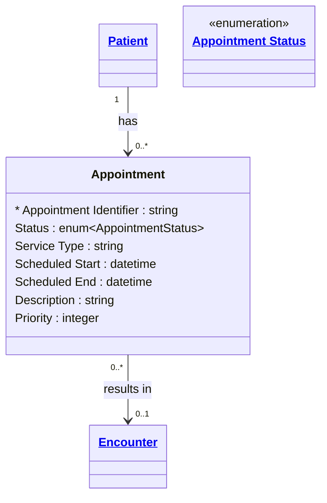

# [Healthcare](../domain.md)

## Entities

### Appointment

A booking of a healthcare event among patients, practitioners, related persons, and/or devices for a specific date/time. Aligned to the FHIR R4 Appointment resource, this entity represents scheduled future healthcare interactions that may or may not result in an Encounter.

Appointments use a period-granularity relationship to Encounters — the appointment captures scheduled time (when the visit is planned) while the encounter captures actual time (when the visit occurred). Comparing scheduled versus actual enables wait time analysis and scheduling efficiency reporting.



```yaml
existence: dependent
mutability: slowly_changing
temporal:
  tracking: valid_time
  description: >
    Valid time tracks the scheduled appointment window from Scheduled Start
    to Scheduled End. Appointments may be rescheduled, changing the valid
    time window, or cancelled.
attributes:
  Appointment Identifier:
    type: string
    identifier: primary
    description: Unique identifier for this appointment.

  Status:
    type: enum:Appointment Status
    description: Lifecycle status of the appointment (proposed, pending, booked, arrived, fulfilled, cancelled, noshow).

  Service Type:
    type: string
    description: Type of healthcare service scheduled (e.g. consultation, follow-up, imaging).

  Scheduled Start:
    type: datetime
    description: Planned start date and time of the appointment.

  Scheduled End:
    type: datetime
    description: Planned end date and time of the appointment.

  Description:
    type: string
    description: Brief description or reason for the appointment.

  Priority:
    type: integer
    description: Relative priority of the appointment (lower numbers are higher priority).
```

```yaml
constraints:
  Scheduled End After Start:
    check: "Scheduled End IS NULL OR Scheduled End > Scheduled Start"
    description: Appointment end must be after start.
```

```yaml
governance:
  pii: true
  classification: Confidential
  retention_basis: >
    Appointment scheduling data is PHI containing patient visit timing.
    Retained per domain default.
  access_role:
    - CLINICAL_STAFF
    - SCHEDULING
    - REGISTRATION
```

## Relationships

### Appointment Results In Encounter

A fulfilled Appointment results in an Encounter. This is a period-granularity relationship — the appointment captures the scheduled time window while the encounter captures the actual clinical interaction period. Comparing the two enables scheduling variance analysis.

```yaml
source: Appointment
type: produces
target: Encounter
cardinality: many-to-one
granularity: period
ownership: Appointment
```
