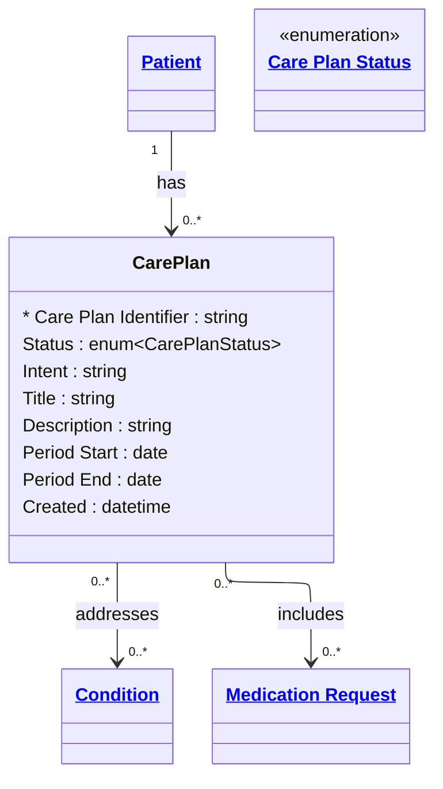

# [Healthcare](../domain.md)

## Entities

### Care Plan

A plan describing the intention of how one or more practitioners intend to deliver care for a particular patient, group, or community for a period of time. Aligned to the FHIR R4 CarePlan resource, this entity coordinates the clinical response to one or more conditions, linking treatment goals, medication orders, and planned activities.

Care Plans are bitemporal — both the clinical validity period (when the plan is active for the patient) and the system recording time (when the plan was entered or revised) matter. A care plan may be backdated to reflect a clinician's assessment that the plan was clinically effective from an earlier date than when it was recorded, or it may be revised with corrections that need to be distinguished from the original version.

Care Plans have a group-granularity relationship to their included activities — a single plan coordinates multiple medication requests, procedures, and goals as a collection.



```yaml
existence: dependent
mutability: slowly_changing
temporal:
  tracking: bitemporal
  description: >
    Bitemporal tracking captures both the clinical validity period of the
    care plan (Period Start to Period End — when the plan is active for the
    patient) and the system recording time (when the plan was entered or
    revised). This supports clinical audit questions like "what care plan
    was active for this patient on date X?" (valid time) and "what did
    the system believe the care plan contained on date Y?" (transaction time).
    Late-arriving corrections, backdated plans, and plan revisions all
    require both temporal dimensions.
attributes:
  Care Plan Identifier:
    type: string
    identifier: primary
    description: Unique identifier for this care plan.

  Status:
    type: enum:Care Plan Status
    description: Lifecycle status of the care plan (draft, active, on-hold, revoked, completed).

  Intent:
    type: string
    description: Level of authority for the plan (proposal, plan, order).

  Title:
    type: string
    description: Human-friendly name for the care plan.

  Description:
    type: string
    description: Summary of the nature and objectives of the plan.

  Period Start:
    type: date
    description: Date from which the care plan is clinically effective.

  Period End:
    type: date
    description: Date on which the care plan ceases to be clinically effective.

  Created:
    type: datetime
    description: Date and time the care plan was first recorded in the system.
```

```yaml
constraints:
  Period End After Start:
    check: "Period End IS NULL OR Period End > Period Start"
    description: Care plan period end must be after period start. Null end indicates ongoing plan.
```

```yaml
governance:
  pii: true
  classification: Highly Confidential
  retention: 7 years
  retention_basis: >
    Care plans are PHI containing treatment strategies and clinical
    decision-making. Retained per domain default for clinical audit
    and continuity of care.
  access_role:
    - CLINICAL_STAFF
    - CARE_COORDINATION
    - HEALTH_INFORMATION_MANAGEMENT
```

## Relationships

### Care Plan Addresses Condition

A Care Plan addresses one or more Conditions — the clinical problems that the plan is designed to manage. This is a group-granularity relationship because the care plan coordinates a collection of activities as a unified response to the addressed conditions.

```yaml
source: Care Plan
type: associates_with
target: Condition
cardinality: many-to-many
granularity: group
ownership: Care Plan
```

### Care Plan Includes Medication Requests

A Care Plan can include Medication Requests as planned pharmacological activities. The plan groups multiple medication orders as part of a coordinated treatment strategy.

```yaml
source: Care Plan
type: has
target: Medication Request
cardinality: many-to-many
granularity: group
ownership: Care Plan
```
