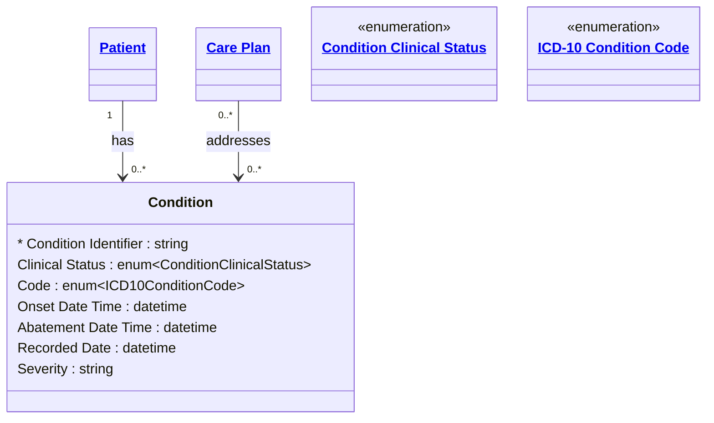

# [Healthcare](../domain.md)

## Entities

### Condition

A clinical condition, problem, diagnosis, or other event, situation, issue, or clinical concept that has risen to a level of concern. Aligned to the FHIR R4 Condition resource, this entity tracks diagnoses using ICD-10 coding for international classification interoperability.

Conditions may be acute or chronic, resolved or ongoing. They serve as the clinical basis for care plans, procedures, and medication requests.



```yaml
existence: dependent
mutability: slowly_changing
temporal:
  tracking: valid_time
  description: >
    Valid time tracks the clinical period of the condition from onset to
    abatement. Conditions may resolve, recur, or become chronic, and the
    valid time window reflects the clinically assessed period of activity.
attributes:
  Condition Identifier:
    type: string
    identifier: primary
    description: Unique identifier for this condition record.

  Clinical Status:
    type: enum:Condition Clinical Status
    description: Clinical status of the condition (active, recurrence, relapse, inactive, remission, resolved).

  Code:
    type: enum:ICD-10 Condition Code
    description: >
      ICD-10 diagnosis code identifying the condition. Uses the International
      Classification of Diseases for standardized clinical reporting.

  Onset Date Time:
    type: datetime
    description: Estimated or actual date the condition began.

  Abatement Date Time:
    type: datetime
    description: Date the condition resolved or went into remission, if applicable.

  Recorded Date:
    type: datetime
    description: Date this condition was first recorded in the clinical system.

  Severity:
    type: string
    description: Subjective severity assessment of the condition (mild, moderate, severe).
```

```yaml
constraints:
  Abatement After Onset:
    check: "Abatement Date Time IS NULL OR Abatement Date Time > Onset Date Time"
    description: Condition abatement must occur after onset. Null abatement indicates ongoing condition.
```

```yaml
governance:
  pii: true
  classification: Highly Confidential
  retention_basis: Inherited from domain default retention of 7 years post last encounter
```
